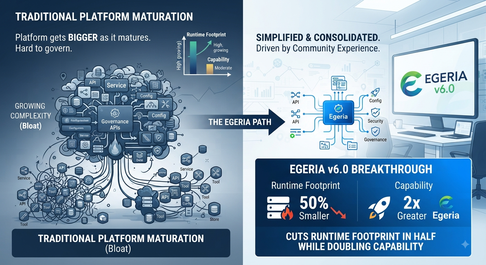

<!-- SPDX-License-Identifier: CC-BY-4.0 -->
<!-- Copyright Contributors to the Egeria project. -->

# Egeria 6.0: Doing More With Half the Footprint

*By Mandy Chessell, Egeria Project Leader, Pragmatic Data Research (PDR) Ltd*

*Part 1 of a four-part series on recent work in the [Egeria](https://egeria-project.org/) project, an LF AI & Data project for open metadata and governance.*

---

Open metadata platforms have a reputation problem: they tend to get bigger, not smaller, as they mature. Every new use case adds another service, another API, another configuration option, until the platform that was supposed to make governance easier becomes something that itself needs governing.

With the April 2026 release, [Egeria](https://egeria-project.org/) took the opposite path. Version 6.0 doubles the platform's capability while cutting the runtime footprint in half. That is not a rounding error or a packaging trick — it is the result of a deliberate, project-wide push to consolidate and simplify, driven by real deployment experience from the community.

## Why simplify now

Egeria's open metadata types and APIs grew organically over several years, as the project added support for new kinds of assets, governance actions, and integration patterns. That flexibility was valuable, but it came at a cost: overlapping concepts, inconsistent REST patterns, and a runtime that was harder to reason about than it needed to be. The 6.0 release set out to fix that without giving up any of the capability the community had built.

## What changed under the hood

A few changes account for most of the simplification:

- **Common attributes moved up the type hierarchy.** Properties that used to be duplicated across specific types are now defined once on the `Referenceable` and `Asset` base types, removing a large amount of redundant modeling.
- **Human and automated actions were unified** under a common `Action` supertype, so governance actions, to-dos, and engine actions share one consistent shape instead of three parallel ones.
- **Collection-based types consolidated.** `Glossary`, `SolutionBlueprint`, `DigitalProduct`, and `DesignModel` now all inherit from `Collection`, and governance implementation entities now inherit from `GovernanceDefinition` — replacing bespoke structures with a shared, well-understood pattern.
- **REST APIs were restructured** around consistent Request/Response patterns across services, and the `LatestChange` classification was replaced with a proper classification history operation, closing off a long-standing source of confusion.

The result is a metadata model and API surface that is smaller in absolute terms, but expresses everything the previous version could — and in most areas, more.

## What's new for users

The simplification wasn't only subtractive. 6.0 also introduces:

- **Dr.Egeria MD**, a forms-based way to author metadata in plain markdown — no client tooling or API calls required to get started.
- **New View Services**, including Governance Officer, Actor Manager, Time Keeper, Notification Manager, Data Discovery, and Reference Data, extending what the higher-level UIs and integrations can do out of the box.
- **A local MCP server**, making it straightforward to connect AI agents directly to open metadata.
- **Distributed secrets management**, so credentials for connectors and integrations no longer need to live in a single central store.
- **Leaner Egeria Workspaces** — Quickstart and Freshstart variants — for getting a working environment up quickly, whether you're evaluating the platform or resetting a development sandbox.
- **An improved PostgreSQL repository**, with SQL pushdown for queries that used to require pulling data into the runtime to filter.
- **New Python libraries** for connector development, lowering the bar for the community to build and share new connectors.

## The honest caveat

A change of this scale is not a drop-in upgrade. Moving from earlier versions to 6.0 involves a proper migration project — reviewing how your metadata types map onto the consolidated model — rather than a routine version bump. The project's [release notes](https://egeria-project.org/release-notes/latest/) go into detail on what to expect, and it's worth budgeting real time for the move if you're running Egeria in production today.

For new deployments, though, the benefit is immediate: a lighter runtime, fewer moving parts to understand, and a more consistent API to build against.

## What's next

6.0 was about clearing space. The next post in this series looks at what the project built on top of that cleared space just one point release later: five new web user interfaces that make Egeria's metadata visible and usable without writing a line of code.

*Learn more at [egeria-project.org](https://egeria-project.org/) or join the conversation on the [Egeria Slack channel](https://lfaidata.slack.com/).*

*Next: [Five Windows Into Your Metadata](../blog-2-five-new-user-interfaces)*
