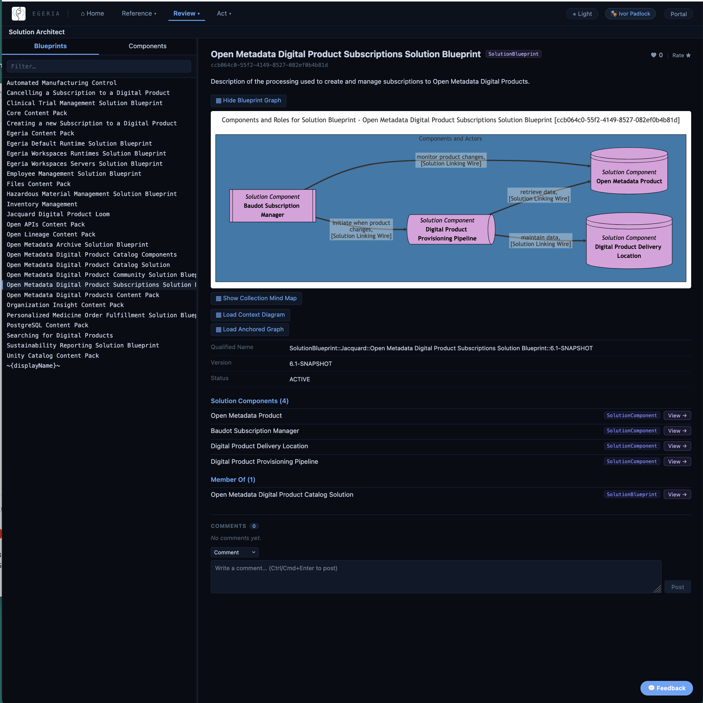
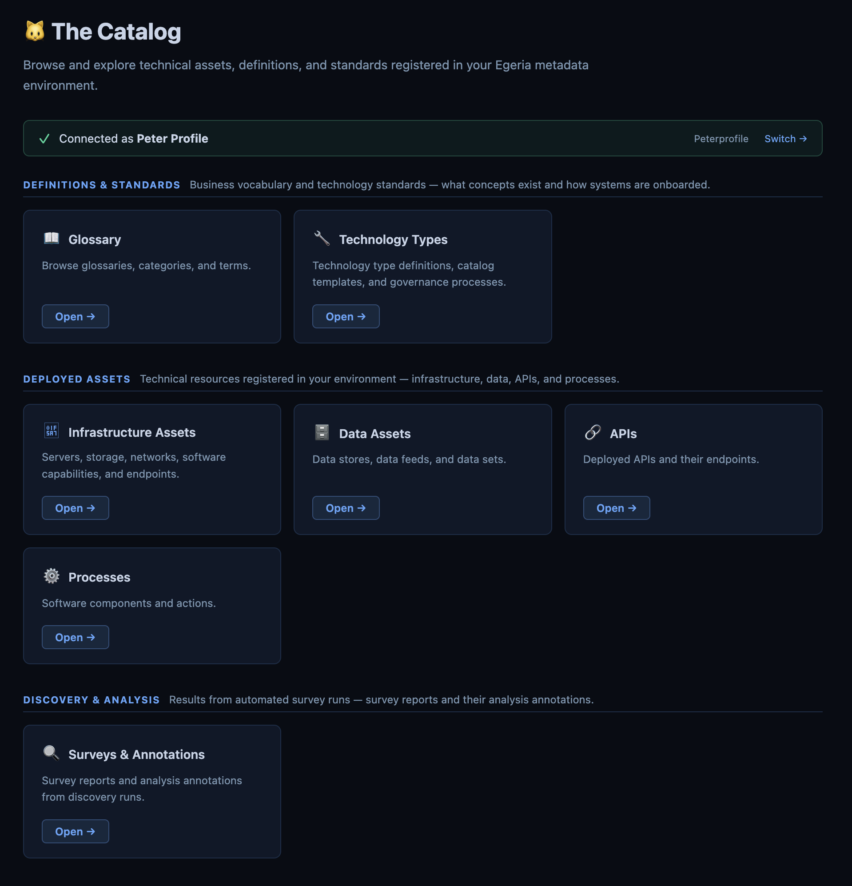
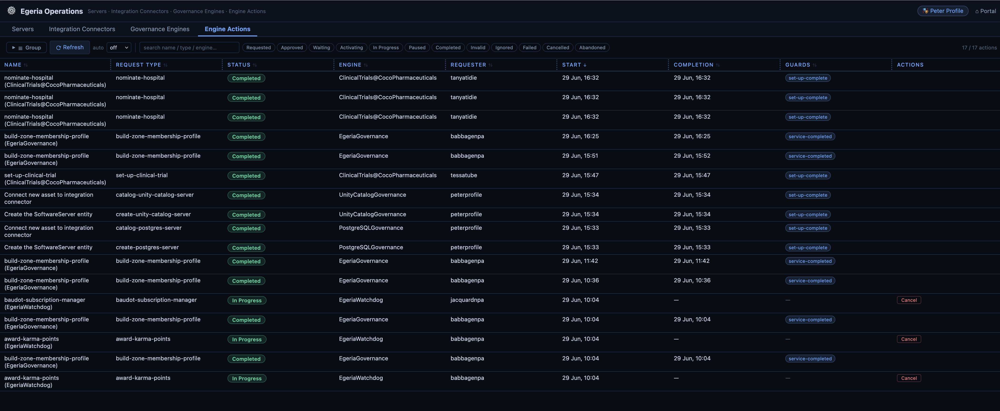
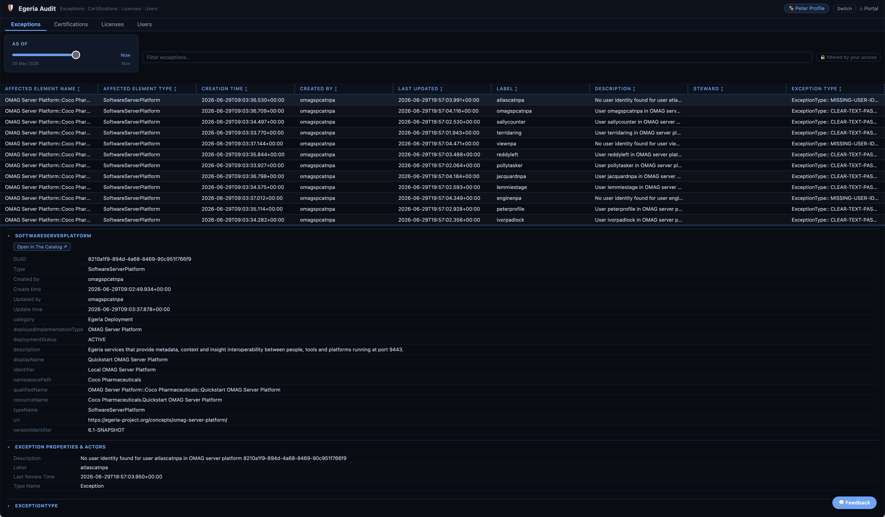
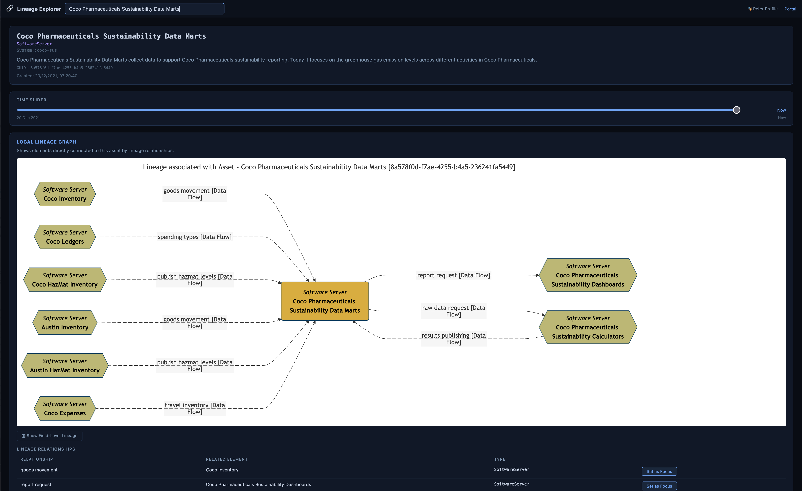

<!-- SPDX-License-Identifier: CC-BY-4.0 -->
<!-- Copyright Contributors to the Egeria project. -->

# Five Windows Into Your Metadata: Egeria's New Web User Interfaces

*By Mandy Chessell, Egeria Project Leader, Pragmatic Data Research (PDR) Ltd*

*Part 2 of a four-part series on recent work in the [Egeria](https://egeria-project.org/) project, an LF AI & Data project for open metadata and governance.*

---

Open metadata is only useful if people can actually see it. For most of its history, [Egeria](https://egeria-project.org/) has been strongest as a platform for developers and integrators — rich APIs, connectors, and event-driven services, but relatively little for someone who just wants to open a browser and look at what the organization knows about its data.

The 6.1 release changes that. Building on the simplified 6.0 platform described in [part one of this series](../blog-1-radical-simplification), the project shipped five purpose-built web user interfaces, each aimed at a different job to be done rather than one general-purpose console trying to do everything.

## Egeria Explorer

Egeria Explorer is the general-purpose entry point: a browser for searching, viewing, and navigating open metadata wherever it lives. It's the tool to reach for when you know roughly what you're looking for — a term, a solution, a person — but not exactly which repository or system holds it. Because it works across the whole metadata ecosystem rather than one connected repository, it gives a consistent view regardless of where the underlying data actually originates.

## The Catalog

Where Explorer is general-purpose, *The Catalog* is focused: it's a browser for the inventories that matter most day-to-day — infrastructure assets, data assets, APIs, and processes. If your job involves finding out what data assets exist, what shape they're in, and what depends on them, this is the interface built around that question specifically.

## Egeria Operations

Running Egeria in production means keeping an eye on servers, connectors, governance engines, and the actions they're carrying out. Egeria Operations gives operations teams a dashboard for exactly that — not just visibility into status, but the ability to act on it directly, issuing refresh, restart, and cancel commands against running components without dropping into the command line.

## Egeria Audit

Governance isn't only about cataloguing data — it's also about being able to demonstrate control. Egeria Audit is where that evidence lives: exceptions, certifications, licenses, and user records, with the ability to manage user status and handle password resets. It's the interface aimed squarely at compliance, security, and administrative teams who need an audit trail, not just a search box.

## Lineage Explorer

Lineage is one of those things that's easy to describe and hard to actually see. Lineage Explorer renders lineage graphs at different levels of detail, letting analysts move between a high-level system-to-system view and a detailed, field-level trace of how a particular piece of data got where it is. That flexibility matters — the level of detail useful for an impact assessment is rarely the level of detail useful for a regulatory inquiry, and forcing everyone through one fixed view doesn't serve either well.

## Why five interfaces instead of one

It would have been simpler, in one sense, to build a single console with five tabs. The project deliberately didn't do that. Each of these interfaces has a different primary audience — data stewards, asset owners, operators, auditors, analysts — and each benefits from being able to evolve independently, be deployed independently, and stay focused on the questions its audience actually asks. That mirrors the same philosophy behind the 6.0 platform simplification: fewer concepts, but each one doing its job cleanly, rather than one interface trying to be everything to everyone.

Together, the five UIs turn Egeria from something you mostly experience through APIs and connectors into something anyone in the organization can open in a browser and use.  

## What's next

Interfaces are only half the story — they're only as good as the metadata behind them. The next post in this series looks at how Egeria is now getting that metadata out of your existing databases and catalogs with minimal manual effort, through a new generation of connectors.

*Try the interfaces yourself, or read more, at [egeria-project.org/user-interfaces](https://egeria-project.org/user-interfaces/).*

*Previous: [Egeria 6.0: Doing More With Half the Footprint](../blog-1-radical-simplification) · Next: [Egeria's Growing Connector Library](../blog-3-new-connectors)*
