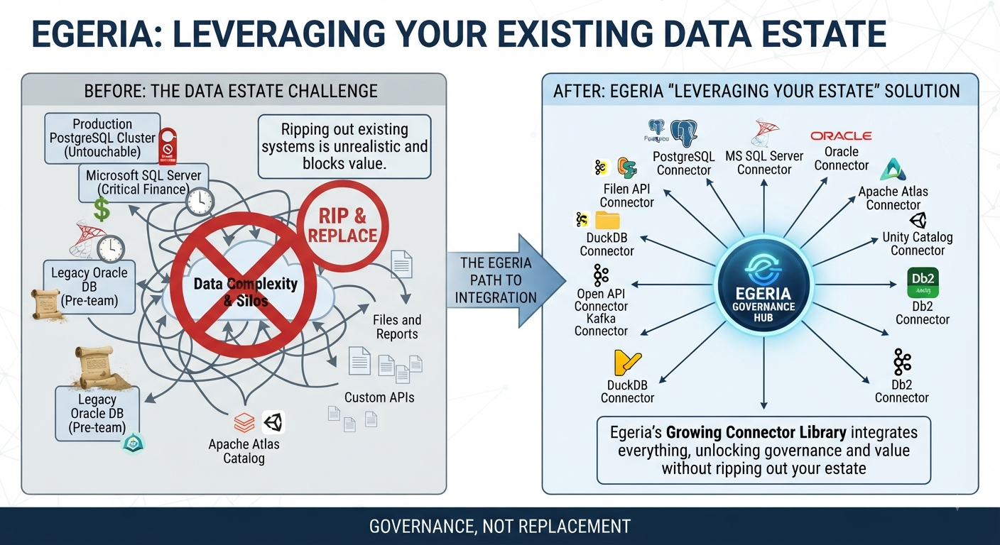

<!-- SPDX-License-Identifier: CC-BY-4.0 -->
<!-- Copyright Contributors to the Egeria project. -->

# You Don't Need to Migrate Everything to Catalog It: Egeria's Growing Connector Library

*By Mandy Chessell, Egeria Project Leader, Pragmatic Data Research (PDR) Ltd*

*Part 3 of a four-part series on recent work in the [Egeria](https://egeria-project.org/) project, an LF AI & Data project for open metadata and governance.*

---

Most organizations don't get to catalog their data estate from a clean slate. There's a production PostgreSQL cluster nobody wants to touch, a Microsoft SQL Server instance running a critical finance workload, an Oracle database that predates half the current team, and probably an existing catalog — Apache Atlas or Unity Catalog — that some part of the business already relies on. Ripping all of that out to adopt a new governance platform is rarely realistic, and it shouldn't be a precondition for getting value from one.

That's the problem the [Egeria](https://egeria-project.org/) project's "[leveraging your estate](https://egeria-project.org/egeria-solutions/leveraging-your-estate/)" solution set is built to solve, and it's been growing steadily. The connector library now reaches PostgreSQL, Microsoft SQL Server, Oracle Database, Db2 for Linux/UNIX/Windows, DuckDB, Apache Kafka, Apache Atlas, Unity Catalog, and generic Open APIs and file-based resources — with more on the way.

## Survey first, migrate never (if you don't need to)

The design intent behind these connectors is captured well by the project's own framing: they exist to "survey and analyse existing deployments of data pipelines and platforms to help you identify where the value lies." That's a deliberately different goal from wholesale migration. A connector doesn't ask you to move your data or change how a system is operated — it asks the system for a description of itself.

Concretely, each connector:

- **Extracts structural metadata** — schemas, tables, columns, functions, and the other building blocks of a data store or pipeline.
- **Captures operational information**, including lineage and usage patterns, so you can see not just what exists but how it's actually being used.
- **Mines existing catalogs**, where one is already in place, pulling in and augmenting definitions that Atlas or Unity Catalog already hold rather than duplicating that effort from scratch.
- **Tracks dynamic signals** over time — when something was created, when it was last accessed, how actively it's used — turning a one-time survey into a living picture.

## Why this matters for modernization planning

Selective, non-disruptive cataloguing sounds like a small technical detail, but it changes the shape of a modernization program. Instead of a big-bang migration where governance is bolted on at the end, teams can run Egeria's connectors alongside legacy platforms from day one, building a comprehensive, cross-system picture of how everything actually interacts and depends on everything else — before committing to what should move, what should be retired, and what should stay exactly where it is.

That's also, not coincidentally, why the connector library keeps expanding one database vendor at a time. Each new connector — Microsoft SQL Server and Oracle Database are recent additions alongside the original PostgreSQL support — follows the same pattern established by the first: connect, survey structure, capture lineage and usage, and feed it all into the same open metadata model that the rest of the platform already understands. A connector for a new vendor doesn't require a new way of thinking about metadata; it just requires teaching Egeria how to ask that vendor's system the same questions it already asks everyone else.

## The bigger picture

Estate cataloguing connectors are, in a sense, the practical complement to the simplification work covered earlier in this series. A leaner platform ([part one](../blog-1-radical-simplification)) and clearer interfaces ([part two](../blog-2-five-new-user-interfaces)) matter less if getting real metadata into the system is expensive. These connectors are how Egeria stays useful in the messy, heterogeneous environments most organizations actually run — without asking anyone to migrate first and catalog later.

## What's next

Connectors and interfaces are one thing in the abstract and another thing applied to a real (if fictional) organization. The final post in this series looks at Coco Pharmaceuticals — Egeria's long-running example company — and the governance scenarios the project has recently expanded around it.

*Explore the full connector catalog at [egeria-project.org/egeria-solutions/leveraging-your-estate](https://egeria-project.org/egeria-solutions/leveraging-your-estate/).*

*Previous: [Five Windows Into Your Metadata](../blog-2-five-new-user-interfaces) · Next: [How Coco Pharmaceuticals Puts Egeria's Governance Model to Work](../blog-4-coco-pharmaceuticals)*
