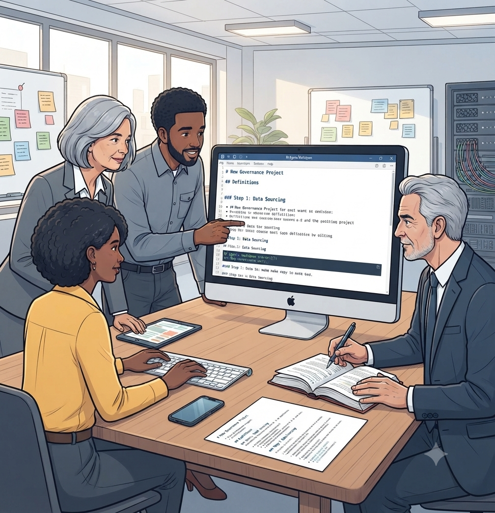
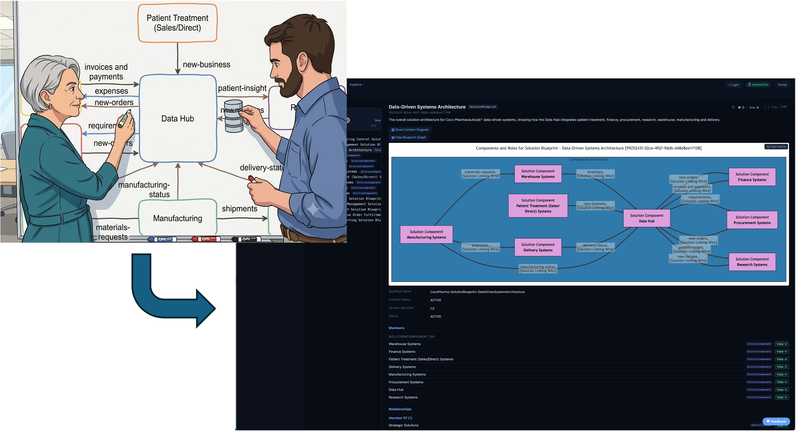

<!-- SPDX-License-Identifier: CC-BY-4.0 -->
<!-- Copyright Contributors to the Egeria project. -->

# Better Data for Everyone: How Coco Pharmaceuticals Puts Egeria's Governance Model to Work

*By Mandy Chessell, Egeria Project Leader, Pragmatic Data Research (PDR) Ltd*

*Part 4 of a four-part series on recent work in the [Egeria](https://egeria-project.org/) project, an LF AI & Data project for open metadata and governance.*

---

Governance concepts are easy to describe in the abstract and hard to make concrete. "Assign a data owner" or "establish a data sharing hub for protected information" mean very different things depending on the organization, the regulation, and the data involved. That's exactly why the [Egeria](https://egeria-project.org/) project maintains [Coco Pharmaceuticals](https://egeria-project.org/practices/coco-pharmaceuticals/) — a detailed, fictional pharmaceutical company used throughout the documentation to turn governance patterns into working examples anyone can follow and reproduce.

## Who Coco Pharmaceuticals is

Coco Pharmaceuticals is a mid-sized company specializing in personalized medicine for cancer treatment, with research labs, manufacturing facilities, warehouses, and distribution centers spread across seven locations, plus research partnerships with universities and hospitals. It's fictional, but not arbitrary — the personas, org structure, and scenarios are drawn from patterns observed across more than a hundred real organizations in regulated and data-intensive industries, so the problems it works through are recognizable rather than contrived.

## A new CDO, a real mandate

The scenarios have recently been expanded around a company-wide initiative: Jules Keeper, Coco Pharmaceuticals' newly appointed Chief Data Officer, launches a data strategy under the banner "better data for everyone," backed by a genuine governance program rather than a policy document nobody reads. That initiative plays out as a series of concrete organizational moves — appointing data owners in departments like finance and clinical research, establishing data stewards for critical datasets, bringing security and privacy leadership into closer alignment with IT infrastructure management, and investing in master data management and metadata tooling to support all of it.

## What the expanded scenarios cover

The documentation walks through this initiative as a sequence of realistic situations, including:

- **Defining a data strategy and standing up a governance program** — the organizational groundwork that has to happen before any tooling decisions make sense.
- **Building governance teams that collaborate across domains** — because data owners, stewards, security, and IT rarely report to the same person, and the scenarios don't pretend otherwise.
- **Developing a digital service that handles personal data** — working through the governance obligations that come with any system touching individual-level information.
- **Establishing a data sharing hub for protected data** — a recurring need in pharma, where research collaboration depends on sharing sensitive data safely with external partners.
- **Sustainability reporting** — an increasingly common governance driver that has little to do with traditional IT security concerns and everything to do with accurate, traceable data.
- **IT security, user auditing, and fraud investigation response** — scenarios that lean directly on capabilities like [Egeria Audit](https://egeria-project.org/user-interfaces/), covered earlier in this series.

## Why a shared example matters

It would be possible to document each of Egeria's governance capabilities in isolation — here's how to define a governance domain, here's how to assign a steward, here's how audit records work. Coco Pharmaceuticals exists because governance capabilities are rarely used in isolation in practice. A data sharing hub for protected research data touches ownership, stewardship, security policy, and audit all at once, and the value of a shared fictional company is that readers can follow one continuous, coherent story across all of it, rather than reassembling the connections themselves from a set of disconnected feature docs.

It also gives the project a low-stakes place to work through hard, realistic problems — the kind that show up in regulated industries handling sensitive data at scale — without needing a real customer's data or a real incident to write about.

## Closing the series

Across this series we've looked at a platform that got smaller and more capable at the same time (6.0), five new interfaces that made its metadata visible to people who aren't developers (6.1's UIs), connectors that bring existing databases and catalogs into view without forcing migration, and now a worked example that ties governance capability back to a plausible organizational story. Individually, each is a meaningful piece of work; together, they represent a platform maturing from "a set of capabilities" toward "something a real governance team could actually run."

*Read the full set of scenarios at [egeria-project.org/practices/coco-pharmaceuticals](https://egeria-project.org/practices/coco-pharmaceuticals/), and follow along with the rest of the project at [egeria-project.org](https://egeria-project.org/).*

*Previous: [Egeria's Growing Connector Library](../blog-3-new-connectors)*
