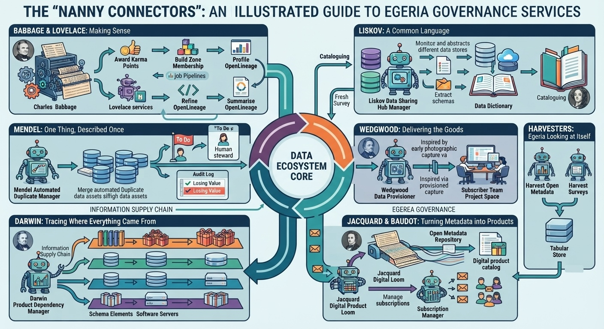

<!-- SPDX-License-Identifier: CC-BY-4.0 -->
<!-- Copyright Contributors to the Egeria project. -->

# Standing on the Shoulders of Giants: The Nanny Connectors That Keep AI's Context Trustworthy

*By Mandy Chessell, Egeria Project Leader, Pragmatic Data Research (PDR) Ltd*

*Part 5 of the series on recent work in the [Egeria](https://egeria-project.org/) project, an LF AI & Data project for open metadata and governance.*

---

Ask almost anyone building AI applications how they plan to give their models the right context and you will hear the same answer: a knowledge graph. It is a sensible answer. A graph of the things an organization cares about, and how they relate, is a far better grounding for a model than a pile of unrelated documents.

But a knowledge graph is a snapshot and often a single perspective. If one team is experimenting with one assistant, that is often enough. If you plan to make *widespread* use of AI - with dozens of agents and applications, each making decisions on the strength of the context it is handed - the graph has to be something you can trust, and that takes far more investment.

## Context is a living thing

Think about what widespread use of AI asks of the context behind it.

- **It has to stay current.** Data lands in new places, pipelines are rewired and systems are retired. Context that describes last quarter's estate quietly misleads every application that relies on it.
- **It has to be consistent.** The same customer, product or supplier is described in half a dozen systems. If an AI application sees them as half a dozen different things, its answers will be confidently wrong.
- **It has to say where things came from.** When an agent acts on some data, someone will want to know which systems and which processes produced it, and whether it is fit for the purpose.
- **It has to be delivered, not just stored.** Teams and applications need to discover the data that is available to them, ask for it, and get it in a form they can use - with an audit trail of who got what.
- **It has to be understandable.** Raw table and column names mean little to a person, and even less to a model. Someone has to add the meaning.
- **It has to be governed.** The more widely AI is used, the more it matters that everyone is working from the same agreed picture.

None of that is a modelling problem. It is an *operations* problem: somebody, or something, has to keep looking after the catalog. In a small deployment that "somebody" is a hard-pressed steward with a spreadsheet. At enterprise scale it has to be automated.

That is the job of Egeria's **Nanny Connectors**.

## Why "nanny"?

A nanny does not do the job of the family; a nanny looks after the household so the family can get on with life. The nanny connectors do the same for an open metadata deployment. They watch it, analyse it, tidy it up, connect it to the rest of the estate and hand its contents out to the people and applications that need them. They are integration connectors and governance services that run in the same [integration daemon](https://egeria-project.org/concepts/integration-daemon/) and [governance engines](https://egeria-project.org/concepts/governance-engine/) as every other connector, so they use the same open metadata APIs and the same audit log. There is nothing special about them beyond the work they do.

## Not a single-vendor world

Why does this need to be a family of connectors rather than a feature of one product? Because the landscape in a typical enterprise is not one product. It is a production database that nobody wants to touch, a lake, a warehouse, a stream of Kafka topics, a couple of catalogs from different eras, a scheduler, a notebook platform and a dozen SaaS applications - each with its own idea of what a dataset, an owner or a quality problem looks like.

No single one of those platforms can see the whole picture, and none of them has any incentive to keep the *others* accurately described. Egeria sits between them as a neutral, open metadata layer, and the [connector library](../blog-3-new-connectors) is how it learns about each one. The nanny connectors are what turn that accumulated knowledge into something that stays true, gets improved and gets used. The names they carry are a hint about the ambition: they are named in tribute to people whose ideas made this kind of work possible.

## Meet the giants

Each nanny connector is named after a person whose work contributed to the IT capability we take for granted today - some directly, some through the ideas that computing later borrowed. Between them they span two centuries:

- [**Charles Babbage**](https://en.wikipedia.org/wiki/Charles_Babbage) designed the Analytical Engine, the first general-purpose mechanical computer.
- [**Ada Lovelace**](https://en.wikipedia.org/wiki/Ada_Lovelace) wrote the first program for Babbage's machine and saw that it could work on more than numbers.
- [**Joseph Marie Jacquard**](https://en.wikipedia.org/wiki/Joseph_Marie_Jacquard) used punched cards to control a loom, an early demonstration that a machine can be programmed.
- [**Emile Baudot**](https://en.wikipedia.org/wiki/%C3%89mile_Baudot) devised the telegraph code and multiplexing that underpin modern data communication (the unit of signalling speed, the baud, is named after him).
- [**Thomas Wedgwood**](https://en.wikipedia.org/wiki/Thomas_Wedgwood_(photographer)) experimented with capturing images on light-sensitive surfaces, an early step towards recording and reproducing information.
- [**Gregor Mendel**](https://en.wikipedia.org/wiki/Gregor_Mendel) established the laws of inheritance, the model for deciding which properties a combined element takes from its parents.
- [**Charles Darwin**](https://en.wikipedia.org/wiki/Charles_Darwin) traced the ancestry of species, the same shape of problem as tracing the lineage of data.
- [**Barbara Liskov**](https://en.wikipedia.org/wiki/Barbara_Liskov) pioneered data abstraction and the substitution principle that underpin modern programming languages and system design.

The sections below describe what each connector does and why the name fits.

### Babbage and Lovelace: making sense of what has been collected

The *Babbage Analytical Engine* is an integration connector that orchestrates a set of analysis services, the *Lovelace Services*. Each Lovelace Service is a [governance service](https://egeria-project.org/concepts/governance-service/) that does one focused analysis on the knowledge graph and records what it finds as a classification on the root element it analysed. The current set includes:

- **Award Karma Points** - a healthy catalog depends on people contributing to it, and this service notices and rewards them.
- **Build Zone Membership Profile** - summarises the make-up of each governance zone.
- **Profile Pipeline Runs** - analyses the runs of each job in an [Open Lineage](https://openlineage.io/) log store and records their frequency, regularity, duration, failure rate and data volume against the job.
- **Refine Data Scope** - works out from the reads and writes of each dataset the pattern in which it is written and the window of data it covers based on Open Lineage events.
- **Summarise Data Quality** - turns the data quality assertions and tests found in the Open Lineage log store into a survey report with the pass rate of each quality dimension.

Notice what the last three have in common. The raw Open Lineage events are already being produced by the pipelines. What is missing is the *interpretation*: is this job reliable, how much history does this dataset hold, is its quality good enough for what I want to do? Those are exactly the questions an AI application, or the person who has to sign off on it, needs answered. The services are selected independently, so a deployment runs only the analyses it wants.

### Mendel: one thing, described once

When many systems describe the same real-world thing, the catalog fills with near-duplicates. The *Mendel Automated Duplicate Manager* takes its name from the geneticist because its survivorship rules decide which properties are inherited by the combined element derived from the neer-duplicates.

When a potential duplicate is discovered, Mendel either validates it, if the match is close enough, or raises a *to do* for a steward to decide. It also revisits its own earlier decisions: a match that has stopped being a match (say, because a qualified name was corrected) is withdrawn rather than left in place forever, while decisions taken by a human steward are never overturned. Once enough validated duplicates cluster together, they are merged into a single consolidated element that carries everything its members know.

Just as importantly, wherever the merge has to choose between conflicting values, the losing value is written to the audit log. A steward can see what was left behind instead of having to guess. For an AI application that asks "tell me about this customer", the difference between one well-formed answer and six competing ones is the difference between being useful and being misleading.

### Darwin: tracing where everything came from

The *Darwin Product Dependency Manager* traces the origin of each digital product's data. Lineage is captured in great detail - column to column mappings between individual schema elements - but the questions people ask are coarse-grained ones: which systems feed this server, and which products does this product depend on?

Darwin works upwards through three levels: from schema elements to the data assets that contain them, from data assets to the software servers that host them, and from data assets to the [digital products](https://egeria-project.org/concepts/digital-product/) that package them. At each level it follows the flow of data along a single [information supply chain](https://egeria-project.org/concepts/information-supply-chain/), and it maintains the resulting `DataFlow` and `DigitalProductDependency` relationships automatically. Dependencies that a person has asserted but that no lineage proves are not deleted; they are recorded as exceptions for someone to look at.

If an AI application is built on a digital product, this is how you find out what it is *really* built on - and what is affected when something upstream changes.

### Jacquard and Baudot: turning metadata into products

Joseph Marie Jacquard used punched cards to control a loom and weave complex patterns automatically. The *Jacquard Digital Product Loom* does the equivalent for metadata. It harvests data from the open metadata repositories and weaves it into [digital products](https://egeria-project.org/concepts/digital-product/) that are organized into a digital product catalog, so the ecosystem's own metadata is published in the same way as any other product.

Once there is a catalog of products, people need to subscribe to them. Emile Baudot, whose telegraph code was a foundation of modern data communication, gives his name to the **Baudot Subscription Manager**. It looks after the subscriptions to the products in the catalog, sending the welcome, one-time and periodic notifications that each subscriber is due, and reacting to changes in the resources being monitored as they arrive.

### Wedgwood: delivering the goods

A subscription is a promise to deliver data. The **Wedgwood Data Provisioner** (after Thomas Wedgwood), an early experimenter in capturing images) is the governance action service that keeps it. Called from the *Baudot Subscription Manager*, it provisions the data from the digital products to the systems or teams that subscribed to them for their projects.

Together, Jacquard, Baudot and Wedgwood make a complete loop: publish a product, subscribe to it, receive its data. For AI this matters because the alternative is every project building its own copy of the data through its own pipeline, with no record of what went where.

### Liskov: a common language for many data stores

Barbara Liskov's work on data abstraction is the inspiration for the **Liskov Data Sharing Hub Manager**. A data sharing hub is a collection of related data stores that together provide a data-oriented service to other systems or teams. Liskov monitors the schemas of those stores and maintains a **data dictionary** of the fields and structures they hold, identifying similar data in different stores and abstracting it away from the technical implementation. Curated descriptions can then be added to give the fields context and meaning.

A dictionary is only as good as the descriptions beneath it, so each time it runs Liskov also works to improve them. It follows the links from each member's technology type to the governance action types that know how to catalog and survey that type of technology, starts cataloguing if it is not already enabled, and requests a fresh survey so that the description of the contents stays up to date. Requests that are already outstanding are not duplicated, and the surveys that are not wanted can be excluded through configuration.

This is the connector that most directly addresses the point at which a model meets real data: the vocabulary that lets the business's words be matched to the columns that hold them.

### The harvesters: Egeria looking at itself

Finally, two external harvester connectors close the loop. **Harvest Open Metadata** publishes insights about the usage and activity in an open metadata ecosystem, and **Harvest Surveys** publishes insights about the surveys found in it, feeding them into a tabular store. It seems a little self-referential, but a metadata ecosystem is itself a system that needs monitoring. Which parts of the catalog are used? Where is the activity? Is the metadata getting better or worse? The Jacquard products built on these insights let a governance team, and an AI application, answer those questions with the same tools they use for everything else.

## Why it all matters for AI

Put the pieces together and a picture emerges of what "context management" actually requires:

| The need | The nanny connector |
|---|---|
| Interpret raw operational signals | Babbage and the Lovelace services |
| Keep one description of each real-world thing | Mendel |
| Know where data came from and what depends on it | Darwin |
| Publish data as products and manage who uses them | Jacquard and Baudot |
| Deliver the data to those who need it | Wedgwood |
| Give the data a shared, business-friendly vocabulary | Liskov |
| Monitor the health of the catalog itself | The harvesters |

A knowledge graph gives an AI application something to look at. The nanny connectors give it something it can *rely on* - and they do so continuously, without a person having to remember to do it, in an estate that no single vendor's product can see whole.

## Standing on the shoulders of giants

There is a reason every one of these connectors is named for a person from the history of computing, mathematics or science. None of the ideas involved is new. Babbage and Lovelace imagined machines that analyse; Jacquard and Baudot worked out how to feed instructions and messages to machines; Liskov taught us to hide the mess behind an abstraction; Mendel and Darwin gave us ways of thinking about inheritance and ancestry. Metadata management is, in the end, the discipline of applying those old ideas carefully and consistently to the data an organization depends on. The novelty is only that AI now makes the cost of not doing it a great deal more visible.

## What's next

The nanny connectors are still growing. The set of Lovelace services is expanding, the products that Jacquard weaves are widening and there will be more analyses to run over the lineage and quality information that is already flowing. The source and the documentation for every connector described here is in the [nanny-connectors module](https://github.com/odpi/egeria/tree/main/open-metadata-implementation/adapters/open-connectors/nanny-connectors) of the Egeria repository, and contributions are always welcome.

*Follow along with the rest of the project at [egeria-project.org](https://egeria-project.org/).*

*Previous: [How Coco Pharmaceuticals Puts Egeria's Governance Model to Work](../blog-4-coco-pharmaceuticals)*
