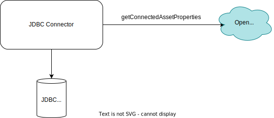

<!-- SPDX-License-Identifier: CC-BY-4.0 -->
<!-- Copyright Contributors to the ODPi Egeria project 2019. -->

### Working with connectors

An **open connector** is a Java client to a [digital resource](/concepts/digital-resource) that implements the **Connector** interface defined in the [Open Connector Framework (OCF)](/frameworks/ocf/overview). It has 2 parts to its interface:

- The specialized interface to work with the specific contents of the resource.  For example, if the connector was for data stored in a relational database, this interface would probably follow the 
  [Java Database Connectivity (JDBC)](https://en.wikipedia.org/wiki/Java_Database_Connectivity) specification.  The documentation for this interface is found with the specific connector. 

- A generalized interface to extract all the open metadata known about the resource.  This is referred to as the [**connected asset properties**](/concepts/connected-asset-properties).

> This is an example of the [JDBC Resource connector](/connectors/resource/jdbc-resource-connector)

An application creates a connector using the [Asset Consumer OMAS client](/services/omas/asset-consumer/overview/#creating-a-connector-for-application-use). When a [resource is catalogued](/concepts/assets) in  open metadata, there is a [Connection](/concepts/connection) object linked to it.  This defines all the properties required to create the connector.

See [Creating a connector](creating-a-connector.md) for step-by-step instructions on creating connectors. Asset Consumer OMAS looks up the Connection object and calls the [Connector Broker](/concepts/connector-broker) to create the connector.

Once the connector is created, an application may use it to retrieve the content of the asset and the connected asset properties.

When the application has finished with the connector, it should call `disconnect()` to release any resources that the connector may be holding.

