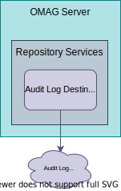

<!-- SPDX-License-Identifier: CC-BY-4.0 -->
<!-- Copyright Contributors to the ODPi Egeria project. -->

# Audit Log Destination Connector

An *[audit log destination connector](/concepts/audit-log-destination-connector)* provides support for a specific *audit log destination*. At least one audit log destination connector is [configured](/concepts/audit-log/#configure-the-audit-log) in every [OMAG Server's](/concepts/omag-server) [configuration document](/concepts/configuraton-document) and used by its [audit log](/concepts/audit-log) component when the server runs.

An audit log destination's purpose may be either to store, process or distribute audit log records to diagnostic systems.  Its associated configuration controls which severities of audit log record it receives.  The implementation for the audit log destination connector can make further choices about how each log record is processed.

An [OMAG Server](/concepts/omag-server) can have [multiple audit log destinations](/guides/admin/servers/by-section/respository-services-section/#configuring-the-audit-log) configured.  This configuration can control which severities of audit log record are sent to each destination.

The implementation for the audit log destination connector can make further choices about how each log record is processed.

The interface for audit log destination connectors is located in the
[repository-services-apis](https://github.com/odpi/egeria/tree/main/open-metadata-implementation/repository-services/repository-services-apis/src/main/java/org/odpi/openmetadata/repositoryservices/connectors/stores/auditlogstore) module.  The audit log destination connectors implemented by Egeria are described in the [connector catalog](/connectors/#audit-log-destination-connectors).

The audit log destination connectors supplied with Egeria are described in the [Connector Catalog](/connectors/#audit-log-destination-connectors)

## Egeria Audit Log Destination Connectors

Below are the connector implementations provided by Egeria

* [Console Audit Log Connector :material-github:](https://github.com/odpi/egeria/tree/main/open-metadata-implementation/adapters/open-connectors/repository-services-connectors/audit-log-connectors/audit-log-console-connector){ target=gh } writes selected parts of each audit log record to stdout.

* [slf4j Audit Log Connector :material-github:](https://github.com/odpi/egeria/tree/main/open-metadata-implementation/adapters/open-connectors/repository-services-connectors/audit-log-connectors/audit-log-slf4j-connector){ target=gh } writes full log records to the slf4j ecosystem.

* [File Audit Log Connector :material-github:](https://github.com/odpi/egeria/tree/main/open-metadata-implementation/adapters/open-connectors/repository-services-connectors/audit-log-connectors/audit-log-file-connector){ target=gh } creates log records as JSON files in a shared directory.

* [Event Topic Audit Log Connector :material-github:](https://github.com/odpi/egeria/tree/main/open-metadata-implementation/adapters/open-connectors/repository-services-connectors/audit-log-connectors/audit-log-event-topic-connector){ target=gh } sends each log record as an event on the supplied event topic.

* [Console Event Display Audit log Destination :material-github:](https://github.com/odpi/egeria/tree/main/open-metadata-implementation/adapters/open-connectors/repository-services-connectors/audit-log-connectors/audit-log-console-event-display-connector){ target=gh } displays the content of events in the console when they are both received and sent.

* [PostgreSQL Audit Log Destination :material-github:](https://github.com/odpi/egeria/tree/main/open-metadata-implementation/adapters/open-connectors/repository-services-connectors/audit-log-connectors/audit-log-postgres-connector){ target=gh } stores audit logs in a PostgreSQL database.

??? education "Further information relating to Audit Log Destination Connectors"

    - [Configuring a Audit Log Destination Connector](/concepts/audit-log/#configure-the-audit-log) in the [Cohort Member](/concepts/cohort-member) server
    - [Audit Log Framework (ALF)](/frameworks/alf/overview) to understand the framework behind the audit log.
    - [Writing a Audit Log Destination Connector](/guides/developer/runtime-connectors/audit-log-destination-connector).

---8<-- "snippets/abbr.md"
