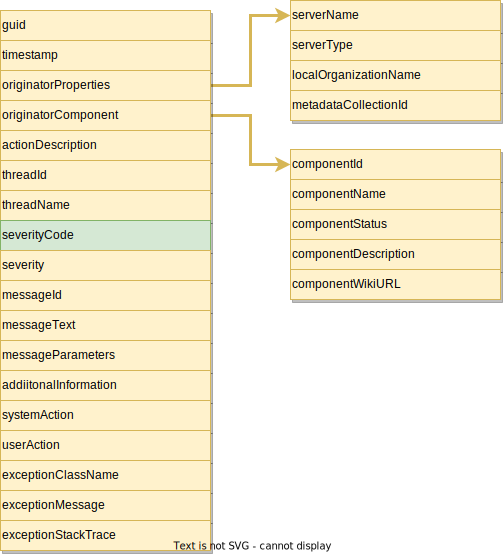

<!-- SPDX-License-Identifier: CC-BY-4.0 -->
<!-- Copyright Contributors to the Egeria project. -->

The audit log provides detailed information relating to the activities within an [OMAG Server](/concepts/omag-server).

The audit log is implemented by the [Open Metadata Repository Services](/services/omrs/component-descriptions/audit-log). It builds on the [Audit Log Framework](/frameworks/alf/overview) to support [multiple destinations](/concepts/audit-log-destination-connector) for the audit log records written to the audit log by the server's subsystems.

Each audit log record written to the audit log includes information about the component that created it, the server/thread it was running in, a severity code, message description and information on how to fix the problem.

> **Figure 1:** Structure of the audit log record.  

The structure is defined by the Audit Log Framework (ALF).  The Open Metadata Repository Services (OMRS) extends the record structure with the list of severity codes designed for the open metadata ecosystem.

| Severity Code | Severity      | Description                                                                                                                                                                                                                         |
|---------------|---------------|-------------------------------------------------------------------------------------------------------------------------------------------------------------------------------------------------------------------------------------|
| 1             | `Information` | The server is providing information about its normal operation.                                                                                                                                                                     |
| 2             | `Event`       | An event was received from another member of the open metadata repository cohort.                                                                                                                                                   |
| 3             | `Decision`    | A decision has been made related to the interaction of the local metadata repository and the rest of the cohort.                                                                                                                    |
| 4             | `Action`      | An Action is required by the administrator. At a minimum, the situation needs to be investigated and if necessary, corrective action taken.                                                                                         |
| 5             | `Error`       | An error occurred, possibly caused by an incompatibility between the local metadata repository and one of the remote repositories. The local repository may restrict some of the metadata interchange functions as a result.        |
| 6             | `Exception`   | An unexpected exception occurred. This means that the server needs some administration attention to correct configuration or fix a logic error because it is not operating as a proper peer in the open metadata repository cohort. |
| 7             | `Security`    | Unauthorized access to a service or metadata instance has been attempted.                                                                                                                                                           |
| 8             | `Startup`     | A new component is starting up.                                                                                                                                                                                                     |
| 9             | `Shutdown`    | An existing component is shutting down.                                                                                                                                                                                             |
| 10            | `Asset`       | An auditable action relating to an asset has been taken.                                                                                                                                                                            |
| 11            | `Types`       | Activity is occurring that relates to the open metadata types in use by this server.                                                                                                                                                |
| 12            | `Cohort`      | The server is exchanging registration information about an open metadata repository cohort that it is connecting to.                                                                                                                |
| 13            | `Trace`       | This is additional information on the operation of the server that may be of assistance in debugging a problem. It is not normally logged to any destination, but can be added when needed.                                         |
| 14            | `PerfMon`     | This log record contains performance monitoring timing information for specific types of processing. It is not normally logged to any destination, but can be added when needed.                                                    |
| 15            | `Activity`    | This log record describes the activity of users. It is not normally logged to any destination, but can be added when needed.                                                                                                        |
| 0             | `<Unknown>`   | Uninitialized Severity                                                                                                                                                                                                              |

