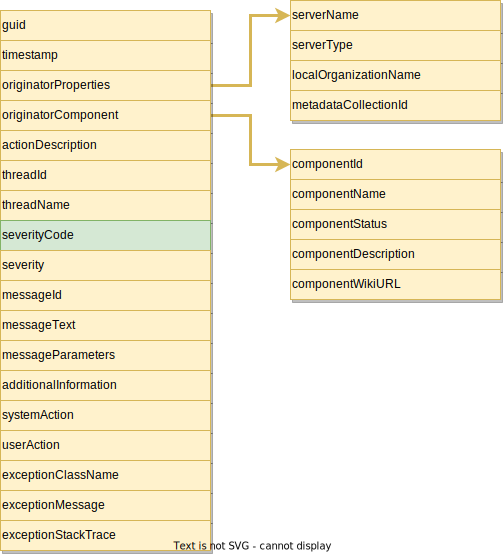

---
hide:
- toc
---

<!-- SPDX-License-Identifier: CC-BY-4.0 -->
<!-- Copyright Contributors to the Egeria project. -->

# Audit Log

The audit log provides detailed information relating to the activities within an [OMAG Server](/egeria-docs/concepts/omag-server).

It builds on the [Audit Log Framework](/egeria-docs/frameworks/alf/overview) to support [multiple destinations](/egeria-docs/concepts/audit-log-destination-connector) for the audit log records written to the audit log by the server's subsystems.

> **Figure 1:** Structure of the audit log record

There is more information on the use of audit logging in the [Diagnostic Guide](/egeria-docs/guides/diagnostic).

--8<-- "docs/guides/admin/servers/configuring-the-audit-log.md"

--8<-- "snippets/abbr.md"
