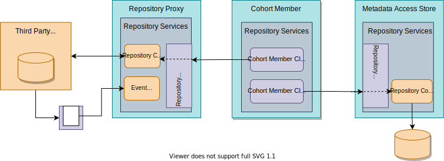

<!-- SPDX-License-Identifier: CC-BY-4.0 -->
<!-- Copyright Contributors to the ODPi Egeria project 2020. -->

# Cohort Member Client Connector

Members of an [Open Metadata Repository Cohort](/concepts/cohort-member) provide the other cohort members with a Connection to a connector that supports the OMRSRepositoryConnector interface during the cohort registration process. This connector translates calls to retrieve and maintain metadata in the member's repository into remote calls to the real repository.

## Egeria Cohort Member Client Connectors

Egeria's [Open Metadata Repository Services (OMRS)](/services/omrs) provides a default REST API implementation and a corresponding client:

* [REST Cohort Client Connector :material-github:](https://github.com/odpi/egeria/tree/main/open-metadata-implementation/adapters/open-connectors/repository-services-connectors/open-metadata-collection-store-connectors/omrs-rest-repository-connector){ target=gh }
  supports remote calls to the OMRS REST API.

The connection for this connector is configured in the `LocalRepositoryRemoteConnection` property of the
cohort member's [Local Repository Configuration](/user/guides/admin/servers/by-section/#configuring-the-local-repository-store).

--8<-- "snippets/abbr.md"

