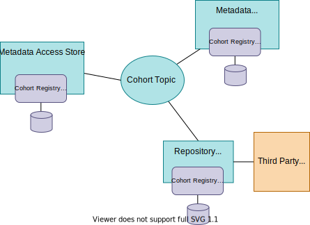
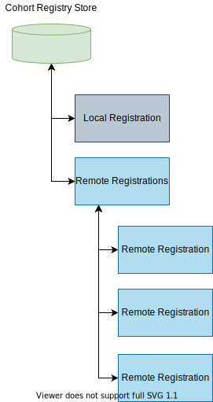

<!-- SPDX-License-Identifier: CC-BY-4.0 -->
<!-- Copyright Contributors to the ODPi Egeria project. -->

# Cohort Registry Store Connector

The *cohort registry store* maintains information about the servers registered in an *[open metadata repository cohort](/concepts/cohort-member)*.  It resides in each *cohort member* and represents that member's view of the cohort membership.   It contains the registration information sent by this member and the responses received from the other members.

Inside the cohort registry store there is one local registration record describing the information sent to the other members of the cohort and a list of remote registration records received from the other members of the cohort.

A *cohort registry store connector* manages the persistence of the cohort registry store.  Egeria uses a connector to allow different storage methods for different deployment environments.  Each member may choose their own implementation of the cohort registry store connector.

## Egeria Cohort Registry Store Connectors

Egeria provides a single implementation of a cohort registry store connector:

* [Cohort Registry File Store Connector :material-github:](https://github.com/odpi/egeria/tree/main/open-metadata-implementation/adapters/open-connectors/repository-services-connectors/cohort-registry-store-connectors/cohort-registry-file-store-connector){ target=gh }
  provides the means to store the cohort registry membership details as a JSON file.

??? education "Further information relating to Cohort Registry Store Connectors"

    - [Configuring a Cohort Registry Store Connector](/guides/admin/servers/by-section/repository-services-section/#registering-the-server-with-a-cohort) in the [Cohort Member](/concepts/cohort-member) server.
    - [Cohort Operations](/features/cohort-operations/overview) to understand the way the cohort is formed.
    - [Writing a Cohort Registry Store Connector](/guides/developer/runtime-connectors/cohort-registry-store-connector).

---8<-- "snippets/abbr.md"
