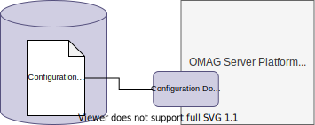

<!-- SPDX-License-Identifier: CC-BY-4.0 -->
<!-- Copyright Contributors to the ODPi Egeria project 2020. -->

# Configuration Document Store Connector

The configuration store connectors contain the connector implementations that manage the storage of [Configuration Documents](/concepts/configuration-document) for [OMAG Servers](/concepts/configuration-document).



There is one configuration document store connector defined for each [OMAG Server Platform](/concepts/omag-server-platform).


The configuration document's persistence is managed by the [configuration document store connector](/concepts/configuration-document-store-connector).

By default, the configuration document is stored as an encrypted JSON in a file under the default directory for the [OMAG Server Platform](/concepts/omag-server-platform) that creates them.

Configuration documents may contain security certificates and passwords and so should be treated as sensitive. It is possible to [change the storage location](/guides/admin/configuring-the-omag-server-platform) of configuration documents - or even the type of store.


??? question "Configuration document store connector interface"
    The [admin-services-api :material-github:](https://github.com/odpi/egeria/tree/main/open-metadata-implementation/admin-services/admin-services-api){ target=gh } module provides the interface definition for this connector. Its interface is simple -- consisting of save, retrieve and delete operations:

    ```java
    /**
     * OMAGServerConfigStore provides the interface to the configuration for an OMAG Server.  This is accessed
     * through a connector.
     */
    public interface OMAGServerConfigStore
    {
        /**
         * Save the server configuration.
         * 
         * @param configuration configuration properties to save
         */
        void saveServerConfig(OMAGServerConfig   configuration);
    
    
        /**
         * Retrieve the configuration saved from a previous run of the server.
         *
         * @return server configuration
         */
        OMAGServerConfig  retrieveServerConfig();
    
    
        /**
         * Remove the server configuration.
         */
        void removeServerConfig();
    }
    ```

The configuration document is represented by the [`OMAGServerConfig`](https://odpi.github.io/egeria/org/odpi/openmetadata/adminservices/configuration/properties/OMAGServerConfig.html) structure. The name of the server is stored in the `localServerName` property in `OMAGServerConfig`.

### Sample implementations

This is the standard implementation of the configuration document store connector provided by Egeria.


* **[File Configuration Store :material-github:](https://github.com/odpi/egeria/tree/main/open-metadata-implementation/adapters/open-connectors/configuration-store-connectors/configuration-file-store-connector){ target=gh }** stores each configuration document as a clear text JSON file.


??? education "Further information relating to Configuration Document Store Connectors"

    - [Configuring a Configuration Document Store Connector](/guides/admin/configuring-the-omag-server-platform/#configuration-store) in the [OMAG Server Platform](/concepts/omag-server-platform)
    - [Writing a Configuration Document Store Connector](/guides/developer/runtime-connectors/configuration-document-store-connector).


--8<-- "snippets/abbr.md"
