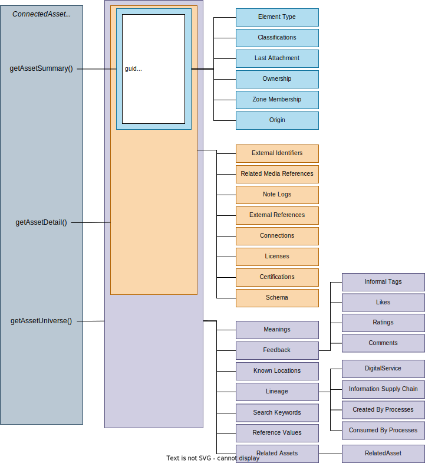

<!-- SPDX-License-Identifier: CC-BY-4.0 -->
<!-- Copyright Contributors to the ODPi Egeria project. -->

# Connected Asset Properties

*Connected Asset Properties* are the properties known about an asset accessed through a connector. These properties are presented at three levels:

- [AssetSummary](#asset-summary)
- [AssetDetails](#asset-detail)
- [AssetUniverse](#asset-universe)

> **Figure 1:** The structure of the connected asset properties

## Asset Summary

AssetSummary holds asset properties that are used for displaying details of an asset in summary lists or hover text.  It includes the following properties:

 - *type* - metadata type information for the asset
 - *guid* - [globally unique identifier](/concepts/guid) for the asset
 - *url* - external link for the asset
 - *qualifiedName* - The official (unique) name for the asset. This is often defined by the IT systems management organization and should be used (when available) on audit logs and error messages.
    
    (Sourced from the qualifiedName attribute in Referenceable - [model 0010](/types/0/0010-Base-Model))
    
 - *resourceName* - The name of the resource.  This is extracted from the resource's implementation when it is catalogued. 
    
    (Sourced from name attribute within Asset - [model 0010](/types/0/0010-Base-Model)))

 - *displayName* - A consumable name for the resource for use on user interfaces and messages.  This is typically the business name that.

    (Sourced from displayName attribute within GlossaryTerm - [model 0330](/types/3/0330-Terms) - linked via the [Supplementary Properties](/types/3/0395-Supplementary-Properties)) relationship.

 - *displaySummary* - A short description for the resource for use in summary tables on user interfaces or messages.

    (Sourced from summary attribute within GlossaryTerm - [model 0330](/types/3/0330-Terms) - linked via the [Supplementary Properties](/types/3/0395-Supplementary-Properties)) relationship.

 - *abbreviation* - A short for the asset for use in summary tables on user interfaces or messages.

    (Sourced from abbreviation attribute within GlossaryTerm - [model 0330](/types/3/0330-Terms) - linked via the [Supplementary Properties](/types/3/0395-Supplementary-Properties)) relationship.

 - *usage* - A short for the asset for use in summary tables on user interfaces or messages.

    (Sourced from usage attribute within GlossaryTerm - [model 0330](/types/3/0330-Terms) - linked via the [Supplementary Properties](/types/3/0395-Supplementary-Properties)) relationship.

 - *resourceDescription* - Description of the resource extracted from the resource's implementation when it was catalogued.
    
    (Sourced from description attribute within Asset - [model 0010](/types/0/0010-Base-Model)))

 - *displayDescription* - full description of the resource - typically from a business perspective.

    (Sourced from description attribute within GlossaryTerm - [model 0330](/types/3/0330-Terms) - linked via the [Supplementary Properties](/types/3/0395-Supplementary-Properties)) relationship.

 - *connectionDescription* - short description about the resource from the perspective of a connection.  The connection may restrict the access to the resources data and so this information is specific to the connection use.

    (Sourced from assetSummary within ConnectionsToAsset - [model 0205](/types/2/0205-Connection-Linkage)) and only filled out if the request for the asset is via a connection.

 - *owner* - name of the person or organization that owns the asset/resource.
    
    (Sourced from the AssetOwnership Classification - [model 0445](/types/4/0445-Governance-Roles)).
 
 - *zoneMembership* - list of governance zones assigned to the asset.
 
    (Sourced from the AssetZoneMembership classification - [model 0445](/types/4/0424-Governance-Zones)))
 
 - *classifications* - full list of the classifications assigned to the asset along with their properties.

## Asset Detail

*AssetDetail* extends *AssetSummary* to provide all the properties directly related to this asset.  It includes:

* *schema* - details of the schema type associated with the asset.

* *external identifiers* - list of identifiers for this asset/resource that are used in other systems.
 
* *related media references* - list of links to external media (images, audio, video) about this asset/resource.
 
* *note logs* - list of NoteLogs for this asset, often providing more detail on how to use the resource and its current status.
 
* *external references* - list of links to additional information about this asset/resource.
 
* *connections* - list of connections defined to access this resource.
 
* *licenses* - list of licenses associated with the asset/resource.
 
* *certifications* - list of certifications that have been awarded to this asset/resource.

## Asset Universe

AssetUniverse extends AssetDetail which extend AssetSummary.  AssetUniverse adds information about the common open metadata entities related to this asset.

 * *meanings* - glossary term(s) assigned to this asset via the [SemanticAssignment](/types/3/0370-Semantic-Assignment) relationship.

 * *reference values* - valid values(s) assigned to this asset via the [ReferenceValueAssignment](/types/5/0545-Reference-Value-Assignment) relationship.

 * *search keywords* - search keywords assigned to this asset.
 
 * *feedback* - details of the likes, reviews and comments, that are connected to the asset.
 
 * *knownLocations* - details of the known locations of the resource.
 
 * *lineage* - details of the lineage for the resource.
 
 * *relatedAssets* - details of the assets linked to this asset.

## Implementation details

The [Connector Broker](/concepts/connector-broker) does not have access to a metadata repository because the OCF is metadata repository neutral. When it creates a connector, the connected asset properties are null.

The Open Metadata Access Services (OMASs) such as [Asset Consumer OMAS](/services/omas/asset-consumer/overview) and [Asset Owner OMAS](/services/omas/asset-owner/overview) include the connector broker in their clients and support APIs for managing connections and creating connectors.

Connectors created by the Egeria access services will include the Connected Asset Properties object configured to retrieve metadata from the same open metadata repository where the OMAS is running.

The Connected Asset Properties are retrieved from the open metadata repositories by [OCF Metadata Management](/services/ocf-metadata-management). It will use the same user id that was used to create the connector.

--8<-- "snippets/abbr.md"