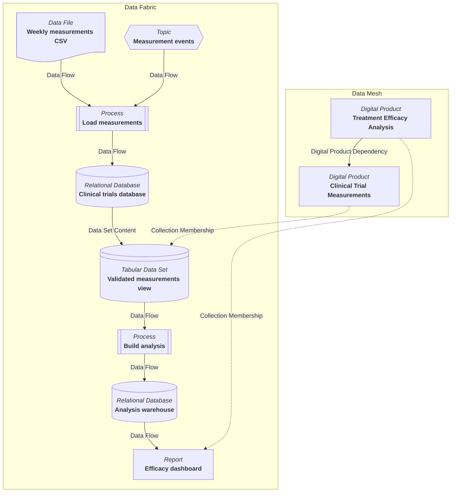

<!-- SPDX-License-Identifier: CC-BY-4.0 -->
<!-- Copyright Contributors to the Egeria project. -->

# Data fabric

The *data fabric* is the technical landscape that stores data and moves it about.  It consists of the [digital resources](/concepts/digital-resource) that are responsible for storing data, the processes that move and transform it, and the [data sets](/types/2/0210-Data-Stores) that provide views over the stored data.  The [lineage](/concepts/lineage) relationships between these resources show how data flows across the fabric, and they are also the means by which the operation of the fabric is monitored and controlled.

The data fabric is the foundation that the [data mesh](/concepts/data-mesh) is built on.  A [digital product](/concepts/digital-product) is a business-level package of data whose contents are supplied by resources in the data fabric.  The dependencies between digital products in the data mesh are therefore a summary of the data flows that occur in the fabric beneath them.  Where the data mesh answers the question "which products depend on which?", the data fabric answers the question "how does the data actually get there?".

In the example above, weekly measurement files and a stream of measurement events are loaded into the clinical trials database.  A validated view over that database is the asset that the *Clinical Trial Measurements* product delivers to its consumers.  The *Treatment Efficacy Analysis* product delivers a dashboard built from a warehouse that is itself loaded from the validated view.  The dependency between the two products in the data mesh is a summary of the chain of lineage relationships that runs through the data fabric from the validated view to the dashboard.

## What makes up the data fabric

Every element of the data fabric is catalogued as an [asset](/concepts/asset).  The asset is the metadata that describes the digital resource; the resource itself sits in the technology that hosts it, and Egeria reaches it through the asset's [connection](/concepts/connection).  The assets fall into three groups.

### Resources that store data

These are the [*DataStore*](/types/2/0210-Data-Stores) assets that describe physical repositories of data, along with the [*DataFeed*](/types/2/0210-Data-Stores) assets that describe a continuous supply of data.  The open metadata types cover a wide range of technology:

* [files and folders](/types/2/0220-Files-and-Folders), including [document stores](/types/2/0221-Document-Stores), [archive files](/types/2/0226-Archive-Files) and [keystores](/types/2/0227-Keystores);
* [databases](/types/2/0224-Databases) and [graph stores](/types/2/0222-Graph-Stores);
* [topics and logs](/types/2/0223-Events-and-Logs) that carry events and continuous data feeds;
* [metadata repositories](/types/2/0225-Metadata-Repositories), which store data about data;
* [reports](/types/2/0239-Reports) and [analytics models](/types/2/0265-Analytics-Assets), which hold the results of processing.

The *deployedImplementationType* property of each asset identifies the class of technology it is implemented in.  The [deployed implementation type](/concepts/deployed-implementation-type) valid values define the technology types that Egeria knows how to connect to and survey.

### Resources that move data

Data moves through the fabric under the control of [processes](/concepts/process).  A process is also an asset, since the organization depends on it and must govern it in the same way as the data it acts on.  The processes of the data fabric include:

* [deployed software components](/types/2/0215-Software-Components) such as extract-transform-load jobs, streaming applications and scheduled scripts;
* the [software capabilities](/concepts/software-capability) that host them, such as data processing engines, database managers and event brokers;
* [deployed APIs](/types/2/0212-Deployed-APIs), which are access points through which data passes into and out of the fabric;
* the [connectors](/concepts/connector) and [integration daemons](/concepts/integration-daemon) that Egeria itself runs to catalogue the fabric and synchronize data between resources.

The inputs and outputs of a process are described by its [ports](/types/2/0217-Ports), each with a schema for the data it carries.

### Data sets that provide views

A [*DataSet*](/types/2/0210-Data-Stores) is a collection of related data that does not need to be stored together.  It is dynamically constructed on request from one or more underlying resources, using the logic recorded in its *formula* property.  The [*DataSetContent*](/types/2/0210-Data-Stores) relationship links the data set to each resource that supplies it, and records the query used to extract that resource's contribution.

Data sets are how the data fabric presents a consumer-oriented shape without physically copying the data.  Examples include a database view, a [tabular data set](/concepts/tabular-data-set) over a folder of parquet files, or an [information view](/types/2/0235-Information-View) that joins data from several sources.  They are also the natural members of a [digital product](/concepts/digital-product): the product team defines the view that their consumers need, and the data set describes how it is derived from the stores beneath.

## Data flows through the fabric

The connections between the assets of the data fabric are the [lineage](/concepts/lineage) relationships.  They describe how data flows from its origins to its destinations and the processing that happens along the way:

* the [data passing](/types/7/0750-Data-Passing) relationships: *DataFlow* shows data moving between two elements, *ControlFlow* shows one process triggering another, and *ProcessCall* shows a process invoking another and waiting for the result;
* the [lineage mapping](/types/7/0770-Lineage-Mapping) relationships: *LineageMapping* and *DataMapping* show how individual data fields in one asset map to those in another;
* the [*DataSetContent*](/types/2/0210-Data-Stores) relationship shows the resources that a data set draws on;
* the [*DerivedSchemaTypeQueryTarget*](/types/5/0512-Derived-Schema-Elements) relationship shows the sources of a calculated data field;
* the [ultimate edges](/types/7/0755-Ultimate-Source-Destination) relationships, *UltimateSource* and *UltimateDestination*, summarize long chains of flow into a single relationship for fast traceability queries.

Following these relationships from asset to process to asset produces the lineage graph of the data fabric.  Because processes can be decomposed using the *ProcessHierarchy* relationship, and long chains can be summarized using the ultimate edges, the same fabric can be viewed at whatever level of detail a question requires.

Each lineage relationship can also carry an *iscQualifiedName*.  This tags the relationship as part of a particular [information supply chain](/concepts/information-supply-chain), which is a business-level description of a kind of data travelling across the fabric, such as the flow of patient measurements from a hospital to a clinical trial report.  When an information supply chain is displayed with its implementation, the lineage relationships tagged with its name are drawn in a **Data Fabric** subgraph beneath the **Data Mesh** subgraph of product dependencies.  In this way the same lineage supports three views: the technical view of the fabric itself, the business flow view of the information supply chain, and the product view of the data mesh.

## Controlling the data fabric

Lineage does more than describe the data fabric.  It is the basis on which the fabric is governed and controlled.  The [lineage management](/features/lineage-management/overview) feature distinguishes two kinds of lineage that play different roles here.

**Design lineage** records the resources of the fabric and the flows between them as they are intended to operate.  It is captured when resources are deployed, through [automated cataloguing](/features/integrated-cataloguing/overview) and [metadata discovery](/features/metadata-discovery/overview), or from the design tools used to build the data pipelines.  Design lineage is the specification of how the fabric should behave.  It supports:

* *impact analysis* - before a store, process or schema is changed, the downstream flows identify the resources, information supply chains and digital products that will be affected;
* *traceability* - a consumer of data can follow the flows back to the sources and check that the data has come from the correct places and been through the correct processing;
* *access control and classification propagation* - the governance classifications on a data source, such as confidentiality or the presence of personal data, identify the flows and destinations that need to be protected to the same level.

**Operational lineage** records what the processes of the fabric actually did: each run of a process, when it happened, how much data it moved, and whether it failed.  This is typically captured from the processing engines themselves using the [Open Lineage](/features/lineage-management/overview#the-open-lineage-standard) standard, and it is correlated with the design lineage so that each run is linked to the process it executed and the resources it touched.

Comparing operational lineage with design lineage is how the data fabric is controlled.  This is called *governance by expectation*: [governance action services](/concepts/governance-action-service) running in an [engine host](/concepts/engine-host) read the operational lineage and validate that the expected processes ran at the expected times, consumed the expected inputs and produced the expected outputs.  A process that should have run but did not, a process that ran against an uncatalogued resource, or a data set whose contents were not refreshed can all be detected and raised as [incident reports](/concepts/incident-report) or [to-dos](/concepts/to-do) for stewards.  Where the lineage volumes are large, the lineage is consolidated into a [lineage warehouse](/concepts/lineage-warehouse) for this kind of analysis.

The same mechanism keeps the data mesh honest.  The [dependencies between digital products](/concepts/data-mesh) can be derived by following the lineage of the assets in each product across the fabric.  When the operational lineage shows data flowing between the assets of two products that have no declared dependency, the organization has discovered an undocumented use of one team's data by another.  When a declared dependency has no supporting flow in the fabric, either the lineage capture is incomplete or the dependency is no longer real.

## Working with the data fabric

The assets that make up the data fabric are catalogued and maintained through the [Asset Maker](/services/omvs/asset-maker/overview) and [Data Engineer](/services/omvs/data-engineer/overview) APIs, and populated automatically by the [integration connectors](/concepts/integration-connector) running in an [integration daemon](/concepts/integration-daemon).  The [Lineage Explorer](/user-interfaces/lineage-explorer/overview) displays the lineage graph of the fabric and allows a technical component to be linked to the information supply chains and digital products that depend on it.  [Egeria Explorer](/user-interfaces/egeria-explorer/overview) shows the data fabric subgraph when an information supply chain is opened from the **Information Supply Chains** card.

???+ info "Further information"

    * [Digital resource](/concepts/digital-resource) and [asset](/concepts/asset) describe how the elements of the data fabric are catalogued.
    * [Process](/concepts/process) describes the elements that move data through the fabric.
    * [Lineage](/concepts/lineage) and [lineage management](/features/lineage-management/overview) describe how the flows across the fabric are captured, stitched together and used.
    * [Information supply chain](/concepts/information-supply-chain) describes the business-level view of a data flow across the fabric.
    * [Data mesh](/concepts/data-mesh) describes the network of digital products built on top of the fabric.
    * [Area 2](/types/2/0210-Data-Stores) of the open metadata types defines the data stores, data sets, data feeds and processes of the fabric.

--8<-- "snippets/abbr.md"
