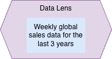

<!-- SPDX-License-Identifier: CC-BY-4.0 -->
<!-- Copyright Contributors to the ODPi Egeria project. -->

# Data Lens

A Data Lens defines a scope of data that is being used to support a business capability, or defines the data requirements for a [project](/concepts/project).

Depending on the type of project, the scope of the data required may need to be constrained through multiple dimensions such as subject area, location, time, organizational context, quality and regulatory framework.

## Capturing the data lens in open metadata

The data lens is defined using a [DataLens](/types/4/0430-Development-Controls) element.
The data lens element can capture literal definitions of the required scope.  However, the use of the data lens is more effective if it lists the identities of the open metadata elements that represent the scope.  This is because these elements are organized and linked together making it possible to identify related scopes for data sets that could be used to manufacture the desired scope.

This includes:

| Type of scope         | Open Metadata Types                     |
|-----------------------|-----------------------------------------|
| Geographic            | Location                                |
| Quality (data values) | DataGrain, DataClass, CertificationType |
| Business unit/area    | BusinessCapability                      |
| Organization          | Team                                    |
| Temporal              | ContextEvent, DataScope                 |
| Legal/Regulatory      | LicenseType, CertificationType          |

The picture below shows an example of a data lens linked to a [collection](/concepts/collection) of [assets](/concepts/asset) that match the requirements in the data lens.  The relationship between the data lens and the collection is [GovernedBy](/types/4/0401-Governance-definitions).  

The matching resource list collection is linked to a [project](/concepts/project) through the [ResourceList](/types/0/0019-More-Information) relationship.  It acts as a mini-catalog of resources that match the needs of the project.  The relationship that links the asset to the matching resource list collection is the [CollectionMembership](/types/0/0021-Collections).  The properties in this relationship allow the project team to comment on and set a status on the usefulness of the asset in to the project.

## Matching the data lens to digital resources

Matching [digital resources](/concepts/digital-resource) to a data lens can be tricky because information about the resource's scope is often not available in the metadata associated with the resource itself.  It typically takes additional curation to establish the scope of the resource.  This information is captured in the [DataScope](/types/2/0210-Data-Stores) classification attached to the [asset](/concepts/asset) or [digital product](/concepts/digital-product) that represents the digital resource.  When the data scope classification is in place, patching to the data lens is straightforward, and easily automated.

Consider a data lens focused on sales data:

A view of the data catalog may show many potential data sources containing sales data.

To understand if all of these data sets are relevant, a bit of digging into their origin (either through lineage or by asking the datasource owners) reveals the source of these data sources, and from their location and use, a view on their geographical scope.

It is clear that the synthetic data from the test system is of no use.  It also suggests that there are uncatalogued regional ODSs.

The next picture reveals the results of an analysis of the data in the remaining data sets on the this.  This shows that the the global sales data mart does not have the [granularity](/concepts/data-grain) needed by the project.  The result is that the team should combine global ODS data to get the appropriate scope and granularity.

## Mismatched scopes

The example above shows a situation where none of the data sets exactly match the requirements defined in the data lens and the answer was to combine data sets.

| Scope Mismatch | Action                                                                                                                                  |
| -------------- |-----------------------------------------------------------------------------------------------------------------------------------------|
|  | Data set has a smaller scope suggesting it should be combined with other data sets.                                                     |
|  | Data set has a broader scope that the project requires suggesting that the desired values be extracted to produce a new data set.       |
|  | Data set has some relevant data, but also data out of scope.  It needs both filtering and combining with other data to match the scope. |

??? info "Further information"

    * A data lens is a type of governance definition and is maintained and queried using the [Governance Officer API](/services/omvs/governance-office/overview).
    * The *DataLens* open metadata type is described in [Model 0430 Development Controls](/types/4/0430-Development-Controls/).

--8<-- "snippets/abbr.md"