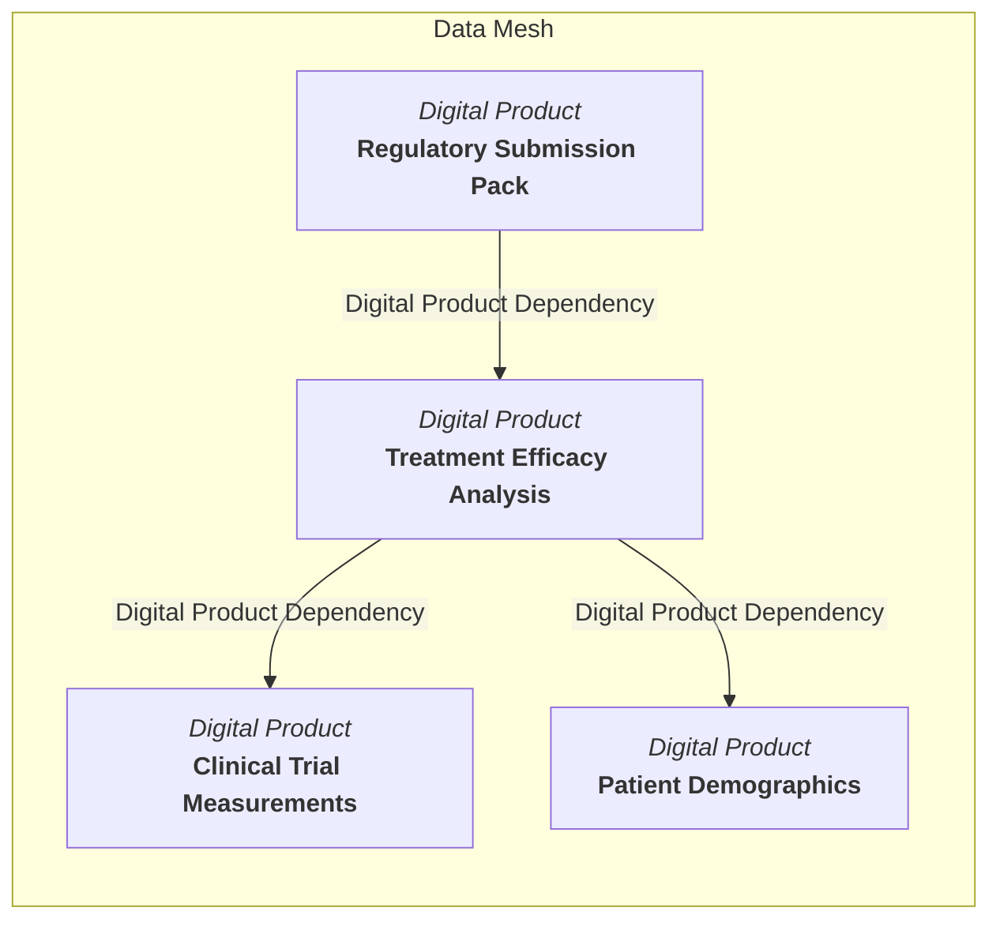

<!-- SPDX-License-Identifier: CC-BY-4.0 -->
<!-- Copyright Contributors to the Egeria project. -->

# Data mesh

A *data mesh* is the network of [digital products](/concepts/digital-product) in an organization, connected by the dependencies between them.  Each digital product is owned by a team that takes responsibility for the data it delivers.  However, few digital products are built from scratch.  Most consume data from other digital products, transform or enrich it, and offer the result to their own consumers.  The data mesh makes these producer-consumer connections visible so that the organization can see how value flows between its product teams, where the critical products are, and which consumers would be affected by a change to a product.

The data mesh is a business-level view.  It is built on top of the [data fabric](/concepts/data-fabric), the landscape of stores, processes and data sets whose fine-grained [lineage](/concepts/lineage) describes the flow of data between individual [assets](/concepts/asset).  The data mesh abstracts this in the same way that an [information supply chain](/concepts/information-supply-chain) provides a business-level view of a particular data flow.  The two views are complementary: the information supply chain follows a kind of data from its origin to its destination, while the data mesh shows the products that participate in that journey and how they depend on one another.

In the example above, the *Treatment Efficacy Analysis* product uses data from both the *Clinical Trial Measurements* and *Patient Demographics* products.  The *Regulatory Submission Pack* in turn uses the analysis.  A change to the way clinical trial measurements are captured therefore has a potential impact on the two downstream products, and on all the subscribers of those products.

## Digital product dependencies

The connections in the data mesh are captured using the [*DigitalProductDependency*](/types/7/0710-Digital-Products) relationship.  It links the digital product that consumes the data (the *usedByDigitalProducts* end) to the digital product that supplies it (the *usesDigitalProducts* end).  The *label* and *description* properties record the nature of the dependency, for example which part of the supplying product's data is used and why.

*DigitalProductDependency* is a type of [*LineageRelationship*](/types/0/0010-Base-Model), which means it also carries the *iscQualifiedName* property.  This allows a dependency to be associated with a specific [information supply chain](/concepts/information-supply-chain).  The same pair of digital products may participate in more than one information supply chain, so the relationship is [multi-link](/concepts/uni-multi-link): each information supply chain that flows between the two products has its own *DigitalProductDependency* relationship, with its own *iscQualifiedName*.  A dependency that is not specific to any information supply chain simply leaves *iscQualifiedName* blank.

There are two ways that a *DigitalProductDependency* relationship comes into existence.

### Explicitly defined dependencies

The product manager for a digital product knows which other products their product consumes.  They can declare these dependencies directly, as part of designing and documenting the product.  This is the natural choice when:

* the product is being designed and its implementation does not yet exist, so there is no lineage to follow;
* the dependency is on a product delivered by an external organization, where the internal lineage of the supplying product is not visible;
* the dependency is contractual or organizational rather than technical, such as a product that relies on a reference data product to define the valid values it uses.

Explicit dependencies are created, updated and removed through the [Product Manager API](/services/omvs/product-manager/overview), which provides *linkDigitalProductDependency*, *updateDigitalProductDependency* and *detachDigitalProductDependency* operations.

### Dependencies derived from lineage

A digital product is a [collection](/concepts/collection) whose members are the assets that describe the product's [digital resources](/concepts/digital-resource).  These assets are also the elements that appear in [lineage](/concepts/lineage).  When the lineage of the assets in one digital product leads to the assets in another digital product, there is a dependency between the two products, whether or not anyone has declared it.

The lineage relationships that reveal a dependency are the same ones that implement an information supply chain:

* the [data passing](/types/7/0750-Data-Passing) relationships: *DataFlow*, *ControlFlow* and *ProcessCall*;
* the [lineage mapping](/types/7/0770-Lineage-Mapping) relationships: *LineageMapping* and *DataMapping*;
* the [ultimate edges](/types/7/0755-Ultimate-Source-Destination) relationships: *UltimateSource* and *UltimateDestination*;
* the [*DataSetContent*](/types/2/0210-Data-Stores) relationship, which shows that a data set is built from other data stores;
* the [*DerivedSchemaTypeQueryTarget*](/types/5/0512-Derived-Schema-Elements) relationship, which shows the sources of a derived data field;
* the [*ImplementedBy*](/types/7/0737-Solution-Implementation) relationship, which links a [solution component](/concepts/solution-component) to the assets that implement it.

The derivation follows these relationships from the assets that are members of a digital product until it reaches an asset that is a member of a different digital product.  Each distinct pair of products discovered in this way becomes a *DigitalProductDependency* relationship.  When the lineage relationships that were followed carry an *iscQualifiedName*, the derived dependency is given the same value, so that it appears in the right information supply chain.

Deriving dependencies from lineage has several advantages over relying on explicit declarations alone:

* it reflects what the implementation actually does, rather than what the product team believes it does;
* it detects dependencies that were introduced by a change to a data pipeline without the product manager being aware of it;
* it can be re-run as the implementation evolves, so the data mesh stays in step with reality.

Derived dependencies and explicit dependencies can coexist for the same pair of products.  A useful governance check is to compare the two: an explicit dependency with no supporting lineage may indicate that lineage capture is incomplete, or that the dependency is no longer real.  A derived dependency with no explicit declaration may indicate an undocumented, and possibly unapproved, use of another team's data.

## Viewing the data mesh

When an information supply chain is retrieved with its implementation details, Egeria queries all the lineage relationships whose *iscQualifiedName* matches the information supply chain's qualified name.  The resulting relationships are split into two groups when the mermaid graph of the implementation is generated:

* the *DigitalProductDependency* relationships, whose ends are digital products, are drawn in a **Data Mesh** subgraph;
* the remaining lineage relationships, whose ends are typically assets and processes, are drawn in a **Data Fabric** subgraph, since they describe the [data fabric](/concepts/data-fabric) that the products are built from.

This lets a business user see the products that the information supply chain passes through without being overwhelmed by the technical detail underneath, while the technical detail remains one click away.  Information supply chains, and their data mesh view, can be explored in [Egeria Explorer](/user-interfaces/egeria-explorer/overview) by clicking on the **Information Supply Chains** card.

The dependencies of an individual digital product are also returned when the product is retrieved through the [Product Manager API](/services/omvs/product-manager/overview) or the [Product Catalog API](/services/omvs/product-catalog/overview).  The products it consumes are listed under *usesDigitalProducts* and the products that consume it under *usedByDigitalProducts*.  A product consumer can use these lists to understand what a product is built from before they [subscribe](/concepts/digital-subscription) to it.

## Using the data mesh

The data mesh supports a number of governance activities:

* **Impact analysis** - before withdrawing a digital product, or releasing a new version with a changed specification, the product manager can follow the *usedByDigitalProducts* dependencies to identify the downstream products and their subscribers that need to be consulted.
* **Traceability** - a consumer of a digital product can follow the *usesDigitalProducts* dependencies to understand the origin of the data they are relying on, and check that each product in the chain has the certifications and licenses they require.
* **Investment decisions** - products with many dependents are the critical infrastructure of the data mesh and deserve investment in their reliability, whereas products with no dependents and few subscribers may be candidates for retirement.
* **Organizational alignment** - since digital products are owned by teams, the data mesh shows which teams depend on one another, which helps to structure the conversations needed when products change.

???+ info "Further information"

    * [Digital product](/concepts/digital-product) describes the structure of a digital product and its lifecycle.
    * [Digital subscription](/concepts/digital-subscription) describes the agreement between a product consumer and a product provider.
    * [Information supply chain](/concepts/information-supply-chain) describes the business-level view of a data flow that the data mesh is aligned with.
    * [Data fabric](/concepts/data-fabric) describes the stores, processes and data sets that the data mesh is built on.
    * [Lineage management](/features/lineage-management/overview) describes how the lineage that dependencies are derived from is captured.
    * [Digital product management](/features/digital-product-management/overview) describes the end-to-end management of digital products.
    * The [DigitalProductDependency](/types/7/0710-Digital-Products) relationship is defined in model 0710.

--8<-- "snippets/abbr.md"
