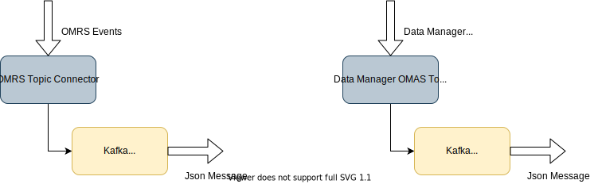

---
hide:
- toc
---

<!-- SPDX-License-Identifier: CC-BY-4.0 -->
<!-- Copyright Contributors to the Egeria project. -->

# Event Bus

Egeria's *event bus* is constructed from an [event broker](/egeria-docs/basic-concepts/#event-broker) infrastructure service and a set of well-known [topics](/egeria-docs/basic-concepts/#topic). Collectively they provide the ability to reliably pass events between different [OMAG Servers](/egeria-docs/concepts/omag-server):

- To register with an [open metadata repository cohort](/egeria-docs/concepts/cohort-members), exchange type definitions and share changes to metadata with other members of the cohort via the [OMRS topic(s)](/egeria-docs/services/omrs/cohort-events).
- To exchange details of metadata changes through an [Open Metadata Access Service (OMAS)](/egeria-docs/services/omas)'s [InTopic](/egeria-docs/concepts/in-topic) and [OutTopic](/egeria-docs/concepts/out-topic).

Each topic maintains a pointer to the last event that a server has read so that it receives each event that is added even if it restarts.

There are different event broker implementations with greater or lesser reliability and performance. Many organizations establish a standard choice of their event broker service which is why Egeria uses [connectors](/egeria-docs/concepts/connector) to implement its event bus.

Egeria's default event broker is [Apache Kafka :material-dock-window:](https://kafka.apache.org/){ target=kafka }. Each topic is accessed through an [open metadata topic connector](/egeria-docs/concepts/open-metadata-topic-connector).

Details of open metadata topic connectors are needed in multiple places in a server's [configuration document](/egeria-docs/concepts/configuration-document). To simplify this configuration, the event bus config is added to the server's configuration document at the [start of the configuration process](/egeria-docs/guides/admin/servers). The event bus config establishes a set of defaults for the open metadata topic connectors. These defaults are used whenever open metadata topic connectors are configured.

The subsystems using the event bus have a specialized connector that supports event exchange for a specific type of event. Since it is necessary to be able to swap the event broker implementation, these connectors embed an [open metadata topic connector](/egeria-docs/concepts/open-metadata-topic-connector) within their implementation.

When the connection for one of these subsystem topic connectors is configured, the defaults from the event bus config are used to set up the nested open metadata topic connection.

The resulting configuration for these nested connectors is as follows:

1. The common configuration for the event bus is identified and configured using the event bus config.
2. This configuration is encoded in a [connection](/egeria-docs/concepts/connection) object for the generic open metadata topic connector.
3. When the consuming component is configured, a connection object for its specialized topic connector is created, with the generic open metadata topic connector embedded inside.
4. When the [connector broker](/egeria-docs/concepts/connector-broker) inside Egeria's runtime is called upon to create the specialized topic connector at server start up, it navigates the hierarchy of connection objects, creating the nested hierarchy of connectors as specified.

--8<-- "snippets/abbr.md"
