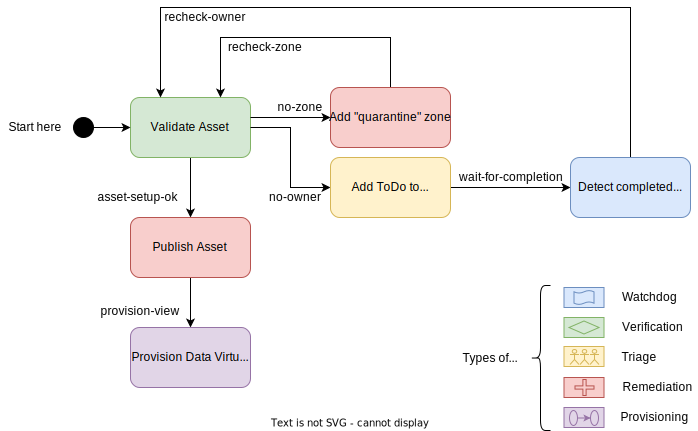
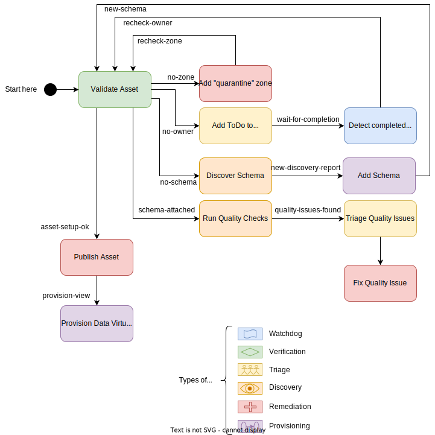
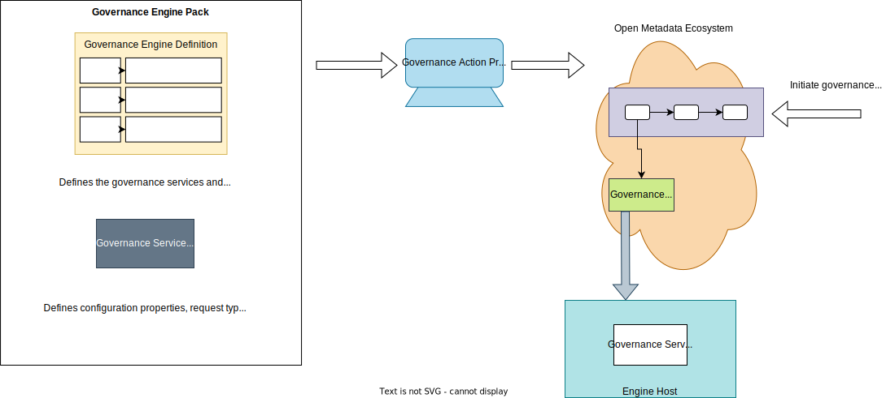

<!-- SPDX-License-Identifier: CC-BY-4.0 -->
<!-- Copyright Contributors to the ODPi Egeria project. -->

# Governance Action Process

A *governance action process* is a predefined sequence of [governance actions](/concepts/governance-action) that are coordinated by the [Governance Engine OMAS](/services/omas/governance-engine/overview).

The steps in a governance action process are defined by linked [governance action types](/concepts/governance-action-type) stored in the open metadata ecosystem.  Each governance action type provides the specification of the governance action to run.  The links between them show which [guards](/concepts/guard) cause the governance action to run.

The governance action process support enables governance professionals to assemble and monitor governance processes without needing to be a Java programmer.

## Examples

In the two examples below, each of the rounded boxes represent a governance action and the links between them is a possible flow - where the label on the link is the guard that must be provided by the predecessor if the linked governance action is to run.

The governance actions in example 1 are all implemented using [governance action services](/concepts/governance-action-service).  When these services complete, they supply a completion status.  If a service completed successfully, they optionally supply one or more guards and a list of [action targets](/concepts/action-target) for the subsequent governance action(s) to process.  

The first governance action in example 1 is called when a new asset is created.  For example the [Generic Element Watchdog Governance Action Service](/connectors/governance-action/generic-element-watchdog-governance-action-service) could be configured to monitor for new/refresh events for particular types of assets and initiate this governance process then this type of event occurs.

The first governance action to run is *Validate Asset*.  It retrieves the asset and tests that it has the expected classifications assigned.  The guards it produces control with actions follow.

Governance actions from the same governance action processes can run in parallel if the predecessor governance actions produces multiple guards. 

> **Example 1:** Governance Action Process to validate and augment a newly created asset

Governance action processes can include any [type of governance service](/concepts/governance-service).
Example 2 shows an [open discovery service](/concepts/open-discovery-service) amongst the [governance action services](/concepts/governance-action-service).

> **Example 2:** Governance Action Process to validate and augment a newly created asset

## Governance Action Process Lifecycle

The diagram below shows a governance action process assembly tool taking in information from a [governance engine pack](/concepts/governance-engine-pack) to build a governance action process flow.  This is shared with the open metadata ecosystem either through direct called to the [Governance Engine OMAS](/services/omas/governance-engone/overview) or via a [open metadata archive](/concepts/open-metadata-archive) (possibly the archive that holds the governance engine definition.

Once the definition of the governance action process is available, an instance of the process can be started, either by a [watchdog governance action service](/concepts/governance-action-service) or through a direct call to the Governance Engine OMAS.  Whichever mechanism is used, it results in the Governance Engine OMAS using the definition to choreograph the creation of [governance action](/concepts/governance-action) entities that drive the execution of the governance services in the [Engine Host](/concepts/engine-host).

!!! education "Further information"
    - The [0462 Governance Action Types](/types/4/0462-Governance-Action-Types) model shows how the governance action process flow is built out of [governance action types](/concepts/governance-action-type).
    - Governance action processes may be created using the [Governance Engine OMAS](/services/omas/governance-engine/overview) API.
    - The [Open Metadata Engine Services (OMES)](/services/omes) provide the mechanisms that support the different types of [governance engines](/concepts/governance-engine). These engines run the [governance services](/concepts/governance-service) that execute the [governance actions](/concepts/governance-action) defined by the governance action process.

--8<-- "snippets/abbr.md"