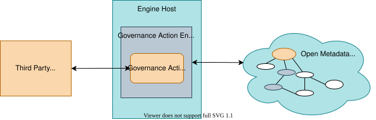

<!-- SPDX-License-Identifier: CC-BY-4.0 -->
<!-- Copyright Contributors to the ODPi Egeria project 2019, 2020. -->

# Governance Action Service

A governance action service is a specialized [connector](/concepts/connector) that performs monitoring of metadata changes, validation of metadata, triage of issues, assessment and/or remediation activities on request.  Some governance action services invoke functions in external engines that are working with data and related assets.

A governance action service runs in the [Governance Action Open Metadata Engine Service (OMES)](/services/omes/governance-action) hosted by the [Engine Host OMAG Server](/concepts/engine-host).

Governance action services implement interfaces defined by the [Open Governance Framework (OGF)](/frameworks/ogf/overview). The OGF offers embeddable functions and APIs to simplify the implementation of governance action services, and their integration into the broader digital landscape, whilst being resilient and with good performance.

It is possible to implement complex governance actions in a single governance action service.  Alternatively, there are four specialized patterns of governance action services that help you to break down your governance function into reusable components that can be choreographed by [governance action processes](/concepts/governance-action-process) to maximise the flexibility of your governance automation.  When a governance action service completes, it produces [guards](/concepts/guard) that define what needs to be done next along with a list of [action targets](/concepts/action-target).

* *[Verification Governance Action Service](/guides/developer/governance-action-services/overview/#verification)* validates that a rule or policy is being followed.  This is often a test that the metadata elements, relationships and classification are set up as they should be.  For example, it may check that a new asset has an owner, is set up with [governance zones](/concepts/governance-zone) and includes a connection and a schema where possible.

* *[Triage Governance Action Service](/guides/developer/governance-action-services/overview/#triage)* runs triage rules to determine how to manage a situation or request, such as a request for action from a [survey action service](/guides/developer/survey-action-services/overview). Often this involves a human decision maker.   It may initiate an external workflow, wait for manual decision or create a [ToDo](/concepts/to-do) for a specific person.

* *[Remediation Governance Action Service](/guides/developer/governance-action-services/overview/#remediation)* makes updates to metadata elements, relationships between them and classifications. Examples of remediation governance action services include:

    * Classification and linking of metadata elements such as adding owners, governance zones and origin classifications to assets.
    * Duplicate detection, linking and consolidating.

* *[Provisioning Governance Action Service](/guides/developer/governance-action-services/overview/#provisioning)*  invokes a provisioning service whenever a provisioning request is made.  Typically, the provisioning service is an external service.  It may also create lineage metadata to describe the work of the provisioning service if the provisioning service is not able to create lineage itself.

The interfaces for governance action services is defined in the [governance-action-framework :material-github:](https://github.com/odpi/egeria/tree/main/open-metadata-implementation/frameworks/open-governance-framework) module.

## Egeria Governance Action Services

The [Governance Services Connectors](https://github.com/odpi/egeria/tree/main/open-metadata-implementation/adapters/open-connectors/governance-action-connectors) implement common functions for governing your open metadata ecosystem.
This includes:

* The **Generic Element Watchdog Governance Action Service** listens for changing metadata elements and initiates governance action processes when certain events occur.
* The **Origin Seeker Governance Action Service**  walks backwards through the lineage relationships to discover the origin of the data asset.
* The **Zone Publisher Governance Action Service** updates the zone membership on the target action assets.

--8<-- "snippets/abbr.md"