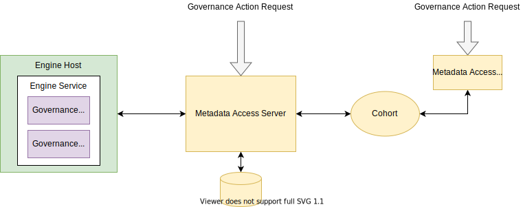

---
hide:
- toc
---

<!-- SPDX-License-Identifier: CC-BY-4.0 -->
<!-- Copyright Contributors to the ODPi Egeria project. -->

# Governance Engine

A *governance engine* provides services that automate governance activities - from validating that the digital landscape is operating correctly, ensuring metadata is complete and correct to performing scheduled maintenance.  Its capability is implemented by a collection of related [governance services](/concepts/governance-service).

--8<-- "docs/concepts/governance-service-types.md"

When a governance engine is called, it is passed a [governance request type](/concepts/governance-request-type) and request parameters.  This is mapped to a call to a governance service through the [governance engine definition](/concepts/governance-engine-definition).

> The structure of a governance engine definition includes a list of governance request types.  Each governance request type, along with optional request parameters, are linked to a governance service definition.  This indicates which governance service to call when the governance request type is used on a call to the governance engine.  The associated request parameters provide default values for the request parameters passed to the governance service when it is invoked.  The request parameters can be added to and overridden by the caller.  The governance request type and request parameters indicate to the governance service what its action should be.

The unique name of the governance engine defined in the governance engine definition is added to the [OMES configuration](/guides/admin/servers/configuring-an-engine-host/#configure-engine-service).  When the [engine host](/concepts/engine-host) starts up the OMES, it reads the *governance engine definition* from its partner [metadata access server](/concepts/metadata-access-server) to complete its initialization.  The engine host monitors changes in the governance engine definition so the services within the governance engine can be dynamically maintained.

Calls to the governance engine are made by creating [engine actions](/concepts/engine-action in the open metadata ecosystem.  The engine host is monitoring for new governance actions for the governance engine.  When one occurs, it claims the governance action and passes on the request to the governance engine to run.  The claim process is used since there may be multiple engine hosts running that governance engine and only one of them should process the request.

> A governance action can be created anywhere in the open metadata ecosystem.  The result is an event that is passed via its connected metadata access server to the engine host.  If the request is for a governance engine that it is hosting, the engine host claims the governance action and passes the request to the governance engine.

??? education "Further information"

    Each governance engine has a unique name.  A *governance engine definition* for this unique name is either created through the [Governance Engine OMAS](/services/omas/governance-engine/overview) API or as part of a [governance engine pack](/concepts/governance-engine-pack).  The [governance engine is configured](/guides/admin/servers/configuring-an-engine-host/#configure-engine-service) in the [engine host](/concepts/engine-host) using this unique name.

    The open metadata types for this definition are in model [0461 - Governance Engines](/types/4/0461-Governance-Engines) - specifically notice **Governance Engine** and **GovernanceService** linked by the **SupportedGovernanceService** relationship.

--8<-- "snippets/abbr.md"