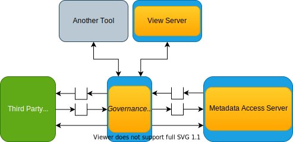

---
hide:
- toc
---

<!-- SPDX-License-Identifier: CC-BY-4.0 -->
<!-- Copyright Contributors to the Egeria project 2020. -->

# Governance server

A *Governance Server* is a specialized [OMAG Server](/concepts/omag-server). It is designed to host specific governance services that manage metadata in different technologies or perform specific active [governance actions](/concepts/governance-actions).

The governance servers each have a specific subsystem that contains its services. They are also paired with different [Open Metadata Access Services (OMASs)](/services/omas) that supports appropriate open metadata services needed by the governance server.

The governance servers are controlled by open metadata.  Their configuration points to the root metadata element(s) that they should use.  They are notified of any changes to this metadata.  Therefore, a governance server's behaviour can be dynamically controlled by extending and updating this metadata.  This means that one governance server can modify either its oen behaviour or the behaviour of another governance server.

The table below shows the different types of governance servers and the OMASs they are paired with.

| Governance Server                                   | Description                                                              | Supported by subsystem                                               | Paired with OMAS                                                                                                                                                                                                                                             | 
|:----------------------------------------------------|:-------------------------------------------------------------------------|:---------------------------------------------------------------------|:-------------------------------------------------------------------------------------------------------------------------------------------------------------------------------------------------------------------------------------------------------------| 
| [Integration Daemon](/concepts/integraition-daemon) | Manages the capture of metadata through configured integration services. | [Integration Daemon Services](/services/integration-daemon-services) | [Governance Server OMAS](/services/omas/governance-server/overview) provides support for retrieving governance engine definitions.  The [integration services](../../integration-services) define the OMASs that support each type of integration connector. |
| [Engine Host](/concepts/engine-host)                | Manages governance engines.                                              | [Engine Host Services](/services/engine-host-services)               | [Governance Server OMAS](/services/omas/governance-server/overview) provides support for retrieving governance engine definitions. The [engine services](../../engine-services) define the OMASs that support each type of governance engine.                |

--8<-- "snippets/abbr.md"
