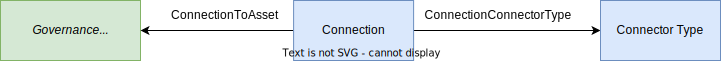

---
hide:
- toc
---

<!-- SPDX-License-Identifier: CC-BY-4.0 -->
<!-- Copyright Contributors to the ODPi Egeria project. -->

# Governance Service Definition

A *governance service definition* is metadata that describes the implementation of a [governance service](/concepts/governance-service).
It includes an entity that is a subtype of [GovernanceService](/types/4/0461-Governance-Engines), a [Connection](/types/2/0201-Connectors-and-Connections) entity and a [ConnectorType](/types/2/0201-Connectors-and-Connections) entity.  



Many of the values for the governance service definition can be gleaned from the governance service implementation which includes a [connector provider](/concepts/connector-provider) that can return the [connector type](/concepts/connector-type).

??? example "Example of a connector type from a governance action service"
    This is extracted from the platform service `GET {{serverURLRoot}}/open-metadata/platform-services/connector-types/{{connectorProviderClassName}}`

    ```json
    {
            "connectorType": {
                "class": "ConnectorType",
                "headerVersion": 0,
                "type": {
                    "typeId": "954421eb-33a6-462d-a8ca-b5709a1bd0d4",
                    "typeName": "ConnectorType",
                    "typeVersion": 1,
                    "typeDescription": "A set of properties describing a type of connector."
                },
                "guid": "e2a14ca8-57b1-48d7-9cc4-d0b44983ca79",
                "qualifiedName": "Egeria:GeneralGovernanceActionService:Provisioning:MoveCopyFile",
                "displayName": "Move or Copy File Governance Action Service",
                "description": "Provisioning Governance Action Service that moves or copies files on request.",
                "connectorProviderClassName": "org.odpi.openmetadata.adapters.connectors.governanceactions.provisioning.MoveCopyFileGovernanceActionProvider",
                "connectorFrameworkName": "Open Connector Framework (OCF)",
                "connectorInterfaceLanguage": "Java",
                "connectorInterfaces": [
                    "org.odpi.openmetadata.frameworks.connectors.VirtualConnectorExtension",
                    "org.odpi.openmetadata.frameworks.auditlog.AuditLoggingComponent",
                    "org.odpi.openmetadata.frameworks.governanceaction.GovernanceActionService"
                ],
                "recognizedConfigurationProperties": [
                    "targetFileNamePattern",
                    "noLineage",
                    "topLevelProcessQualifiedName",
                    "topLevelProcessTemplateQualifiedName",
                    "destinationFileTemplateQualifiedName",
                    "destinationFolder",
                    "topLevelProcessLineageOnly",
                    "lineageFromSourceFolderOnly",
                    "lineageToDestinationFolderOnly"
                ]
            }
        }
    
    ```

The possible subtypes of *GovernanceService* are determined from the `connectorInterfaces` shown in the connector type from the connector provider.

| Connector Interface                                                                               | SubType of *GovernanceService*                                  |
|---------------------------------------------------------------------------------------------------|-----------------------------------------------------------------|
| `org.odpi.openmetadata.frameworks.governanceaction.GovernanceActionService`                       | [GovernanceActionService](/types/4/0461-Governance-Engines)     |
| `org.odpi.openmetadata.frameworks.surveyaction.SurveyActionService`                               | [SurveyActionService](/types/4/0461-Governance-Engines)         |
| `org.odpi.openmetadata.engineservices.repositorygovernance.connector.RepositoryGovernanceService` | [RepositoryGovernanceService](/types/4/0461-Governance-Engines) |


*GovernanceService* is a type of [Asset](/concepts/asset) and so is linked to the connection entity using the [ConnectionToAsset](/types/2/0205-Connection-Linkage) relationship.

The connection entity will include the settings for the various configuration properties described in the connector type.  If different combinations of configuration properties are desired, they are configured in different governance service definitions.

A governance service definition is then linked into one or more [Governance Engine Definitions](/concepts/governance-engine-definition).

!!! education "Further information"

    * Governance engine definitions are typically defined in a [governance engine pack](/guides/developer/open-metadata-archives/creating-governance-engine-packs) or through the [Action Author](/services/omns/action-author/overview) API.  This will typically include the governance service definitions.
    * Governance engines are run by the [Open Metadata Engine Services (OMES)](/services/omes) in an [Engine Host](/concepts/engine-host) OMAG Server.  
  

--8<-- "snippets/abbr.md"