<!-- SPDX-License-Identifier: CC-BY-4.0 -->
<!-- Copyright Contributors to the Egeria project. -->

# Information supply chain

[Lineage](/concepts/lineage) is typically captured at a very fine-level of detail.  This detail enables automated governance processes to validate that the data pipelines are running as they should be.  However, this level of detail is often too much for most business users and regulators to comprehend.  It is necessary to model the flow of data at a level of detail that is meaningful to these users and correlate the fine-grained detail to this business view.

An *InformationSupplyChain* serves as a high-level depiction of data and control movement. It generally outlines how a particular kind of data travels through a digital environment. For instance, one information supply chain might track risk data for a regulatory compliance report, while another illustrates the assembly of data required for carbon accounting.

So the information supply chain is an architectural construct that can provide the focus for data governance or compliance activities that must demonstrate data being delivered where it is needed in a timely and efficient manner.  

However, the information supply chain is more than a mere diagram. It is associated with the real lineage producing components that are executing the data flow.  It provides a target for roll-ups of activity, errors and volumetrics extracted from the underlying lineage data.  The traceability back to the actual components and lineage logs supports validation, investigation and auditability of the information supply chain metrics.

## Information Supply Chain Segments

An information supply chain may be broken down into multiple, nested *segments*. Each segment may represent, for example, the portion of the information supply chain that is owned by a particular team, or the data flows that occur at different phases of the work.  This allows drill-down and more focused analysis by the owners of each segment.

## Information Supply Chain Examples

The skill in using information supply chains is to get the right level of abstraction to make its description and analysis meaningful to its intended audience.  As such they tend to be designed as part of an initiative or project, where the audience is understood.

In the [Coco Pharmaceuticals](/practices/coco-pharmaceuticals) scenarios we see multiple examples of information supply chains:

* In the [Investigating suspicious activity](/practices/coco-pharmaceuticals/scenarios/investigating-suspicious-activity/overview) scenario, Coco Pharmaceuticals use an information supply chain to model the flow of supplier information and orders through their systems to identify where bogus supplier information could be inserted without detection.
* In the [Sustainability initiative](/practices/coco-pharmaceuticals/scenarios/sustainability-initiative/overview) scenario, Coco Pharmaceuticals model an information supply chain during the development of their new sustainability data pipeline.
* In [Receiving patient data from a hospital](/practices/coco-pharmaceuticals/scenarios/receiving-patient-data-from-a-hospital/overview), we seem various Coco Pharmaceuticals persona using the information supply chains supporting their clinical trials to understand the process of a clinical trial and any issues that need action.
* In the initial set up of the data governance program, we see Coco Pharmaceuticals [identifying the key information supply chains](/practices/coco-pharmaceuticals/scenarios/defining-information-supply-chains/overview) that the program will need to support.

## Working with Information Supply Chains

Information supply chains can be viewed in [Egeria Explorer](/user-interfaces/egeria-explorer/overview) by clicking on the **Information Supply Chains** card.  The [Quickstart](/egeria-workspaces/quick-start/overview) environment includes multiple examples of information supply chains, both from Coco Pharmaceuticals and those that are part of the base Egeria implementation.

The [Lineage Explorer](/user-interfaces/lineage-explorer/overview) supports linking from a technical component in a lineage graph to its associated information supply chains in *Egeria Explorer*.

The [Solution Architect API](/services/omvs/solution-architect/overview) is where you can define, query and maintain your information supply chains.  This includes the standard OMVS REST API, python interface and Java client libraries for connectors.  They are also fully supported by [Dr.Egeria](/user-interfaces/dr-egeria/overview) in the *Solution Architect* family.

## Visualizing Information Supply Chains

When an information supply chain is retrieved with its implementation (`addImplementation=true`), Egeria returns a [mermaid](/user-interfaces/mermaid/overview) graph of it, in the *iscImplementationMermaidGraph* property, along with its properties.  This is the graph that Egeria Explorer displays.  The graph is split into a stack of areas, drawn from top to bottom, that move from the purpose of the information supply chain, through its design and the progress of its implementation, down to the digital products, data and systems that implement it.  An area is only drawn if it has something in it.

| Area              | What it shows                                                                                                                                                                                                                                                                                                                                       |
|:------------------|:----------------------------------------------------------------------------------------------------------------------------------------------------------------------------------------------------------------------------------------------------------------------------------------------------------------------------------------------------|
| **Context**       | The information supply chain itself, along with its parent and its nested [segments](#information-supply-chain-segments) (linked by dotted lines) and the information supply chains that it receives from or supplies to through *InformationSupplyChainLink* relationships (linked by solid lines).                                                 |
| **Design**        | The [solution components](/concepts/solution-component) that are members of the information supply chain, and the *SolutionLinkingWire* relationships between them that carry the information supply chain's qualified name in their *iscQualifiedNames* attribute.  Wires that belong only to other information supply chains are left out.  |
| **Status**        | The same solution components and wires as the *Design* area, but coloured to show how far the implementation of each component has progressed - see below.                                                                                                                                                                                          |
| **Data Mesh**     | The [digital products](/concepts/digital-product) at either end of the information supply chain's lineage relationships, and the [*DigitalProductDependency*](/types/7/0710-Digital-Products) relationships between them that make up the [data mesh](/concepts/data-mesh).                                                                         |
| **Data Fabric**   | The data assets, processes and other elements at either end of the information supply chain's lineage relationships, and the lineage between them.  This is the [data fabric](/concepts/data-fabric) - the detail of how the data actually moves.                                                                                                  |
| **System Fabric** | The IT infrastructure (such as hosts) and the [software capabilities](/concepts/software-capability) (such as database managers) at either end of the information supply chain's lineage relationships - the systems that the data and processes run on.                                                                                         |

The *Data Mesh*, *Data Fabric* and *System Fabric* areas are built from the information supply chain's *implementation*: the lineage relationships that carry its qualified name in their *iscQualifiedName* attribute (see [Lineage Implementation](#lineage-implementation) below).  Each relationship is drawn as a line labelled with its label or role and its type, and it can cross from one area to another - for example, the lineage mapping from the data set that a digital product packages runs from the *Data Fabric* area up into the *Data Mesh* area.

### Showing the progress of the implementation

The *Status* area colours each solution component by its *deploymentStatus*.  When the status is anything other than *Active*, it is also written into the component's label, so that the status can still be read when the graph is displayed without colour.

| Deployment status                          | How the solution component is drawn                                                    |
|:-------------------------------------------|:---------------------------------------------------------------------------------------|
| *Active*, or no status                     | The normal solution component style - the component is assumed to be deployed.         |
| *Proposed*, *Approved for deployment*      | Light yellow.                                                                          |
| *Under development*, *Development complete* | Pale orange (papaya whip).                                                            |
| *StandBy*                                  | Silver.                                                                                |
| *Disabled*                                 | Dark grey.                                                                             |
| *Rejected*                                 | Rosy brown.                                                                            |
| *Failed*                                   | Orange-red.                                                                            |
| *Other*                                    | The normal style, with the *userDefinedDeploymentStatus* written into the label.       |

A component with the [*Promise*](/concepts/promise) classification has not been delivered at all, so it is drawn in the *Promise* style whatever its deployment status.  Likewise, a component with the [*Memento*](/concepts/memento) classification has been retired, and is drawn in the *Memento* style.  These styles are also used for promised and retired elements in the other areas of the graph, so that planned and retired resources stand out from the ones that are in use.  Promised and retired elements are only returned when the information supply chain is retrieved with `forLineage=true` - in Egeria Explorer and the Lineage Explorer, this is the *Show Promise / Memento* option.

### Sample information supply chain

The [Core Content Pack](/content-packs/core-content-pack/overview) includes an information supply chain called *SAMPLE Information Supply Chain - Deployment Status Demonstration* that exists only to show each of these areas.  It has a chain of solution components, one for each deployment status plus one with the *Promise* classification; a source data file, a load process and a target data set for the *Data Fabric* area; a provider and a consumer digital product for the *Data Mesh* area; and a host and a database manager for the *System Fabric* area.  Everything in it is named *SAMPLE* so that it is not mistaken for real content, and it may be deleted.  Because the sample declares a dependency between the two digital products that the lineage beneath them does not prove, the [Darwin Product Dependency Manager](/features/lineage-management/overview/#rolling-up-the-lineage) records an exception against it - this is expected.

The graph below is the sample information supply chain as Egeria draws it.  It was retrieved with `forLineage=true`, so the promised component at the start of the chain is included.

```mermaid
---
title: Information Supply Chain - SAMPLE Information Supply Chain - Deployment Status Demonstration [f9d90bd0-9364-4015-a1b9-9bfff6d9a3e7]
---
flowchart TD
%%{init: {"flowchart": {"htmlLabels": false}} }%%

subgraph 1 [Context]
2@{ shape: flip-tri, label: "*Information Supply Chain*
**SAMPLE Information Supply Chain - Deployment Status Demonstration**"}
end
subgraph 3 [Design]
4@{ shape: rect, label: "*Solution Component*
**SAMPLE Solution Component - Failed**"}
5@{ shape: rect, label: "*Solution Component*
**SAMPLE Solution Component - Development Complete**"}
6@{ shape: rect, label: "*Solution Component*
**SAMPLE Solution Component - Active**"}
7@{ shape: rect, label: "*Solution Component*
**SAMPLE Solution Component - Rejected**"}
8@{ shape: rect, label: "*Solution Component*
**SAMPLE Solution Component - Standby**"}
9@{ shape: rect, label: "*Solution Component*
**SAMPLE Solution Component - Under Development**"}
10@{ shape: notch-pent, label: "*Solution Component*
**SAMPLE Solution Component - Promise**"}
11@{ shape: rect, label: "*Solution Component*
**SAMPLE Solution Component - Disabled**"}
12@{ shape: rect, label: "*Solution Component*
**SAMPLE Solution Component - Other**"}
13@{ shape: rect, label: "*Solution Component*
**SAMPLE Solution Component - Approved For Deployment**"}
14@{ shape: rect, label: "*Solution Component*
**SAMPLE Solution Component - Proposed**"}
11-. "sample flow [Solution Linking Wire]" .->4
4-. "sample flow [Solution Linking Wire]" .->12
9-. "sample flow [Solution Linking Wire]" .->5
5-. "sample flow [Solution Linking Wire]" .->13
8-. "sample flow [Solution Linking Wire]" .->6
6-. "sample flow [Solution Linking Wire]" .->11
7-. "sample flow [Solution Linking Wire]" .->8
13-. "sample flow [Solution Linking Wire]" .->7
14-. "sample flow [Solution Linking Wire]" .->9
10-. "sample flow [Solution Linking Wire]" .->14
end
subgraph 15 [Status]
16@{ shape: rect, label: "*Solution Component*
**SAMPLE Solution Component - Failed**
Deployment Status: Failed"}
17@{ shape: rect, label: "*Solution Component*
**SAMPLE Solution Component - Development Complete**
Deployment Status: Development complete"}
18@{ shape: rect, label: "*Solution Component*
**SAMPLE Solution Component - Active**"}
19@{ shape: rect, label: "*Solution Component*
**SAMPLE Solution Component - Rejected**
Deployment Status: Rejected"}
20@{ shape: rect, label: "*Solution Component*
**SAMPLE Solution Component - Standby**
Deployment Status: StandBy"}
21@{ shape: rect, label: "*Solution Component*
**SAMPLE Solution Component - Under Development**
Deployment Status: Under development"}
22@{ shape: notch-pent, label: "*Solution Component*
**SAMPLE Solution Component - Promise**
Deployment Status: Proposed"}
23@{ shape: rect, label: "*Solution Component*
**SAMPLE Solution Component - Disabled**
Deployment Status: Disabled"}
24@{ shape: rect, label: "*Solution Component*
**SAMPLE Solution Component - Other**
Deployment Status: Awaiting vendor"}
25@{ shape: rect, label: "*Solution Component*
**SAMPLE Solution Component - Approved For Deployment**
Deployment Status: Approved for deployment"}
26@{ shape: rect, label: "*Solution Component*
**SAMPLE Solution Component - Proposed**
Deployment Status: Proposed"}
23-. "sample flow [Solution Linking Wire]" .->16
16-. "sample flow [Solution Linking Wire]" .->24
21-. "sample flow [Solution Linking Wire]" .->17
17-. "sample flow [Solution Linking Wire]" .->25
20-. "sample flow [Solution Linking Wire]" .->18
18-. "sample flow [Solution Linking Wire]" .->23
19-. "sample flow [Solution Linking Wire]" .->20
25-. "sample flow [Solution Linking Wire]" .->19
26-. "sample flow [Solution Linking Wire]" .->21
22-. "sample flow [Solution Linking Wire]" .->26
end
subgraph 27 [Data Mesh]
direction BT
28@{ shape: rect, label: "*Digital Product*
**SAMPLE-DigitalProduct:Consumer**"}
29@{ shape: rect, label: "*Digital Product*
**SAMPLE-DigitalProduct:Provider**"}
end
subgraph 30 [Data Fabric]
31@{ shape: subproc, label: "*Process*
**SAMPLE-Process:Load**"}
32@{ shape: cyl, label: "*Data Set*
**SAMPLE-DataSet:Target**"}
33@{ shape: tag-doc, label: "*Data File*
**SAMPLE-DataFile:Source**"}
end
subgraph 34 [System Fabric]
35@{ shape: rounded, label: "*Database Manager*
**SAMPLE-DatabaseManager:Database-Manager**"}
36@{ shape: rect, label: "*Host*
**SAMPLE-Host:Server**"}
end
28==>|"sample depends on [Digital Product Dependency]"|29
31==>|"sample load [Data Flow]"|32
33==>|"sample extract [Data Flow]"|31
32==>|"sample hosted by [Lineage Mapping]"|35
35==>|"sample runs on [Lineage Mapping]"|36
32==>|"sample packaged as [Lineage Mapping]"|29
1~~~3
3~~~15
15~~~27
27~~~30
30~~~34
style 22 color:#004563, fill:#F0FFFF, stroke:#004563
style 23 color:#000000, fill:#A9A9A9, stroke:#000000
style 24 color:#000000, fill:#DDA0DD, stroke:#000000
style 25 color:#000000, fill:#ffffe0, stroke:#004563
style 26 color:#000000, fill:#ffffe0, stroke:#004563
style 27 color:#000000, fill:#5f9ea0, stroke:#3079ab
style 28 color:#000000, fill:#838cc7, stroke:#3079ab
style 29 color:#000000, fill:#838cc7, stroke:#3079ab
style 30 color:#004563, fill:#b7c0c7, stroke:#004563
style 31 color:#000000, fill:#BDB76B, stroke:#004563
style 10 color:#004563, fill:#F0FFFF, stroke:#004563
style 32 color:#000000, fill:#BDB76B, stroke:#004563
style 11 color:#000000, fill:#DDA0DD, stroke:#000000
style 33 color:#000000, fill:#BDB76B, stroke:#004563
style 12 color:#000000, fill:#DDA0DD, stroke:#000000
style 34 color:#004563, fill:#b7c0c7, stroke:#004563
style 13 color:#000000, fill:#DDA0DD, stroke:#000000
style 35 color:#000000, fill:#e0ab18, stroke:#004563
style 14 color:#000000, fill:#DDA0DD, stroke:#000000
style 36 color:#FFFFFF, fill:#A9A9A9, stroke:#FFFF00
style 15 color:#000000, fill:#b0c4de, stroke:#000000
style 16 color:#FFFFFF, fill:#ff4500, stroke:#000000
style 17 color:#000000, fill:#FFEFD5, stroke:#004563
style 18 color:#000000, fill:#DDA0DD, stroke:#000000
style 19 color:#000000, fill:#bc8f8f, stroke:#000000
style 1 color:#FFFFFF, fill:#FFFFFF, stroke:#FFFFFF
style 2 color:#FFFFFF, fill:#004563, stroke:#e0ab18
style 3 color:#000000, fill:#b0c4de, stroke:#000000
style 4 color:#000000, fill:#DDA0DD, stroke:#000000
style 5 color:#000000, fill:#DDA0DD, stroke:#000000
style 6 color:#000000, fill:#DDA0DD, stroke:#000000
style 7 color:#000000, fill:#DDA0DD, stroke:#000000
style 8 color:#000000, fill:#DDA0DD, stroke:#000000
style 9 color:#000000, fill:#DDA0DD, stroke:#000000
style 20 color:#000000, fill:#C0C0C0, stroke:#000000
style 21 color:#000000, fill:#FFEFD5, stroke:#004563
```

## Modelling Information Supply Chains

An information supply chain is represented by an [*InformationSupplyChain*](/types/7/0720-Information-Supply-Chains) entity.  This is a type of [collection](/types/0/0021-Collections).  So, its nested segments, and any parent information supply chain are organised into a hierarchy using the [*CollectionMembership*](/types/0/0021-Collections) relationship.  The handoff of control/data flow between information supply chains is captured using the [*InformationSupplyChainLink*](/types/7/0720-Information-Supply-Chains) relationship.  This relationship can also be used to link the business elements (typically [business capability](/concepts/business-capability) or [actor](/concepts/actor)) that initiates or consumes the data/control flow.

### Information Supply Chain Design

The high-level components illustrating the flow of data/control are captured by [Solution Components](/concepts/solution-component).  Providing a design is optional, but recommented since it creates a pictorial view of the flow for people that find the detail overwhelming and/or do not have access to the technical assets that are involved.  

A solution component may represent an implementation that has multiple information supply chains flowing through it.  The linkage between  the *InformationSupplyChain* and a relevant solution component uses a [CollectionMembership](/types/0/0021-Collections) relationship.  The flows between these solution component in the information supply chain's design are [SolutionLinkingWire](/types/7/0735-Solution-Ports-and-Wires) relationships that have the qualified name of the information supply chain stored in their *iscQualifiedNames* attribute.

An information supply chain segment is also represented by an *InformationSupplyChain* entity. It is also linked to its parent using the *CollectionMembership* relationship.

### Lineage Implementation

The unique identifiers/names of the information supply chain segments, or information supply chain itself, are encoded in the *iscQualifiedName* attribute of the lineage relationships captured in the lower levels of lineage detail.

The *iscQualifiedName* attribute is defined on [*LineageRelationship*](/types/0/0010-Base-Model/#lineagerelationship-relationship), so the relationships that can be tagged with an information supply chain are its subtypes:

* The [data passing](/types/7/0750-Data-Passing) relationships: DataFlow, ControlFlow and ProcessCall.
* The [lineage mapping](/types/7/0770-Lineage-Mapping) relationships: LineageMapping and DataMapping.
* The [ultimate edges](/types/7/0755-Ultimate-Source-Destination) relationships: UltimateSource and UltimateDestination.
* The [DigitalProductDependency](/types/7/0710-Digital-Products) relationship, which records that one digital product consumes data from another.  These relationships form the [data mesh](/concepts/data-mesh) and are shown in a **Data Mesh** subgraph when the information supply chain's implementation is displayed.  The remaining lineage relationships describe the [data fabric](/concepts/data-fabric) and are shown in a **Data Fabric** subgraph.

Retrieving an information supply chain with its implementation matches on the *iscQualifiedName* alone, with no restriction on the relationship type, so a relationship type that does not inherit the attribute can never form part of an implementation.  The [DataSetContent](/types/2/0210-Data-Stores), [DerivedSchemaTypeQueryTarget](/types/5/0512-Derived-Schema-Elements) and [ImplementedBy](/types/7/0737-Solution-Implementation) relationships are in that position: each of them reveals where something's content comes from - the resources a data set draws on, the sources of a calculated data field, and the assets that implement a [solution component](/concepts/solution-component) - but none of them is a *LineageRelationship*, so none can be assigned to an information supply chain.

The coarser-grained of these relationships do not have to be captured by hand.  The [Darwin Product Dependency Manager](/features/lineage-management/overview/#rolling-up-the-lineage) derives the data flows between data assets, the data flows between software servers, and the dependencies between digital products from the finer-grained lineage beneath them, and carries the *iscQualifiedName* up from the finer-grained relationship onto the coarser one at each step, so that the whole of an information supply chain's implementation stays tagged with its name.  Where a relationship has been asserted by hand without an *iscQualifiedName*, and the lineage proves it, Darwin fills the value in.

???+ info "Further information"
    * [Lineage Management](/features/lineage-management/overview)

--8<-- "snippets/abbr.md"
