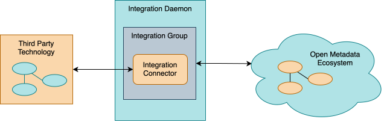

<!-- SPDX-License-Identifier: CC-BY-4.0 -->
<!-- Copyright Contributors to the ODPi Egeria project 2020. -->

# Integration Connector

The *integration connectors* support the exchange of metadata with third party technologies.  This exchange may be inbound and/or outbound; synchronous, polling or event-driven.

An integration connector is hosted in an [Integration Daemon](/concepts/integration-daemon) server.  It is built using the [Open Integration Framework (OIF)](/frameworks/oif/overview), which supplies its base classes and the *context* object that gives it access to open metadata.  A single integration connector can work with many pieces of third party technology, each one attached to it as a [catalog target](/concepts/catalog-target).

> An integration connector is shown deployed in an integration daemon.  The connector is linking to a third party technology and also calling the open metadata APIs of Egeria to manage the exchange of metadata.

!!! education "Further information"
    
    - [Configuring an integration connector](/guides/admin/servers/by-section/integration-daemon-services-section).
    - [Writing an integration connector](/guides/developer/integration-connectors).
    - [Supporting catalog targets](/guides/developer/integration-connectors/catalog-targets).
    - [Open Connector Framework (OCF)](/frameworks/ocf/overview).

---8<-- "snippets/abbr.md"
