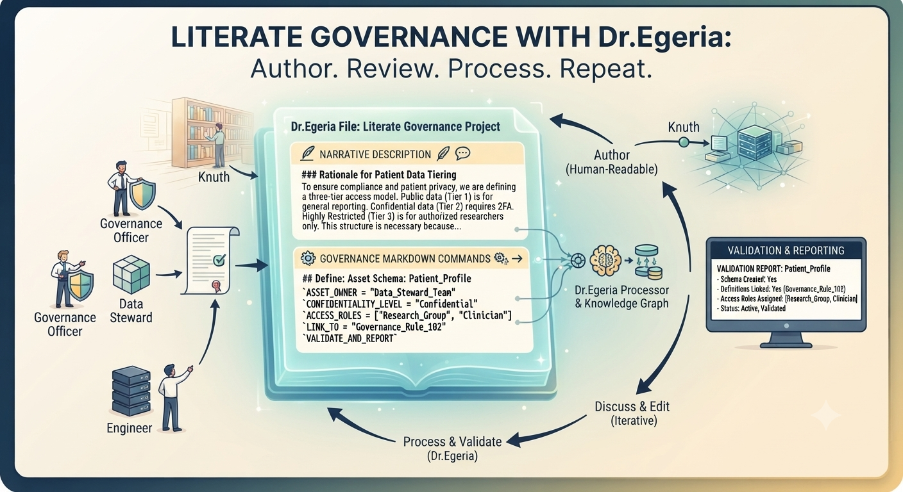

<!-- SPDX-License-Identifier: CC-BY-4.0 -->
<!-- Copyright Contributors to the Egeria project. -->

# Literate governance

Literate governance is a concept that emphasizes the importance of documentation and communication in the governance process. It involves creating and maintaining documentation that is easily accessible and understandable by all stakeholders involved in the governance process. This documentation can include policies, procedures, guidelines, and other materials that help to ensure that governance decisions are made in a transparent and consistent manner.

The concept borrows heavily from Donald Knuth’s philosophy of _Literate Programming_. Instead of writing disconnected code or filling out rigid forms, governance officers, data stewards and engineers can author integrated documents that explains _why_ a structure exists in plain natural language, right alongside the precise commands that _create_ it.

Dr.Egeria’s markdown-based architecture is natively built for this. A single Dr.Egeria file is essentially a structural narrative document. It can contain blocks of descriptive text, separated by native markdown commands that define governance definitions, asset schemas, or module relationships.  When the document is passed to the Dr.Egeria processor, it interprets the document and creates the appropriate definitions in Egeria's knowledge graph.

The command language includes report requests so it is easy to validate that the content has been loaded and linked correctly.

The benefit of this approach is its lifecycle simplicity. A person can author a multi-step document that lays out a new project or set of governance definitions and load it into Egeria.  The original document can be shared with team members for peer review. Since the Dr.Egeria document is completely human-readable, others can review and edit the document itself, sending the updated file around for discussion.

The document can be validated and reprocessed by Dr.Egeria as many times as it takes.

--8<-- "snippets/abbr.md"