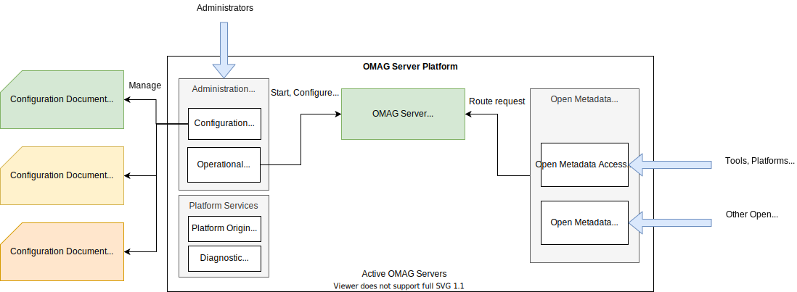

---
hide:
- toc
---

<!-- SPDX-License-Identifier: CC-BY-4.0 -->
<!-- Copyright Contributors to the Egeria project. -->

# OMAG Server Platform

The OMAG Server Platform provides a runtime process and platform for
four broad groups of services:

- **Server origin service** - used to determine the type and level of the OMAG Server Platform.
- **Platform services** - used to determine the servers and their services running on the platform.
- **Administration services** - used to configure and manage the [OMAG servers](omag-server.md) running inside the OMAG Server Platform.
- **Open Metadata and Governance (OMAG) services** - used to work with metadata and govern the assets of an organization.

The OMAG services are configured and activated in [OMAG servers](omag-server.md) using the
[administration services](/egeria-docs/guides/admin).
The configuration operations of the admin services create
[configuration documents](configuration-document.md), one for each OMAG server.
Inside a configuration document is the definition of which OMAG services to activate in the server.
These include the [repository services](/egeria-docs/services/omrs) (any type of server),
the [access services](/egeria-docs/services/omas) (for metadata access points
and metadata servers), [governance services](/egeria-docs/services/omes) (for governance servers) and
[view services](/egeria-docs/services/omvs) (for view servers).

Once a configuration document is defined, the OMAG server can be started and stopped multiple times by
the admin services server instance operations.

The OMAG Server Platform also supports some [platform services](../../../platform-services)
to query details of the servers running on the platform.

The OMAG Server Platform can also host multiple OMAG servers at any one time:

The choices are as follows:

- **A** - Each OMAG server has its own dedicated OMAG Server Platform - useful when only one server is needed
  in a deployment environment, or there is a desire to keep each server isolated in its own stack.
- **B** - Multiple OMAG servers are hosted on the same OMAG Server Platform. The OMAG Server Platform routes
  inbound requests to the right server based on the server name specified in the request URL.
  The servers may all be of the same type (multi-tenant operation) or be a set of collaborating servers
  of different types consolidated onto the same platform.
- **C** - Multiple copies of same server instance running on different platforms to provide
  high availability and distribution of workload (horizontal scalability).

Each OMAG server is isolated within the server platform and so the OMAG server platform can be used to 
support [multi-tenant :material-dock-window:](https://en.wikipedia.org/wiki/Multitenancy){ target=wikipedia }
operation for a cloud service,
or host a variety of different OMAG servers needed at a particular location.

## Startup sequence

When the OMAG Server Platform first starts up, a limited set of functionality is available:

The server origin service is operational at this point. It can be used by operational scripts to determine if the
OMAG Server Platform is still running.

The administration services are active at this point, while the open metadata and governance services
will return an error if called since there are no [OMAG servers](omag-server.md) running.

The configuration services are used to create [configuration documents](configuration-document.md).
Each configuration document describes the open metadata and governance services that should be activated in an
OMAG server.

In the following diagram, the configuration services create three configuration documents:

- one for the `cdoMetadataRepository` OMAG server
- one for the `stewardshipServer` OMAG Server
- one for the `dataLakeDiscoveryEngine` OMAG Server

The [admin guide](/egeria-docs/guides/admin)
provides detailed instructions on creating configuration documents for various configurations.

Once a configuration document for an OMAG server is used by
the operational services initialize the requested services in the OMAG server.
The OMAG server can be started in any OMAG Server Platform: it does not have to be the same OMAG
Server Platform that created the configuration document.

For example, the following diagram shows an OMAG server platform with the `cdoMetadataRepository` local
OMAG server running.

Once the OMAG server has initialized successfully, the open metadata and governance services
can route requests to it.

An OMAG Server Platform can run multiple OMAG servers at one time:

??? education "Further reading"
    - [Configuring the OMAG Server Platform](/egeria-docs/guides/admin/configuring-the-omag-server-platform)
    - [Installing the OMAG Server Platform Tutorial](../../../../open-metadata-resources/open-metadata-tutorials/building-egeria-tutorial/task-installing-egeria.md)
    - [Running the OMAG Server Platform Tutorial](../../../../open-metadata-resources/open-metadata-tutorials/omag-server-tutorial)

--8<-- "snippets/abbr.md"
