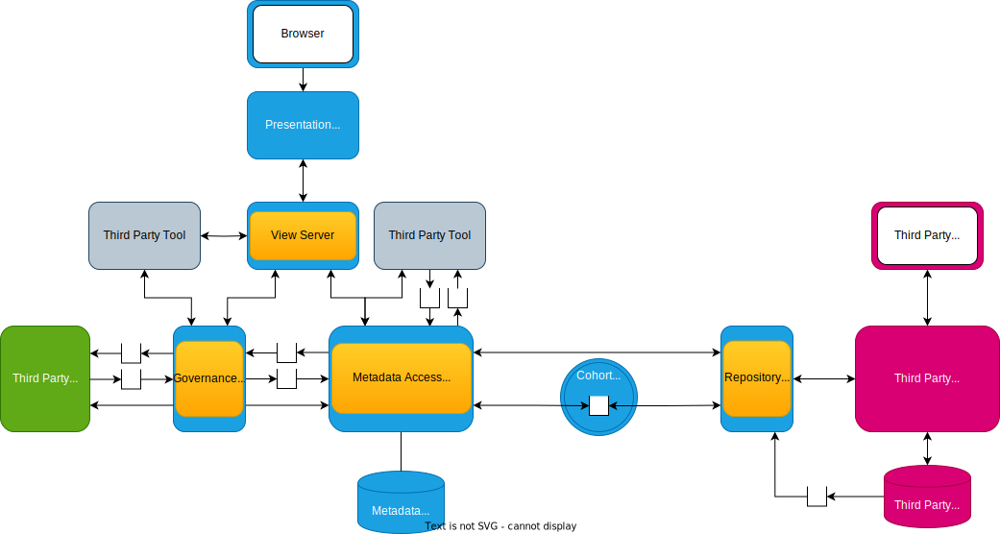
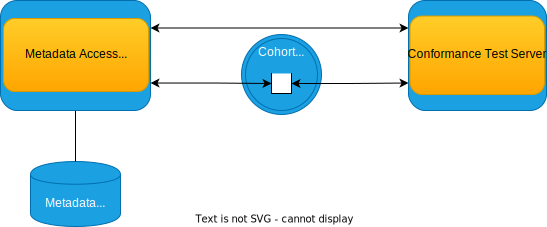

<!-- SPDX-License-Identifier: CC-BY-4.0 -->
<!-- Copyright Contributors to the Egeria project. -->

# Open Metadata and Governance (OMAG) Server

An *OMAG Server* is a software server that runs inside the [OMAG Server Platform](/concepts/omag-server-platform). It is therefore sometimes referred to as a "logical" server rather than a physical server that runs in its own process. It supports the integration of one or more technologies by hosting connectors that interact with that technology, or providing specialist [APIs](/basic-concepts/#application-programming-interface-apis) or [event topics](/basic-concepts/#topic) (both in and out).

Because of the wide variety of technologies deployed in organizations today, each with very different capabilities and needs, the integration and exchange of metadata needs to be organized. This organization is managed through the Egeria frameworks and services supported by the OMAG Servers. There are different [types of OMAG Server](#types-of-omag-server), each supporting specific technologies. The OMAG Server ensures this type of technology is integrated appropriately for its needs.

The capabilities that are activated in an OMAG Server are defined in its [configuration document](/concepts/configuration-document). When the server is started, the operational services of the OMAG Server Platform reads the configuration document and activates the OMAG Server with the requested services.

## Platform URL root

An OMAG Server's *platform URL root* is the network address of the [OMAG Server Platform](/concepts/omag-server-platform) where the OMAG Server is going to run. This is often the host name of the computer or container where the platform runs plus the port number allocated to the OMAG Server Platform.

Its value is needed when creating clients or configuring services that will call the OMAG Server because it provides the root of the URL used to call the server's open metadata and governance REST calls, which have the following format in their URLs:

```text
{{platformURLRoot}}/servers/{{serverName}}/<operation-name-and-parameters>
```

The platform URL root is the content of the URL prior to `/servers/`. The default value an OMAG Server Platform is `https://localhost:9443`.

## Server name

Most APIs in Egeria require both a [platform URL root](#platform-url-root) and a server name. The server name is the name of an OMAG Server where the desired service is running.

## Types of OMAG Server

The function needed to operate the [open metadata ecosystem](/concepts/open-metadata-ecosystem) are organized into different types of [services](/services) that are configured in their own type of OMAG Server.  This makes it easier to explain how to set them up and connect them together.
The types of OMAG Server are shown in Figure 1. The hierarchy groups similar types of server together.


> **Figure 1:** Types of OMAG Server

??? question "Detailed explanation of diagram"

    The way to understand the diagram is that the arrows should be read as **IS A**.  For example, the *repository proxy **IS A** cohort member* and the *cohort member **IS A** OMAG Server*. This means that everything documented about a particular type of server is also true for all server types that point to it through the **IS A** arrow, all the way down the hierarchy.

    Object-oriented software engineers would know of this type of relationship as behavior inheritance.

- [Cohort member](cohort-member) - All of these types of servers are optionally able to exchange metadata through an open metadata repository cohort.  This is a peer-to-peer metadata exchange for metadata repositories.
    - [Metadata access store](/concepts/metadata-access-store) - supports a metadata repository that can natively store open metadata along with specialized metadata APIs for different types of tools (these APIs are called [Open Metadata Access Services (OMASs)](/services/omas)).
    - [Metadata access point](/concepts/metadata-access-point) - supports the OMASs like the metadata access store, but but does not have its own repository. All the metadata it serves up and stores belongs to the metadata repositories in other members of the cohort.  This type of server needs to be connected to at least one cohort to be useful.
    - [Repository proxy](/concepts/repository-proxy) - acts as an open metadata translator for a third party metadata repository. It supports open metadata API calls and translates them to the proprietary APIs of the repository. It also translates events from the proprietary repository into open metadata events that flow over the cohort.
    - [Conformance test server](/concepts/conformance-test-server) - validates that a member of the cohort is conforming with the open metadata protocols. This server is typically only seen in development and test cohorts rather than production.
- [View server](/concepts/view-server) - manages specialist services for user interfaces.
- [Governance server](/concepts/governance-server) - supports the use of metadata in the broader IT landscape.
    - [Engine host](/concepts/engine-host) - provides a runtime for a specific type of [governance engine](/concepts/governance-engine) that runs [governance services](/concepts/governance-service) to monitor, enhance and govern the open metadata ecosystem.
    - [Integration daemon](/concepts/integration-daemon) - manages the synchronization of metadata with third party technology that can not call the access services directly.   through the [integration services](/services/omis).
    - [Data engine proxy](/concepts/data-engine-proxy) - supports the capture of metadata from a data engine. This includes details of the processing of data that it is doing which is valuable when piecing together lineage.
    - [Open lineage server](/concepts/open-lineage-server) - Manages the collation of lineage information and maintains it in a format for reporting. This includes the state of the lineage at different points in time.

## Server connectivity

The different types of OMAG Servers connect together as illustrated in Figure 2.  Metadata Access Stores and Metadata Access Points (collectively called [Metadata Access Servers](/concepts/metadata-access-server)) provide access to open metadata to the governance servers and view servers via their [Open Metadata Access Services (OMASs)](/services/omas).
The Governance Servers connect to external tools, engines and platforms.  The View Servers are called by user interfaces (including Egeria's user interfaces).
Multiple Metadata Access Servers can share metadata with Repository Proxies via one or more cohorts.   



> **Figure 2:** The connectivity between OMAG Servers

The repository for a Metadata Access Store may be connected to a conformance test server via a cohort to test that its implementation is conformant with the open metadata standards.  It is shown in figure 3.  This only happens during test and evaluation.


> **Figure 3:** Conformance testing


!!! education "Further information"

    The configuration for an OMAG Server is defined in a [configuration document](/concepts/configuration-document).
    This configuration document is stored by a [configuration document store connector](/concepts/configuration-document/#storage).

    - [Configuring an OMAG Server](/guides/admin/servers)
    - [Start and stop an OMAG Server](/guides/operations/overview/#starting-and-stopping-an-omag-server)

--8<-- "snippets/abbr.md"
