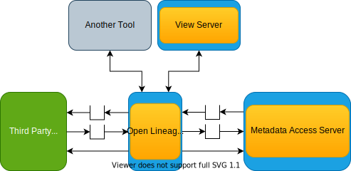

---
hide:
- toc
---

<!-- SPDX-License-Identifier: CC-BY-4.0 -->
<!-- Copyright Contributors to the Egeria project 2020. -->

# Open lineage server

The open lineage server is a [governance server](/concepts/governance-server)
that manages a historical warehouse of lineage information.

Its behavior and configuration is described [in the administration guide](/guides/admin/servers/configuring-an-open-lineage-server).

--8<-- "snippets/abbr.md"
