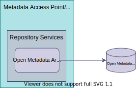

---
hide:
- toc
---

<!-- SPDX-License-Identifier: CC-BY-4.0 -->
<!-- Copyright Contributors to the ODPi Egeria project. -->

# Open Metadata Archive Store Connector

The *open archive store connector* manages the storage of an [Open Metadata Archive](/concepts/open-metadata-archive).  It is used in a utility or as an archive service in a [repository governance service](/concepts/repository-governance-service) that is maintaining an open metadata archive, and it is called in an [Metadata Access Store](/concepts/metadata-access-store) when it is loading metadata from the archive.

## Egeria Open Metadata Archive Connectors

Egeria provides two implementations of the open metadata archive store connector:

* [File-based Open Metadata Archive Store Connector :material-github:](https://github.com/odpi/egeria/tree/main/open-metadata-implementation/adapters/open-connectors/repository-services-connectors/open-metadata-archive-connectors/open-metadata-archive-file-connector){ target=gh }
  stores an open metadata archive as a plain text JSON file.

* [Directory-based Open Metadata Archive File Store Connector :material-github:](https://github.com/odpi/egeria/tree/main/open-metadata-implementation/adapters/open-connectors/repository-services-connectors/open-metadata-archive-connectors/open-metadata-archive-directory-connector){ target=gh }
  stores an open metadata archive in a directory structure where each type definition and metadata instance is stored in JSON format in its own file.

??? education "Further information relating to Open Metadata Archive Store Connectors"

    - [Metadata Archiving](/features/metadata-archiving/overview) to understand the different mechanisms that use open metadata archives.
    - [Open Metadata Archives](/concepts/open-metadata-archive) to understand structure of an open metadata archive.
    - [Writing a Open Metadata Archive Store Connector](/guides/developer/runtime-connectors/open-metadata-archive-store-connector).
    - [Loading an Open Metadata Archive at server statup](/guides/admin/servers/by-section/repository-services-section/#configuring-the-open-metadata-archives-to-load-on-server-startup)
    - [Loading an Open Metadata Archive in a running server](/guides/operations/adding-archive-to-running-server)

--8<-- "snippets/abbr.md"
