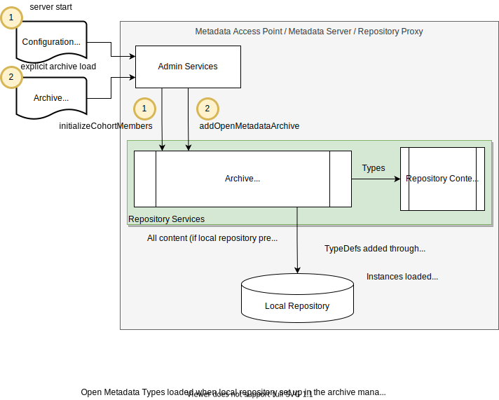

<!-- SPDX-License-Identifier: CC-BY-4.0 -->
<!-- Copyright Contributors to the Egeria project. -->

# Open Metadata Archive

An *open metadata archive* is a portable collection of open metadata [type definitions](/egeria-docs/introduction/key-concepts/#metadata-types) and [instances](/egeria-docs/introduction/key-concepts/#metadata-instances).  It can be [loaded each time a metadata access server starts up](/egeria-docs/guides/admin/servers/configuring-a-metadata-access-store/#configure-metadata-to-load-on-startup) or [added to a running metadata access server](/egeria-docs/guides/operations/adding-archive-to-a-running-server).

The open metadata archive has two types:

- A **content pack** containing reusable definitions that are generally useful. They may come from the Egeria community or third parties.
- A **metadata export** containing an export of metadata from a repository. They are used to transfer metadata between repositories that are not connected to the same [cohort](/egeria-docs/services/omrs/cohort).

## Structure

The logical structure of an open metadata archive is as follows:

--8<-- "docs/guides/developer/open-metadata-archives/open-metadata-archive-header-example.md"

Instances are linked together as follows:

- Entities are stored as `EntityDetail` structures.
- Relationships are stored as `Relationship` structures and link to their entities through the embedded `EntityProxy` structure.
- The entities will include their classifications; however, for classifications that are attached to entities that are not included in the archive, they are stored in an `ClassificationEntityExtension` structure.

Typically, open metadata archives are encoded in JSON format and stored in a file; however, both the format and storage method can be changed by changing the [open metadata archive connector](/egeria-docs/concepts/open-metadata-archive-store-connector).

## Processing

Open metadata archives are introduced into the server through the admin services either:

1. provided as part of the contents of the server's configuration document, or
2. through the operational command that added the archive directly into the running server's repository.

The archive is passed to the repository services' operational services, which in turn passes it on to the [archive manager](/egeria-docs/services/omrs/archive-manager). Type information is passed to the [repository content manager](../services/omrs/repository-content-manager.md).

Both the types and instances are passed to the local repository (if there is one).

The archive loads in the following order:

1. Attribute Type Definitions (`AttributeTypeDef`s) from the type store, through `verifyAttributeTypeDef()` and then `addAttributeTypeDef()`:
    1. PrimitiveDefs
    2. CollectionDefs
    3. EnumDefs
2. New Type Definitions (`TypeDef`s) from the type store, through `verifyTypeDef()` and `addTypeDef()` calls to the local repository:
    1. EntityDefs
    2. RelationshipDefs
    3. ClassificationDefs
3. Updates to types (`TypeDefPatch`es)
4. Instances, as reference copies:
    1. Entities
    2. Relationships
    3. Classifications

!!! tip "Cohort propagation"
    If the server is connected to the cohort, the new content is sent as notifications to the rest of the cohort.

--8<-- "docs/guides/admin/servers/configuring-the-startup-archives.md"

--8<-- "docs/guides/operations/adding-archive-to-running-server.md"

??? education "Further information"

    - [Metadata Archiving](/egeria-docs/features/metadata-archiving/overview) describing all of the features of Egeria that use the Open Metadata Archives
    - [The open metadata archive connector](/egeria-docs/concepts/open-metadata-archive-connector)

--8<-- "snippets/abbr.md"
