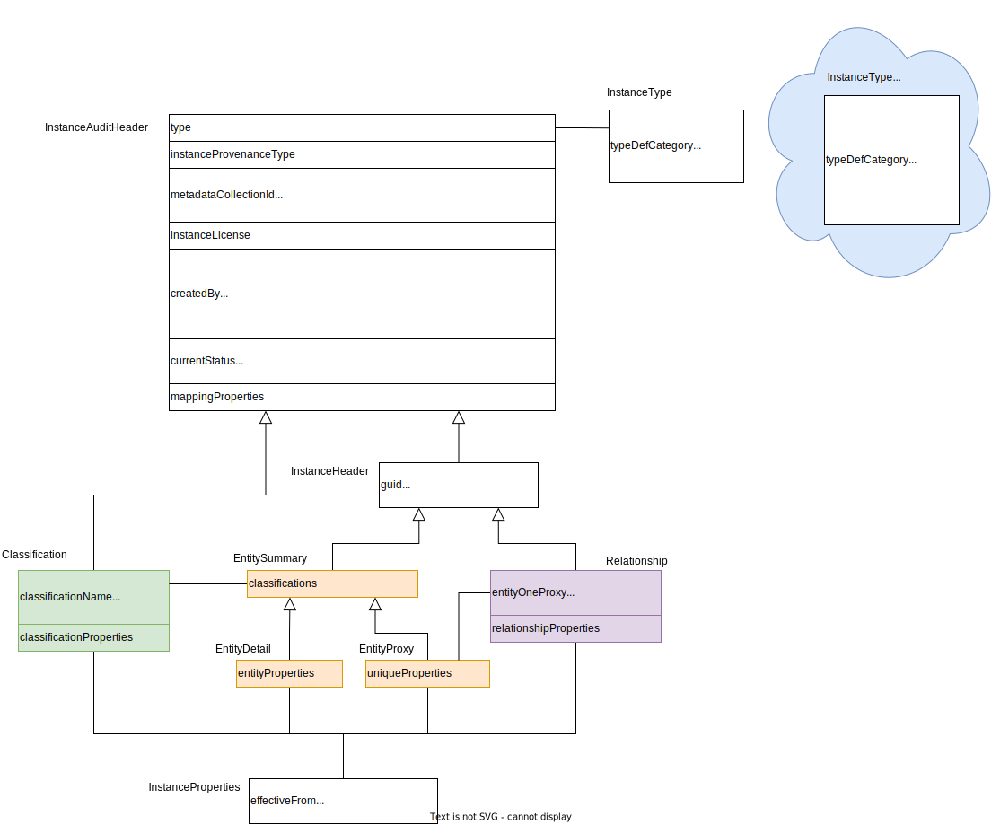

---
hide:
- toc
---

<!-- SPDX-License-Identifier: CC-BY-4.0 -->
<!-- Copyright Contributors to the ODPi Egeria project. -->

# Open Metadata Instances

An open metadata instance describes a single element of metadata.
There are two types of metadata instances in open metadata:

- *Entities* - these are the nodes (vertices) in the metadata graph.  They typically describe concepts, people,
places, things.

- *Relationships* - these are links (edges) in the metadata graph that show how the entities are related.

Entities can also be decorated with **classifications**.  These describe additional attributes of an entity
and can be used to identify entities that are similar in a specific aspect.

Attributes are optional. They can be primitives, enums, or collections such as arrays and maps.

Linked entities, relationships and classifications can be stored in different repositories in the cohort.
The graph is broken down into the structures shown in figure 2 to send as events, pass over APIS and and to store in [open metadata archives](open-metadata-archive.md).
An entity proxy is a subset of an entity.

Each instance has a home repository where updates occur.

Each instance can be copied to other repositories for efficiency.  These copies are read-only and called reference copies.

Model is design to allow metadata from one repository to be augmented by another. 

## Type definitions

Every metadata instance is linked to an [open metadata type definition (TypeDef)](open-metadata-type-definitions.md)
that describes what it represents and the properties that may be stored in it.

Although not proper metadata instances, the classifications are also linked to a TypeDef to ensure they
are have a well defined meaning.

## Fields in an open metadata instance

--8<-- "snippets/abbr.md"