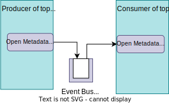
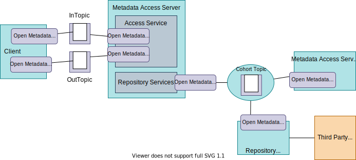
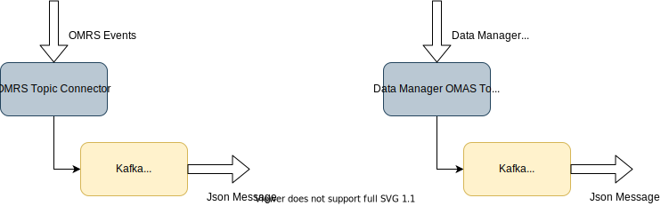

---
hide:
- toc
---

<!-- SPDX-License-Identifier: CC-BY-4.0 -->
<!-- Copyright Contributors to the ODPi Egeria project 2020. -->
  
# Open Metadata Topic Connectors

The *open metadata topic connector provides a publish-subscribe service that allows a producer to publish events to subscribed consumers.  Events are organized into topics.  A producer publishes an event to a topic and the consumers register a listener to receive all events from a topic.  It is the type of connector implemented by specific [event buses](/concepts/event-bus) such as [Apache Kafka](https://kafka.apache.org/).

The Open Metadata Topic Connector implements the [OpenMetadataTopicConnector](https://odpi.github.io/egeria/org/odpi/openmetadata/repositoryservices/connectors/openmetadatatopic/OpenMetadataTopicConnector.html) interface. This supports both the event producer and event consumer interfaces.  It assumes the event payload can be received as a string. Typically, this event payload is encoded in JSON but other formats are possible.

???+ info "Use of Open Metadata Topic Connector in Egeria"
The Open Metadata Topic Connectors are used by Egeria to read and write [events](/concepts/basic-concepts/#event) that contain notifications describing changes in open metadata.    For example, the Open Metadata Topic Connectors connect servers into an [open metadata repository cohort](/concepts/cohort-member) and exchange notifications through the [Open Metadata Access Services (OMAS)'s](/services/omas) topics called the [InTopic](/concepts/in-topic) and [OutTopic](/concepts/out-topic).  In all of these cases, an open metadata topic connector is nested inside a [specific runtime topic connector](/concepts/event-bus) that supports the event type in use.  The use of the open metadata topic connector in this way means that only one connector need be implemented for each type of event bus - rather than one for each type of event that Egeria supports.

    

## Use of Open Metadata Topic Connectors in Egeria

The open metadata topic [connector](/concepts/connector) supports the base `Open Metadata Topic` interface that is used for asynchronous event passing between members of the open metadata ecosystem. They typically delegate calls to their interface to an [event broker](/concepts/basic-concepts/#event-broker).  For example, the Kafka Open Metadata Topic Connector sends and receives events through Apache Kafka.

An open metadata topic connectors passes an event as a String containing a JSON document. They are designed to be embedded in virtual topic connectors that support a specific bean implementation for the event and manage the parsing of the JSON string into a Java bean.  The virtual topic connectors delegate all of the event communications to the open metadata topic connectors.

For example, the open metadata modules that support asynchronous communication implement virtual topic connectors that wrap the open metadata topic connectors. Figure 1 shows these virtual topic connectors working with the Apache Kafka implementation of the open metadata topic connector.

> **Figure 1:** Nested topic connectors

If a new implementation of the open metadata topic connector was implemented for a different event broker, the virtual topic connectors would continue to work as before.  The only change is that the [connection](/concepts/connection) for the open metadata topic connector would provide the configuration for the 

--8<-- "snippets/abbr.md"
