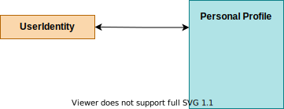
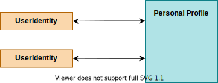
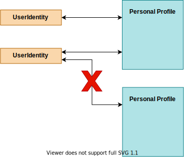
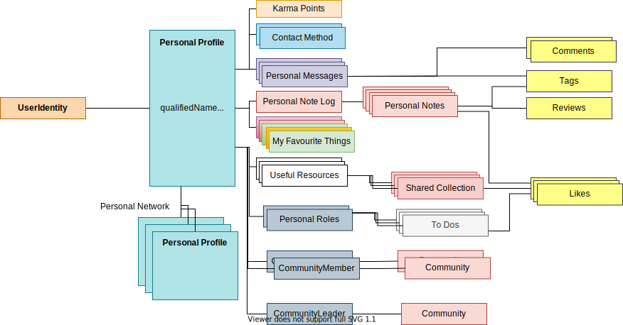

<!-- SPDX-License-Identifier: CC-BY-4.0 -->
<!-- Copyright Contributors to the ODPi Egeria project. -->

# Personal Profile

A personal profile provides a place for an individual to share information about themselves with the other people they are collaborating with.  It is associated with one or more of the person's userIds.

Personal profiles are managed through the [My Profile API](/services/omvs/my-profile/overview). They are organized as follows. Each userId is linked to the profile as a [UserIdentity](/concepts/user-identity) object.

> 

There can be more than one userId for a profile (for example if a user has an administrator userId and a normal userId)

> 

However, the same userId can not be linked to two profiles.

> 

This means we can retrieve a profile from the UserId.

Each profile has a qualified name that should uniquely identify the individual.  For example, an employee identifier.

There is space to provide the name the individual wants to be known as, and their full name, along with a job title.

An individual can also maintain collections of their favourite Assets, Projects and Communities and control notifications about changes to the member of these lists.

> 

## Personal Message

A personal message is a [notification](notification.md) that is attached to an individual's actor profile.  The notifications are organized into three note-logs:

* Journal Entries - these are private to the individual.  They enable an individual to record details of their work and personal reflections.
* Blog entries - these are public to the open metadata ecosystem.  They are used to broadcast information and perspectives that the individual wishes to share.
* Activity Log - these are also public to the open metadata ecosystem and record specific activities and their status.

Personal messages are supported by the [My Profile API](/services/omvs/my-profile/overview).

## Personal roles

Personal roles are the list of [person roles](/concepts/person-role) that an individual is currently appointed to.

[Community Member](/concepts/community/#community-member), [Team Leader](/concepts/person-role/#team-leader) and [Team Member](/concepts/person-role/#team-member) are examples of personal roles.

## Peer Network

An individual can maintain a list of their close/important colleagues. This is called their **peer network** and it is chained off of their*personal profile*.

It is important to note that the perspective on who is a close/important colleague is a personal perspective. Therefore open metadata separates the concept of who has linked to them from who they have linked to.

--8<-- "snippets/abbr.md"