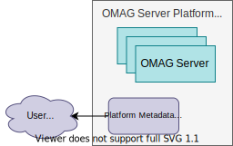

<!-- SPDX-License-Identifier: CC-BY-4.0 -->
<!-- Copyright Contributors to the ODPi Egeria project 2020. -->

# Platform Metadata Security Connector

The *platform metadata security connector* provides user account lookup based on a user name and authorization support for requests to the [OMAG Server Platform](/concepts/omag-server-platform).
There is one platform metadata security connector defined for each OMAG Server Platform.

## Egeria Platform Security Connectors

Egeria has a default implementation of the platform metadata security connector:

* [Open Metadata Access Security Connector](https://github.com/odpi/egeria/tree/main/open-metadata-implementation/adapters/open-connectors/metadata-security-connectors/open-metadata-access-security-connector)

??? education "Further information relating to Metadata Security Connectors"

    - [Metadata Security Overview](/features/metadata-security/overview) to understand the metadata security connectors in the context of all the security features.
    - [Configuring a Platform Metadata Security Connector](/guides/admin/configuring-the-omag-server-platform/#platform-security) in the [OMAG Server Platform](/concepts/omag-server-platform)
    - [Writing a Platform Metadata Security Connector](/guides/developer/runtime-connectors/platform-metadata-security-connector).

--8<-- "snippets/abbr.md"
