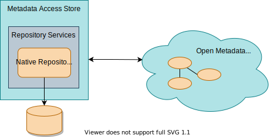
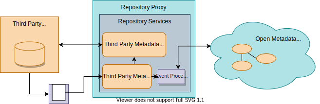

---
hide:
- toc
---

<!-- SPDX-License-Identifier: CC-BY-4.0 -->
<!-- Copyright Contributors to the ODPi Egeria project. -->

# Repository Connector

The [repository connector](/concepts/repository-connector), and its optional [event mapper connector](/concepts/event-mmapper-connector) provide the ability to integrate a metadata repository into the open metadata ecosystem.  These connector have direct access to the connected [open metadata repository cohorts](/concepts/cohort-member).  There are two patterns of use for these connectors.

In the first pattern, called the *native repository connector*, the [repository connector](/concepts/repository-connector) delegates all of its methods to a particular type of persistence store.  Metadata is only accessible through the Egeria APIs and it is stored as entities, relationships and classifications enabling it to support any valid type of open metadata. This type of repository connector runs as the local repository  within an Egeria [Metadata Access Store](/concepts/metadata-access-store) server.

> Repository connector supporting a native open metadata repository

In the second pattern, called the *adapter repository connector*, the repository connector, and an optional [event mapper connector](/concepts/event-mapper-connector), provide an adapter for a third party metadata repository so it can be a part of the open metadata ecosystem.  These connectors run in a [Repository Proxy](/concepts/repository-proxy) server.

>  Repository connector and optional event mapper connector supporting an adapter to a third party metadata repository

## Egeria repository connectors

The table below lists the repository connectors supporting the native open metadata repositories.

| Native Repository Connector                                                                                                                                                                                                                   | Description                                                                                                                                                                                                                                                                                    |
|-----------------------------------------------------------------------------------------------------------------------------------------------------------------------------------------------------------------------------------------------|------------------------------------------------------------------------------------------------------------------------------------------------------------------------------------------------------------------------------------------------------------------------------------------------|
| [PostgreSQL OMRS Repository Connector](https://github.com/odpi/egeria/tree/main/open-metadata-implementation/adapters/open-connectors/repository-services-connectors/open-metadata-collection-store-connectors/postgres-repository-connector) | provides a native repository for a metadata server using [PostgreSQL :material-dock-window:](https://www.postgresql.org/){ target=postgres } as the backend.                                                                                                                                   |
| [In-memory OMRS Repository Connector](https://github.com/odpi/egeria/tree/main/open-metadata-implementation/adapters/open-connectors/repository-services-connectors/open-metadata-collection-store-connectors/in-memory-repository-connector) | provides a simple native repository implementation that "stores" metadata in HashMaps within the JVM; it is used for testing, or for environments where metadata maintained in other repositories needs to be cached locally for performance/scalability reasons.                              |
| [Read-only OMRS Repository Connector](https://github.com/odpi/egeria/tree/main/open-metadata-implementation/adapters/open-connectors/repository-services-connectors/open-metadata-collection-store-connectors/in-memory-repository-connector) | provides a native repository implementation that does not support the interfaces for create, update, delete; however, it does support the search interfaces and is able to cache metadata -- this means it can be loaded with open metadata archives to provide standard metadata definitions. |

??? education "Further information relating to Repository and Event Mapper connectors"

    - [Configuring a native repository connector](/guides/admin/servers/by-server-type/configuring-a-metadata-access-store/#configure-the-native-repository-connector) to understand how to set up a repository connector in a [Metadata Access Store](/concepts/metadata-access-store).
    - [Configuring an adapter repository connector](/guides/admin/servers/by-server-type/configuring-a-repository-proxy/#configure-the-connectors-to-the-third-party-metadata-repository) to understand how to set up a repository connector in a [Repository Proxy](/concepts/repository-proxy).
    - [Writing repository and event mapper connectors](/guides/developer/repository-connectors/overview) for more information on writing new repository and event mapper connectors.
    - [Open Connector Framework (OCF)](/frameworks/ocf/overview).

--8<-- "snippets/abbr.md"

