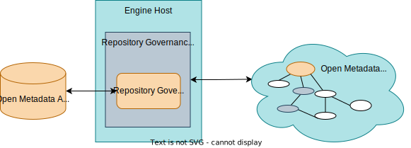

<!-- SPDX-License-Identifier: CC-BY-4.0 -->
<!-- Copyright Contributors to the ODPi Egeria project 2019, 2020. -->

# Repository Governance Service

An *repository governance service* is a [specialized connector](/concepts/connector) that performs governance on open metadata repository  such as maintaining an [open metadata archive](/concepts/open-metadata-archive). It is hosted in the [Repository Governance OMES](/services/omes/repository-governance/overview) which is, in turn, running in an [engine host](/concepts/engine-host) OMAG server.

> **Figure 1:** Repository Governance Services

A repository governance service can:

- Register a listener with the Enterprise OMAS Topic to receive notifications from any of the repositories connected via [Open Metadata Repository Cohorts](/concepts/cohort-member).
- Issue requests to find and retrieve metadata instances from any of the repositories connected via Open Metadata Repository Cohorts.
- Incrementally build and store an open metadata archive.

## Egeria's Repository Governance Services

The repository governance services are still experimental.  There is a proof of concept connector for dynamically building an archive for a glossary called the [Dynamic Glossary Archiver](https://github.com/odpi/egeria/tree/main/open-metadata-implementation/adapters/open-connectors/dynamic-archiver-connectors). 

--8<-- "snippets/abbr.md"