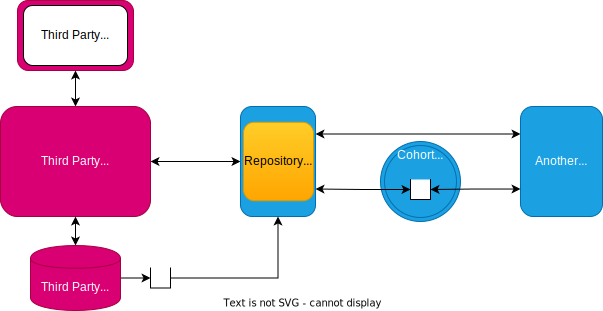

---
hide:
- toc
---

<!-- SPDX-License-Identifier: CC-BY-4.0 -->
<!-- Copyright Contributors to the Egeria project. -->

# Repository Proxy

A *repository proxy* is an [OMAG Server](/egeria-docs/concepts/omag-server) that has been configured to act as a proxy to a third party metadata repository. It is used by a technology that is integrating using the [adapter integration pattern](../../../../open-metadata-publication/website/open-metadata-integration-patterns/adapter-integration-pattern.md).

The repository proxy hosts a repository connector to wrap the third party metadata server's APIs and an optional event mapper connector.  There are two repository connector implementations included with Egeria:

- [Repository connectors for Apache Atlas :material-dock-window:](https://github.com/odpi/egeria-connector-hadoop-ecosystem){ target=atlas }
- [Repository connectors for IBM Information Governance Catalog (IGC) :material-dock-window:](https://github.com/odpi/egeria-connector-ibm-information-server){ target=infosvr }

--8<-- "snippets/abbr.md"
