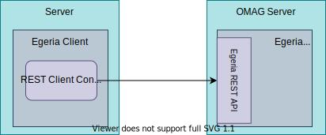

---
hide:
- toc
---

<!-- SPDX-License-Identifier: CC-BY-4.0 -->
<!-- Copyright Contributors to the ODPi Egeria project. -->

# REST client connector

Egeria makes extensive use of [REST API calls](/concepts/basic-concepts) for synchronous (request-response) communication with
its own deployed platforms and third party technologies.  The REST client connectors are used to issue
the REST API calls.

## Egeria REST client connectors

Egeria provides a single implementation for Spring.

* [Spring REST Client Connector :material-github:](https://github.com/odpi/egeria/tree/main/open-metadata-implementation/adapters/open-connectors/rest-client-connectors/spring-rest-client-connector){ target=gh }
  uses the Spring RESTClient to issue REST API calls.

!!! education "Further information"
    
    - Egeria's [Platform API clients](/guides/developer/#working-with-the-platform-apis).
    - Egeria's [OMAS clients](/guides/developer/#working-with-the-open-metadata-and-governance-apis).
    - [Open Connector Framework (OCF)](/frameworks/ocf/overview).

--8<-- "snippets/abbr.md"

