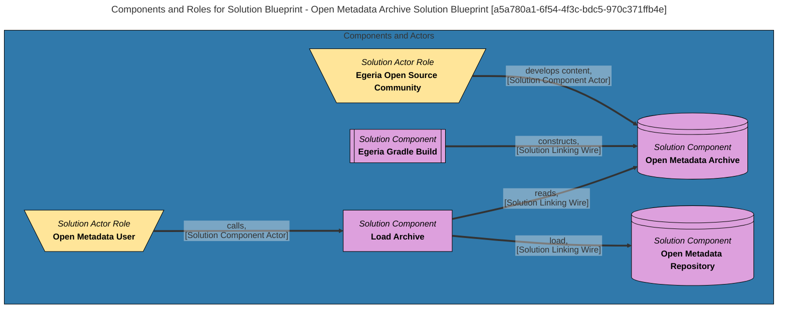

---
hide:
- toc
---

<!-- SPDX-License-Identifier: CC-BY-4.0 -->
<!-- Copyright Contributors to the Egeria project. -->

# Solution Blueprint

The *solution blueprint* collects the [solution components](/concepts/solution-component) that together deliver a business solution.

A [project](/concepts/project) may have multiple solution blueprints, each showing a particular aspect, or level of detail.  The aim is to model only the detail that is important for the team members to discuss, agree on and share with stakeholders.  As such, a blueprint does not contain many of the details, such as data types and cardinality, typically found on more technical models such as UML, or E-R diagrams.  Their purpose is to support the telling of a story.

The diagram below shows the mermaid diagram produced by Egeria for a solution blueprint that describes how the [Open Metadata Archives](/content-packs) are created and loaded.

The inverted trapeziums shown in yellow are the *solution actor roles* involved in the solution.  They are typically teams, roles, or individuals that are part of the solution.  However, they may be automated processes from outside the solution that are interacting with one or more of the solution components.

The solution components are shown in pink.  Their shapes indicate the type of component (based on the *solutionComponentType* attribute).

A solution blueprint is defined as a specialized [collection](/concepts/collection) of solution components.  The visualization of the blueprint includes just these components, any solution actors linked to these components and the solution linking wires that collect them together.  Each solution linking wire includes the label from the relationship as well as its type.

The operations for working with solution blueprints are found in the [Solution Architect](/services/omvs/solution-architect/overview) services and the open metadata types are found in model [0740 Solution Blueprints](/types/7/0740-Solution-Blueprints).

-8<-- "snippets/abbr.md"
