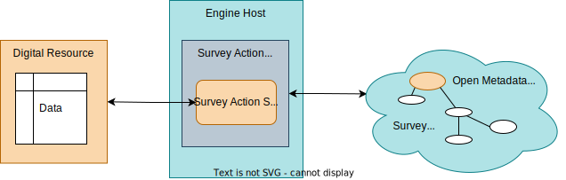

---
hide:
- toc
---

<!-- SPDX-License-Identifier: CC-BY-4.0 -->
<!-- Copyright Contributors to the ODPi Egeria project. -->

# Survey Action Service

An *survey action service* is a component that performs analysis of the contents of a [digital resource](/concepts/digital-resource) on request.  The aim of the survey action service is to enable a detailed picture of the properties of a resource to be built up.

Each time a survey action service runs, it creates a new [survey report](/concepts/survey-report) linked off of the digital resource's [Asset](/concepts/asset) metadata element that records the results of the analysis.

> Each time an survey action service runs to analyse a digital resource, a new survey report is created and attached to the resource's asset.  If the survey action service is run regularly, it is possible to track how the contents are changing over time.

The *survey report* contains one or more sets of related properties that the survey action service has discovered about the resource, its metadata, structure and/or content.  These are stored in a set of [*annotations*](/concepts/survey-report/#annotations) linked off of the survey report.

An survey action service is designed to run at regular intervals to gather a detailed perspective on the contents of the digital resource and how they are changing over time.  Each time it runs, it is given access to the results of previously run survey-action services, along with a review of these findings made by individuals responsible for the digital resource (such as stewards, owners, custodians).

??? info "Operation of an survey action service"
    Once installed in the engine host, the survey action service can be called either by:

    * via an [engine action](/concepts/engine-action), or
    * via a [governance action type](/concepts/governance-action-type), or
    * via a [governance action process](/concepts/governance-action-process).

Each time the survey action service starts, the Survey Action OMES creates a new [Survey Report](/concepts/survey-report) via a call to the Asset Owner OMAS.  As the survey action service runs, it is retrieving metadata, and storing annotations, via its [survey context](/concepts/survey-context).  The Survey Action OMES routes these requests to the Asset Owner OMAS which has access to the open metadata repositories.

??? info "Runtime for a survey action service"
    Survey action services are packaged into [Survey Action Engines](/concepts/survey-action-engine) that run in the [Survey Action OMES](/services/omes/survey-action/overview) hosted in an [Engine Host](/concepts/engine-host).

    The metadata repository interface for metadata discovery tools is implemented by the [Asset Owner OMAS](/services/omas/asset-owner/overview) that runs in a [Metadata Access Server](/concepts/metadata-access-server).

    A survey action service may be triggered via an [Engine Action](/concepts/engine-action), a [governance action type](/concepts/overnance-action-type) or as part of a [governance action process](/concepts/governance-action-process).

    

## Survey Action Pipeline

There is a lot of common functions that are used repeatedly during the surveying process.

A *survey action pipeline* is a specialized implementation of a [survey action service](/concepts/survey-action-service) that runs a set of survey action services against a single [digital resource](/concepts/digital-resource).  The implementation of the pipeline determines the order that these services are run.

Each service in the pipeline is able to access the results of the services that have run before it through the [survey context](/frameworks/osf/overview/#survey-context).  The combined results of the pipeline are grouped into a single [survey report](/concepts/survey-report) linked off of the asset.

The aim of the survey action pipeline is to enable reusable survey action service implementations to be choreographed together for different types of digital resource.

!!! education "Further information"

    * [Writing Survey Action Services](/guides/developer/survey-action-services/overview)
    * [Configuring Survey Action Services into a Governance Engine](/guides/developer/open-metadata-archives/creating-governance-engine-packs)
    
--8<-- "snippets/abbr.md"