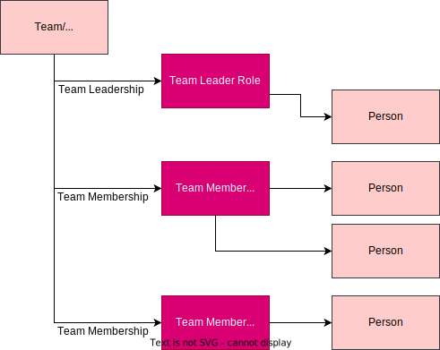
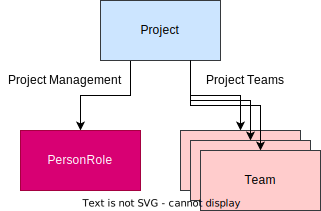

<!-- SPDX-License-Identifier: CC-BY-4.0 -->
<!-- Copyright Contributors to the ODPi Egeria project. -->

# Teams

A team is a group of people who are working together to achieve a common goal.  The makeup of the team is defined using [Person Roles](/concepts/person-role) that define the different jobs within the team.  Some roles are defined as leadership roles and others are defined as team membership roles.  Individuals are then appointed to the roles.

## Organizations

Organization entities are specialized types of teams that represent the top of an organization - typically a separate legal entity.  The organization is then structured using a hierarchy of teams that describe how people are organized to achieve the objectives of the organization.

## Project teams

[Projects](/concepts/projects) typically have one or more teams defined to identify the people who are performing its task.

!!! info "Further information"
    * The Open Metadata Type definitions for teams are in model [0115](/types/1/1005-teams).

---8<-- "snippets/abbr.md"