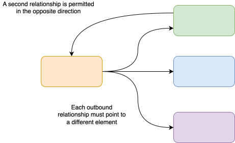
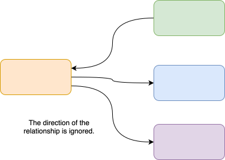
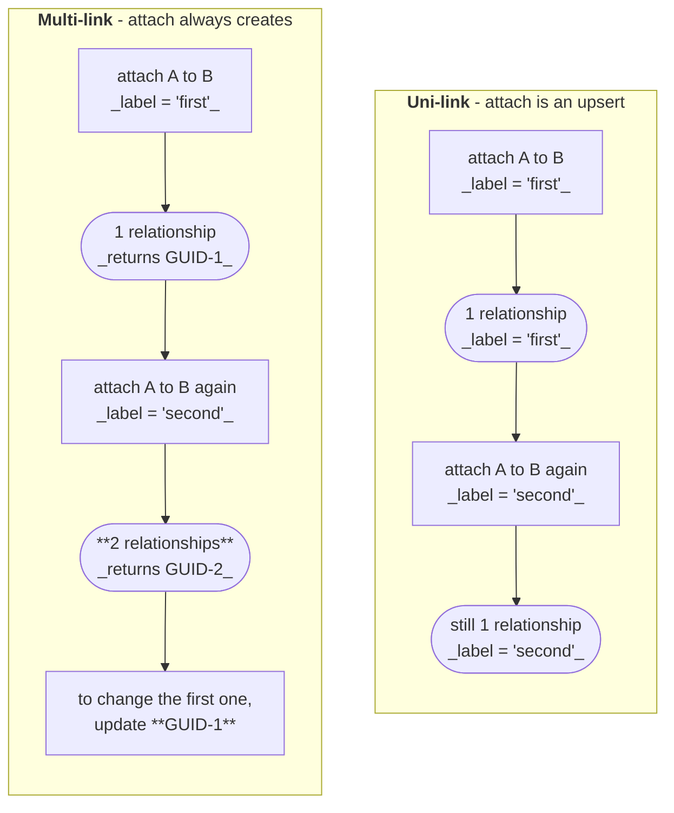

<!-- SPDX-License-Identifier: CC-BY-4.0 -->
<!-- Copyright Contributors to the ODPi Egeria project 2020. -->

# Relationship Linkage Rules (Relationship Category)

Relationships have a cardinality.  This determines, when starting from a particular element, how many relationships of a particular type are allowed.  If multiple (many) relationships are permitted. the relationship category further controls how many relationships of a specific type are permitted between two elements.

## Uni-link relationships

This is the default category, and most common setting. *Uni-link* means only one relationship of this type can be connected between two element instances in a specific direction. If a second relationship is connected between them in a specific direction, the properties of the original relationship are simply updated.



## Reversible relationships

*Reversible* means a relationship can be created in both directions between two elements.  However, only one relationship will be stored and later "creates" will simply update the properties of the original relationship.  A reversible relationship is defined by setting the attribute name of either end to be the same value.



## Multi-link relationships

*Multi-link* means multiple instances of the relationship may be present between two elements.  In this case, the relationship properties are key in identifying the significance of each relationship instance.  A multi-link relationship is defined using the milti-link boolean setting in the relationship definition.


## Maintaining relationships through the APIs

The category of a relationship is not just a modelling detail: it determines the shape of the API used to maintain it.  Uni-link and reversible relationships are identified by the elements at their two ends, because there can only ever be one of them.  Multi-link relationships have to be identified by their own unique identifier, because the two ends do not distinguish one instance from another.

This difference runs all the way through Egeria - the REST API, the Java clients and the [connector context](/guides/developer/integration-connectors/integration-context) clients all follow it.  Getting it wrong is one of the more common mistakes made when building on the APIs, so it is worth understanding before you write the calls.

### How to tell which pattern applies

The relationship's type definition decides, and there are three ways to find out which it is:

* On the [type model diagrams](/types), a thin line is uni-link and a thick line is multi-link.
* At runtime, the type definition returned by the API carries a *relationship category* of `Uni-link`, `Reversible` or `Multi-link`.
* Most directly of all, look at what the attach call gives you back.  **If the attach call returns the new relationship's unique identifier, the relationship is multi-link.  If it returns nothing, it is uni-link.**  In REST terms that is a `GUIDResponse` rather than a `VoidResponse`.  The identifier is returned precisely because you are going to need it later - and if you are not given one, it is because you will never need it.

### Uni-link and reversible: identified by the two ends

Every call names the two elements being connected.  There is no update method, and none is needed: attaching the same two elements again updates the properties of the relationship that is already there rather than creating a second one.  Attach is, in effect, an *upsert*, and calling it repeatedly is safe.

```
###
# @name linkSolutionDesign
# Attach a solution blueprint to the element that it describes.
POST {{baseURL}}/servers/{{viewServer}}/api/open-metadata/solution-architect/elements/{{parentGUID}}/solution-designs/{{solutionBlueprintGUID}}/attach
Authorization: Bearer {{token}}
Content-Type: application/json

{
  "class" : "NewRelationshipRequestBody",
  "properties" : {
    "class" : "SolutionDesignProperties",
    "label" : "logical design",
    "description" : "The blueprint that this element implements."
  }
}
```

Detaching names the same two elements:

```
###
# @name detachSolutionDesign
POST {{baseURL}}/servers/{{viewServer}}/api/open-metadata/solution-architect/elements/{{parentGUID}}/solution-designs/{{solutionBlueprintGUID}}/detach
Authorization: Bearer {{token}}
Content-Type: application/json

{
  "class" : "DeleteRelationshipRequestBody"
}
```

The same pair of calls through a connector context client - a `void` attach and a detach, both taking the two end identifiers:

```java
collectionClient.linkSolutionDesign(parentGUID,
                                    solutionBlueprintGUID,
                                    makeAnchorOptions,
                                    solutionDesignProperties);

collectionClient.detachSolutionDesign(parentGUID,
                                      solutionBlueprintGUID,
                                      deleteOptions);
```

For a *reversible* relationship the attach call also looks for an existing relationship with the ends the other way round before it decides to create one, so linking B to A after A has been linked to B updates the original relationship rather than adding a second.

The one-relationship rule is enforced by this API rather than by the repositories themselves.  If the repositories do somehow hold more than one relationship of a uni-link type between the same two elements, the attach call cannot tell which one you meant, so rather than guess it fails with `OMAG-GENERIC-HANDLERS-404-004`, listing the identifiers it found so that the surplus can be cleaned up.

### Multi-link: identified by the relationship's own unique identifier

Attach always creates a new relationship and returns its unique identifier.  Update and detach then work on that identifier rather than on the two ends.

```
###
# @name linkExternalReference
# Attach an external reference to an element.  Returns the new relationship's GUID.
POST {{baseURL}}/servers/{{viewServer}}/api/open-metadata/external-links/elements/{{elementGUID}}/external-references/{{externalReferenceGUID}}/attach
Authorization: Bearer {{token}}
Content-Type: application/json

{
  "class" : "NewRelationshipRequestBody",
  "properties" : {
    "class" : "ExternalReferenceLinkProperties",
    "label" : "installation guide",
    "description" : "Section 4 covers the network configuration."
  }
}
```

To change the label on that link later, use the identifier that the attach call returned - not the two ends:

```
###
# @name updateExternalReferenceLink
POST {{baseURL}}/servers/{{viewServer}}/api/open-metadata/external-links/external-reference-links/{{externalReferenceLinkRelationshipGUID}}/update
Authorization: Bearer {{token}}
Content-Type: application/json

{
  "class" : "UpdateRelationshipRequestBody",
  "mergeUpdate" : true,
  "properties" : {
    "class" : "ExternalReferenceLinkProperties",
    "label" : "installation and networking guide"
  }
}
```

```
###
# @name detachExternalReference
POST {{baseURL}}/servers/{{viewServer}}/api/open-metadata/external-links/external-reference-links/{{externalReferenceLinkRelationshipGUID}}/detach
Authorization: Bearer {{token}}
Content-Type: application/json

{
  "class" : "DeleteRelationshipRequestBody"
}
```

The same three calls through a connector context client.  Note that the attach method returns a `String` - that return value is the whole point of the pattern, so keep it:

```java
String linkGUID = externalReferenceClient.linkExternalReference(elementGUID,
                                                               externalReferenceGUID,
                                                               makeAnchorOptions,
                                                               relationshipProperties);

externalReferenceClient.updateExternalReferenceLink(linkGUID,
                                                    updateOptions,
                                                    relationshipProperties);

externalReferenceClient.detachExternalReference(linkGUID,
                                                deleteOptions);
```

Multi-link relationships often have a *second* detach call that takes the two ends instead.  It does not remove one relationship - it removes **every** relationship of that type between the two elements.  It is there for the case where you want to clear the connection entirely, and the javadoc on each of these methods says so.  Read the parameter names before you call it:

```java
// removes ALL ExternalReferenceLink relationships between these two elements
externalReferenceClient.detachExternalReference(elementGUID,
                                                externalReferenceGUID,
                                                deleteOptions);
```

### The common mistake



!!! warning "Calling attach twice does not update a multi-link relationship"
    Because attach behaves as an upsert for uni-link relationships, it is easy to assume it does the same for multi-link relationships.  It does not.  Each call adds another relationship, and nothing reports an error - the second call succeeds and returns a different identifier from the first.

    The symptom is an element that slowly accumulates duplicate attachments, one for every time the code ran.  It shows up most often in [integration connectors](/concepts/integration-connector), where `refresh()` is called repeatedly on a schedule, and in any code that re-runs to "make sure" a link exists.

    If you want to change the properties of a multi-link relationship, you must call the update method with the relationship's own unique identifier.

### Finding the relationship identifier again

Keeping the identifier that attach returned is the simplest approach, but it is not always possible - the code that maintains a relationship is often not the code that created it.  In that case, retrieve the element's related elements and read the identifier from the relationship header that comes back with each one.  Every related-element result carries the properties of the relationship *and* its header, and the `guid` in that header is what the update and detach calls need.

This is also how a user interface does it: the list of an element's attachments already contains the relationship identifiers, so the *edit* and *remove* buttons beside each entry have everything they need.

For a multi-link relationship, expect more than one result for the same pair of elements - that is the whole point of the category - so match on the relationship properties to find the one you want.

### Summary

|  | uni-link and reversible | multi-link |
|---|---|---|
| Identified by | the two end elements | its own unique identifier |
| Attach returns | nothing | the new relationship's identifier |
| Attaching the same pair again | updates the existing relationship | creates another relationship |
| Update | no separate call - attach again | update call, keyed by the relationship identifier |
| Detach | keyed by the two end elements | keyed by the relationship identifier |
| Detach by the two ends | removes the one relationship | removes **all** of them, where such a call is offered |

--8<-- "snippets/abbr.md"

