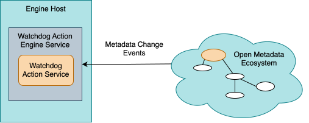

---
hide:
- toc
---

<!-- SPDX-License-Identifier: CC-BY-4.0 -->
<!-- Copyright Contributors to the Egeria project. -->

# Watchdog Action Service

A *watchdog action service* is a specialized [connector](/concepts/connector) that monitors the open metadata ecosystem for a specific situation or event and, when it occurs, notifies the people, teams or processes that need to know.

> A watchdog action service, hosted in a watchdog action engine running in the engine host, listens for metadata change events from the open metadata ecosystem and notifies its subscribers when the situation it is watching for occurs.

Unlike the other kinds of [governance service](/concepts/governance-service), a watchdog action service is expected to keep running for as long as the situation needs watching, rather than completing quickly - see [Open Watchdog Framework (OWF)](/frameworks/owf/overview) for why watchdog action services were given their own framework, rather than remaining one of the (short-running) [governance action service](/concepts/governance-action-service) types.

A watchdog action service can be set up in either of two ways:

* Watching a single metadata instance, or every instance of a particular open metadata type, and running a named [governance action process](/concepts/governance-action-process) whenever a chosen kind of event occurs against it - a new element appearing, a property changing, a classification being added or removed, and so on.
* Watching through a formally-defined [*notification type*](/types/4/0451-Notifications), which describes the resource(s) to monitor and the subscribers to notify, and manages the resulting subscription lifecycle - welcoming new subscribers, notifying them as often as the notification type specifies, and dismissing them when the subscription ends.

See [Open Watchdog Framework (OWF)](/frameworks/owf/overview) for the full description of both patterns, the *watchdog context* that a watchdog action service uses to do its work, the standard request parameters, action targets and guards it supports, and worked examples of both patterns.

??? info "Operation of a watchdog action service"
    Once installed in the engine host, a watchdog action service can be started via:

    * an [engine action](/concepts/engine-action), or
    * a [governance action type](/concepts/governance-action-type), or
    * a [governance action process](/concepts/governance-action-process).

    Unlike a short-running governance action service, a watchdog action service does not typically complete straight away - it keeps running, and its engine action stays active, for as long as it is watching for something.  It only records a completion status if it fails, if it was asked to watch for a single occurrence and that has now happened, or if it is deliberately stopped.  If the engine host server hosting it is restarted, the watchdog action service is restarted too, rather than being left incomplete.

??? info "Runtime for a watchdog action service"
    Watchdog action services are packaged into [watchdog action engines](/concepts/watchdog-action-engine) that run in the [Watchdog Action OMES](/services/omes/watchdog-action/overview) hosted in an [Engine Host](/concepts/engine-host).

    The open metadata repository interface for a watchdog action service is provided through its *watchdog context*, which the Watchdog Action OMES routes to a Metadata Access Server.

!!! education "Further information"

    * [Open Watchdog Framework (OWF)](/frameworks/owf/overview)
    * [Writing Watchdog Action Services](/guides/developer/watchdog-action-services/overview)

--8<-- "snippets/abbr.md"
