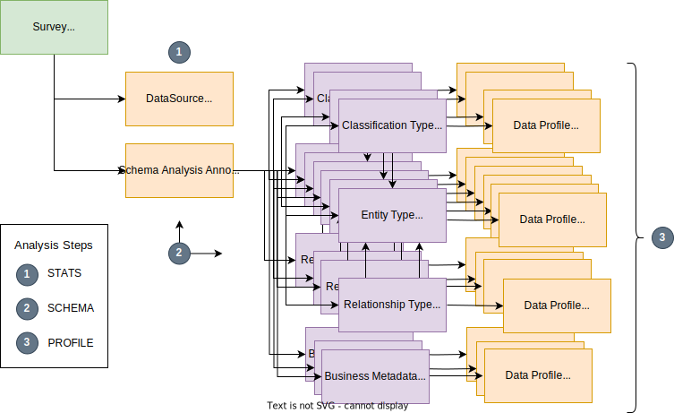

<!-- SPDX-License-Identifier: CC-BY-4.0 -->
<!-- Copyright Contributors to the ODPi Egeria project. -->

--8<-- "snippets/content-status/tech-preview.md"

# Apache Atlas Survey Action Service

???+ info "Connector summary"
    - Connector Category: [Survey Action Service](/concepts/survey-action-service)
    - Hosting Service: [Survey Action OMES](/services/omes/survey-action/overview)
    - Hosting Server: [Engine Host](/concepts/engine-host)
    - Source Module: [apache-atlas-connectors :material-github:](https://github.com/odpi/egeria/tree/main/open-metadata-implementation/adapters/open-connectors/system-connectors/apache-atlas-connectors){ target=gh }
    - Jar File Name: `apache-atlas-connectors.jar`
    - Connector Provider Class Name: `org.odpi.openmetadata.adapters.connectors.apacheatlas.survey.SurveyApacheAtlasProvider`

## Overview

---8<-- "snippets/systems/apache-atlas-intro.md"

The Apache Atlas Survey Action Service builds a [survey report](/concepts/survey-report) that describes the types defined in the Apache Atlas server and the numbers of instances that are found for these types.

---8<-- "snippets/survey-action-services/survey-action-service-config-summary.md"

> **Figure 1:** Operation of the Apache Atlas Survey Action Service

---8<-- "snippets/survey-action-services/survey-action-service-operation-summary.md"

## Survey action service function

The Apache Atlas Survey Action Service provides a summary of the contents of the Apache Atlas repository found at the time it was run.

It has three analysis steps:

1. Measure Resource - Retrieves the overall metrics from the Apache Atlas server.  These are stored in a [*DataSourceMeasurementAnnotation*](/types/0660-Data-Source-Measurement) entity linked to the [*SurveyReport*](/types/6/0603-Survey-Reports) entity generated for each run of the Apache Atlas Survey Action Service.
2. Schema Extraction - Retrieves the types from Apache Atlas and organizes them in a linked graph of [*Schema Attributes*](/types/5/0533-Graph-Schemas) entities.  All the graph schema attributes are linked to a [*GraphSchemaType*](/types/5/0533-Graph-Schemas) entity which is in turn linked to the [*SurveyReport*](/types/6/0603-Survey-Reports) entity.
3. Profile Data - Retrieves each entity in the Apache Atlas server and adds the following counts to [*DataProfileAnnotation*](/types/6/0620-Data-Profiling) entities linked from the appropriate data field entities:

    * The number of instances of each entity type.
    * The number of classifications of a particular type attached to each type of entity.
    * The number of relationships of a particular type attached to each type of entity.
    * The number of each type of label attached to each type of entity.
    * The number of business metadata properties of a particular type attached to each type of entity.

Each analysis step builds on the work of its predecessor. The processing requirements increase with each step, so you can choose to stop the processing after any step using the `finalAnalysisStep` property.  This can be set as a configuration property in the connection object for this survey action service, or as a request parameter passed when the Apache Atlas Survey Action Service is run.

The default value for `finalAnalysisStep` is `Profile Data`.

## Metadata Setup

Prior to running the Apache Atlas Survey Action Service, an [asset](/concepts/asset) and [connection](/concepts/connection) must be created for the Apache Atlas server that is to be analysed.

Typically, the asset for Apache Atlas is of type [*SoftwareServer*](/types/0/0040-Software-Server) with a *deployedImplementationType* set to *Apache Atlas Server*.  The `networkAddress` in the connection's [endpoint](/concepts/endpoint) is the hostname and port of the Apache Atlas server.  For example, `http://localhost:21000`.

> **Figure 2:** Metadata added to the open metadata repository

## Survey Reports

Each time the Apache Atlas Survey Action Service runs, there is a new [survey report](/concepts/survey-report) created.

> **Figure 3:** Survey reports linked from Apache Atlas's asset

Figure 4 shows the structure of the survey report.  The annotations are labelled with the analysis steps that create them.

> **Figure 4:** Analysis stages performed by the survey action service

### Data Source Measurements Annotation

The data source measurements annotation is created in the *Measure Resource* analysis step.  It sets up the following properties in the *dataSourceProperties* map:

* entityInstanceCount - number of active entity instances
* entityInstanceCount:*typeName* - number of active entity instance of this type
* entityWithSubtypesInstanceCount:*typeName* - number of active entity instances of this type and all subtypes.
* classificationCount - number of classifications added to entity instances.
* typeCount - number of defined types (and their versions).
* typeUnusedCount - number of types with no instances.

This analysis is achieved using two REST API calls and so has minimum impact on the Apache Atlas Server.

### Schema Analysis Annotation

The schema analysis annotation is created in the *Schema Extraction* analysis step.  It identifies the name/type of the schema created.

### Apache Atlas Types as a schema

In the *Schema Extraction* analysis step, the apache atlas types extracted from the Apache Atlas server are used to create a schema that describes the graph structure of the metadata found in the Apache Atlas server:

* A [*GraphVertex*](/types/5/0533-Graph-Schemas) entity is created for each Apache Atlas entity type, business metadata type and classification type.  
* A [*GraphEdge*](/types/5/0533-Graph-Schemas) entity is created for each Apache Atlas relationship type, and each permitted use of a classification type by an entity type.

*GraphVertex* and *GraphEdge* are types of [*SchemaAttribute*](/types/5/0505-Schema-Attributes).  The graph schema attributes are connected together using [*GraphEdgeLink*](/types/5/0533-Graph-Schemas) relationships that connect each GraphEdge schema attribute to two GraphVertex schema attributes.

* The relationship type graph edges are each attached to two entity type graph vertices: one for the type of entity that can be attached at end 1 of the relationship; the other for the type of entity that can be attached at end 2.
* The classification type permitted use graph edges are linked to each of the associated entity type graph vertices.

All the graph vertices are linked to a [*GraphSchemaType*](/types/5/0533-Graph-Schemas) entity using the [*AttributeForSchema*](/types/5/0505-Schema-Attributes) relationship.  The *GraphSchemaType* entity is linked to the asset for the Apache Atlas server using the [AssetSchemaType](/types/5/0503-Asset-Schema/) relationship.

> **Figure 5:** Linkage of graph schema elements based on Apache Atlas type.

### Data Profile Annotation

This survey action service attaches multiple data profile annotations to each graph schema attribute depending on their category (entity, relationship, classification or business metadata).

> **Figure 6:** Details of the data profile annotations attached to each type of data field

It sets up the following fields in each data profile annotation:

* *analysisStep* - this is always set to *Profile Data*.
* *annotationType* - this identifies the type of values that the annotation contains.
* *explanation* - this provides more information about the annotation type.
* *valueCount* - this is a map of typeName to count.  For example, if this annotation was counting the classifications attached to the *DataSet* entity type, then the map would include an entry for each type of classification attached to this type of entity and a count of how many times it is used.
* *additionalProperties* - contains the count of instances for the particular type that the data field represents.

The table summarizes the values in each of the data profile annotations depending on the category of the data field it is attached to.

| Atlas Type Category | Annotation Type                                | Explanation                                                                                               | Value Count                          | Instance count in AdditionalProperties    |
|---------------------|------------------------------------------------|-----------------------------------------------------------------------------------------------------------|--------------------------------------|-------------------------------------------|
| Entity              | Apache Atlas Attached Classification Types     | Count of classification types attached to this type of entity.                                            | Classification Name to Count         | Entity instances for this type            |
| Entity              | Apache Atlas End 1 Attached Relationship Types | Count of different types of relationships attached to this type of entity at End 1.                       | Relationship Name to Count           | Entity instances for this type            |
| Entity              | Apache Atlas End 2 Attached Relationship Types | Count of different types of relationships attached to this type of entity at End 2.                       | Relationship Name to Count           | Entity instances for this type            |
| Entity              | Apache Atlas Attached Labels                   | Count of the different labels attached to this type of entity.                                            | Label Name to Count                  | Entity Instances for this type            |            
| Entity              | Apache Atlas Attached Business Metadata Types  | Count of the different types of business metadata properties attached to this type of entity.             | Business Metadata Type Name to Count | Entity instances for this type            |
| Classification      | Apache Atlas Attached Entity Types             | Count of entities where this classification is attached, organized by entity type.                        | Entity Type Name to Count            | Classification Instances for this type    |
| Business Metadata   | Apache Atlas Attached Entity Types             | Count of entities where this type of business metadata properties are attached, organized by entity type. | Entity Type Name to Count            | Business metadata instances for this type |
| Relationship        | Apache Atlas Attached End 1 Entity Types       | Count of entity types attached at end 1 of this type of relationship.                                     | Entity Type Name to Count            | Relationship instances for this type      |
| Relationship        | Apache Atlas Attached End 2 Entity Types       | Count of entity types attached at end 2 of this type of relationship.                                     | Entity Type Name to Count            | Relationship instances for this type      |
| Relationship        | Apache Atlas Attached Entity Type Pairs        | Count of entity type pairs for this type of relationship.                                                 | Entity Type Name to Count            | Relationship instances for this type      |

---8<-- "snippets/abbr.md"
