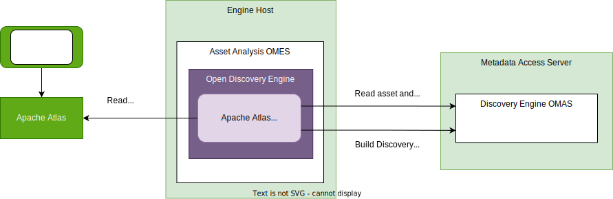
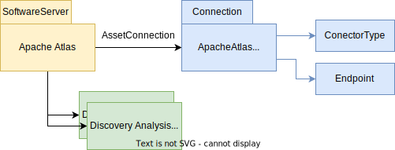
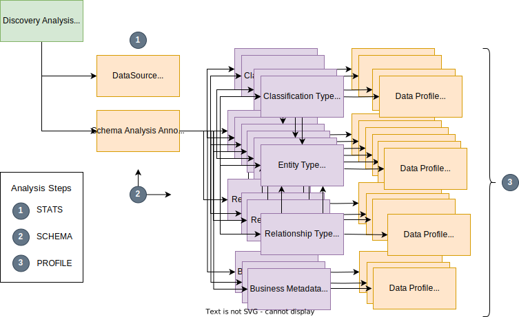

<!-- SPDX-License-Identifier: CC-BY-4.0 -->
<!-- Copyright Contributors to the ODPi Egeria project. -->

--8<-- "snippets/content-status/tech-preview.md"

# Apache Atlas Open Discovery Service

???+ info "Connector summary"
    - Connector Category: [Open Discovery Service](/concepts/open-discovery-service)
    - Hosting Service: [Asset Analysis OMES](/services/omes/asset-analysis/overview)
    - Hosting Server: [Engine Host](/concepts/engine-host)
    - Source Module: [discovery-service-connectors :material-github:](https://github.com/odpi/egeria/tree/main/open-metadata-implementation/adapters/open-connectors/discovery-service-connectors){ target=gh }
    - Jar File Name: `discovery-service-connectors.jar`
    - Connector Provider Class Name: `org.odpi.openmetadata.adapters.connectors.discoveryservices.discoveratlas.DiscoverApacheAtlasProvider`

## Overview

---8<-- "snippets/systems/apache-atlas-intro.md"

The Apache Atlas Discovery Service builds a [discovery analysis report](/concepts/discovery-analysis-report) that describes the types defined in the Apache Atlas server and the numbers of instances that are found of these types.

---8<-- "snippets/discovery-services/discovery-service-config-summary.md"

> **Figure 1:** Operation of the Apache Atlas Open Discovery Service

---8<-- "snippets/discovery-services/discovery-service-operation-summary.md"

## Discovery service function

The Apache Atlas Discovery Service provides a summary of the contents of the Apache Atlas repository found at the time it was run.

It has three analysis steps:

1. STATS - Retrieves the overall metrics from the Apache Atlas server.  These are stored in a [*DataSourceMeasurementAnnotation*](/types/0660-Data-Source-Measurement) entity linked to the [*DiscoveryAnalysisReport*](/types/6/0605-Open-Discovery-Analysis-Reports) entity generated for each run of the Apache Atlas Discovery Service.
2. SCHEMA - Retrieves the types from Apache Atlas and organizes them in a linked graph of [*DataField*](/types/6/0615-Schema-Extraction) entities.  All the data fields are linked to a [*SchemaAnalysisAnnotation*](/types/6/0615-Schema-Extraction) entity which is in turn linked to the [*DiscoveryAnalysisReport*](/types/6/0605-Open-Discovery-Analysis-Reports) entity
3. PROFILE - Retrieves each entity in the Apache Atlas server and adds the following counts to [*DataProfileAnnotation*](/types/6/0620-Data-Profiling) entities linked from the appropriate data field entities:

    * The number of instances of each entity type.
    * The number of classifications of a particular type is attached to each type of entity.
    * The number of relationships of a particular type is attached to each type of entity.

Each analysis step builds on the work of its predecessor. The processing requirements increase with each step, so you can choose to stop the processing after any step using the `finalAnalysisStep` property.  This can be set as a configuration property in the connection object for this discovery service, or as an analysis parameter passed when the Apache Atlas Discovery Service is run.

The default value for `finalAnalysisStep` is `PROFILE`.

## Metadata Setup

Prior to running the Apache Atlas Discovery Service, an [asset](/concepts/asset) and [connection](/concepts/connection) must be created for the Apache Atlas server that is to be analysed.

Typically, the asset for Apache Atlas is of type [*SoftwareServer*](/types/0/0040-Software-Server).  The `networkAddress` in the connection's [endpoint](/concepts/endpoint) is the hostname and port of the Apache Atlas server.  For example, `http://localhost:21000`.

> **Figure 2:** Metadata added to the open metadata repository

## Discovery Analysis Reports

Each time the Apache Atlas Discovery Service runs, there is a new [discovery analysis report](/concepts/discovery-analysis-report) created.

> **Figure 3:** Discovery analysis reports linked from Apache Atlas's asset

Figure 4 shows the structure of the discovery analysis report.  The annotations are labelled with the analysis steps that create them.

> **Figure 4:** Analysis stages performed by the discovery service

### Data Source Measurements Annotation

The data source measurements annotation is created in the STATS analysis step.  It has the following

### Schema Analysis Annotation

The schema analysis annotation is created in the SCHEMA analysis step.  It is the parent entity for the data fields.  It sets up the following properties un the *dataSourceProperties* map:

* entityCount
* classificationCount
* typeUnusedCount
* typeCount
* activeEntityInstanceCount:*typeName*
* activeEntityWithSubtypesInstanceCount:*typeName*

### Data Field

In the SCHEMA analysis step, a *DataField* is created for each Apache Atlas entity type, relationship type and classification type.  If the version of Apache Atlas is 2.3 or later, data fields are created for the Business Metadata Types.  

In the PROFILE analysis step, additional *DataFields* may be created for any labels discovered on the entity instances in Apache Atlas.

### Data Profile Annotation

The date profile annotations count the instances of each type.

---8<-- "snippets/abbr.md"
