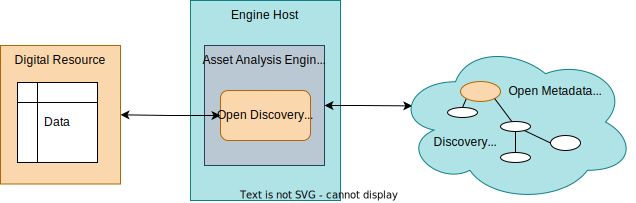

---
hide:
- toc
---

<!-- SPDX-License-Identifier: CC-BY-4.0 -->
<!-- Copyright Contributors to the Egeria project. -->

# Open Discovery Services

[Open discovery services](/egeria-docs/frameworks/odf/#discovery-service) are connectors analyze the content of resources in the digital landscape and create annotations that are attached to the resource's Asset metadata element in the open metadata repositories in the form of an open discovery report.

The definition of the connector interfaces for discovery services is defined in the [open-discovery-services :material-github:](https://github.com/odpi/egeria/tree/master/open-metadata-implementation/frameworks/open-discovery-framework/src/main/java/org/odpi/openmetadata/frameworks/discovery){ target=gh } module.

| Connector | Description |
|---|---|
| [CSV Discovery Service :material-github:](https://github.com/odpi/egeria/tree/master/open-metadata-implementation/adapters/open-connectors/discovery-service-connectors){ target=gh } | extracts the column names from the first line of the file, counts up the number of records in the file and extracts its last modified time |
| [Sequential Discovery Pipeline :material-github:](https://github.com/odpi/egeria/tree/master/open-metadata-implementation/adapters/open-connectors/discovery-service-connectors){ target=gh } | runs nested discovery services in a sequence ([more information on discovery pipelines](/egeria-docs/frameworks/odf/#discovery-pipeline)) |

--8<-- "snippets/abbr.md"
