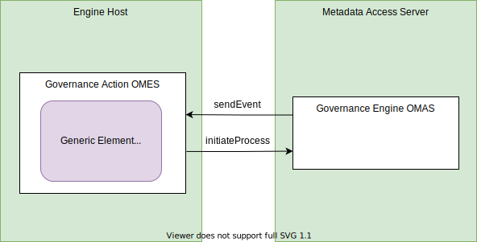

---
hide:
- toc
---

<!-- SPDX-License-Identifier: CC-BY-4.0 -->
<!-- Copyright Contributors to the Egeria project. -->

# Generic Element Watchdog Governance Action Service

??? info "Connector summary"

    - Connector Category: [Watchdog Governance Action Service](/egeria-docs/frameworks/gaf/#watchdog-governance-service)
    - Hosting Service: [Governance Action OMES](/egeria-docs/services/omes/governance-action)
    - Hosting Server: [Engine Host](/egeria-docs/concepts/engine-host)
    - Source Module: [governance-action-connectors :material-github:](../../../open-metadata-implementation/adapters/open-connectors/governance-action-connectors){ target=gh }
    - Jar File Name: `governance-action-connectors.jar`
    - ConnectorProviderClassName: `org.odpi.openmetadata.adapters.connectors.governanceactions.watchdog/GenericElementWatchdogGovernanceActionProvider.java`
 

The *Generic Element Watchdog* governance action service detects changes to requested elements and initiates a governance action process when they occur. It has two modes of operation: 

- listening for a single event and then terminating when it occurs, or
- continuously listening for multiple events.

It is possible to listen for:

- specific types of elements
- specific instances
- specific types of events



## Configuration

This connector uses the [Governance Action OMES](/egeria-docs/omes/governance-action) running in the [engine host](/egeria-docs/concepts/engine-host).

The following properties can be set up in its connection's configuration properties and overridden by the request parameters:

- The `interestingTypeName` property takes the name of an element type. If set, it determines which types of elements are to be monitored. This monitoring includes all subtypes of this interesting type. If `interestingTypeName` is not set the default value is `OpenMetadataRoot` - effectively all elements with an open metadata type.
- The `instanceToMonitor` property takes the unique identifier of a metadata element. If set, this service will only consider events for this instance. If it is not set then all elements of the interesting type are monitored unless there are one or more action targets that are labelled with `instanceToMonitor` when this service starts. If the action targets are set up then these are the instances that are monitored.

The rest of the properties are the governance action processes to call for specific types of events. The property is set to the qualified name of the process to run if the type of event occurs on the metadata instance(s) being monitored. If the property is not set, the type of event it refers to is ignored.

| Property | Description |
|---|---|
| `newElementProcessName` | listen for new or refreshed elements |
| `updatedElementProcessName` | listen for changes to the properties in the element |
| `deletedElementProcessName` | listen for elements that have been deleted |
| `classifiedElementProcessName` | listen for elements that have had a new classification attached |
| `reclassifiedElementProcessName` | listen for elements that have had the properties in one of their classifications changed |
| `declassifiedElementProcessName` | listen for elements that have had a classification removed |
| `newRelationshipProcessName` | listen for new relationships linking these elements to other elements |
| `updatedRelationshipProcessName` | listen for changes to the properties of relationships that are attached to these elements |
| `deletedRelationshipProcessName` | listen for the removal of relationships attached to these elements |

!!! example "Connection configuration"
    ```json linenums="1"
    {
      "connection":
      { 
        "class": "Connection",
        "connectorType": 
        {
          "class": "ConnectorType",
          "connectorProviderClassName": "org.odpi.openmetadata.adapters.connectors.governanceactions.watchdog.GenericElementWatchdogGovernanceActionProvider"           
        },
        "configurationProperties": 
        {
          "interestingTypeName": "{{typeName}}",
          "instanceToMonitor": "{{guid}}",
          "newElementProcessName": "{{processQualifiedName}}",
          "updatedElementProcessName": "{{processQualifiedName}}",
          "deletedElementProcessName": "{{processQualifiedName}}",
          "classifiedElementProcessName": "{{processQualifiedName}}",
          "reclassifiedElementProcessName": "{{processQualifiedName}}",
          "declassifiedElementProcessName": "{{processQualifiedName}}",
          "newRelationshipProcessName": "{{processQualifiedName}}",
          "updatedRelationshipProcessName": "{{processQualifiedName}}",
          "deletedRelationshipProcessName": "{{processQualifiedName}}"
        }
      }
    }
    ```

    This is its connection definition to use when creating the definition of the governance action service using the [Governance Engine OMAS](/egeria-docs/services/omas/governance-engine). Remove the configuration properties that are not required. Replace `{{typeName}}`, `{{guid}}` and `{{processQualifiedName}}` as required.

## Governance action settings

When this governance action service is called through a [`GovernanceAction`](/egeria-docs/types/4/0463-governance-actions/#governanceaction) it supports the following options:

### Request types and parameters

There are two request types that control its modes of operation:

- `process-single-event` to request it monitors for a single specific event and then completes.
- `process-multiple-events` to request it continuously monitors for events until it fails.

If the engine host server where it is running is restarted, this governance action service is also restarted.

Any of the configuration properties can be overridden by request parameters of the same name.

### Action targets

The `instanceToMonitor` property can be supplied as a name action target. Using action targets allows the instance to be dynamically controlled and for multiple instances to be monitored.

### Completion status and guards

This service will only complete and produce a guard if it encounters an unrecoverable error or it is set up to listen for a single event and that event occurs.

On completion, this governance action service uses:

- `CompletionStatus.ACTIONED` with guard `monitoring-complete` - requested single event occurred, or
- `CompletionStatus.FAILED` with guard `monitoring-failed` - monitor not configured correctly or failed 

??? education "Further information"
    - This connector is configured in the `governDL01` engine host server as part of the *automated curation* asset management [hands-on lab](/egeria-docs/getting-started/hands-on-labs).

--8<-- "snippets/abbr.md"
