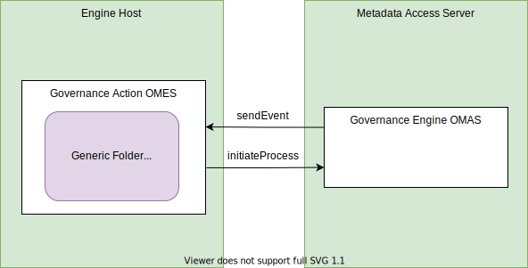

---
hide:
- toc
---

<!-- SPDX-License-Identifier: CC-BY-4.0 -->
<!-- Copyright Contributors to the Egeria project. -->

# Generic Folder Watchdog Governance Action Service

??? info "Connector details"
    - Connector Category: [Watchdog Governance Action Service](/frameworks/gaf/#watchdog-governance-service)
    - Hosting Service: [Governance Action OMES](/services/omes/governance-action)
    - Hosting Server: [Engine Host](/concepts/engine-host)
    - Source Module: [governance-action-connectors :material-github:](../../../open-metadata-implementation/adapters/open-connectors/governance-action-connectors){ target=gh }
    - Jar File Name: `governance-action-connectors.jar`
    - ConnectorProviderClassName: `org.odpi.openmetadata.adapters.connectors.governanceactions.watchdog.GenericFolderWatchdogGovernanceActionProvider`
 

The *generic folder watchdog* governance action service detects changes to the assets in a specific folder and initiates a governance action process when they occur. It has two modes of operation: 

- listening for a single event and then terminating when it occurs, or
- continuously listening for multiple events.

It is possible to listen for:

- assets directly in the folder - and optionally assets in any nested folder
- specific types of events



## Configuration

This connector uses the [Governance Action OMES](/services/omes/governance-action) running in the [engine host](/concepts/engine-host).

The following properties that can be set up in its connection's configuration properties and overridden by the request parameters.

- The `interestingTypeName` property takes the name of a `DataFile` type. If set, it determines which types of assets are to be monitored. This monitoring includes all subtypes of this interesting type. If `interestingTypeName` is not set the default value is `DataFile` - effectively all files with an open metadata type.

The rest of the properties are the governance action processes to call for specific types of events. The property is set to the qualified name of the process to run if the type of event occurs on the metadata instance(s) being monitored. If the property is not set, the type of event it refers to is ignored.

| Property | Description |
|---|---|
| `newElementProcessName` | listen for new or refreshed elements |
| `updatedElementProcessName` | listen for changes to the properties in the element |
| `deletedElementProcessName` | listen for elements that have been deleted |
| `classifiedElementProcessName` | listen for elements that have had a new classification attached |
| `reclassifiedElementProcessName` | listen for elements that have had the properties in one of their classifications changed |
| `declassifiedElementProcessName` | listen for elements that have had a classification removed |

!!! example "Connection configuration"
    ```json linenums="1"
    {
      "connection": { 
        "class": "Connection",
        "connectorType": {
          "class": "ConnectorType",
          "connectorProviderClassName": "org.odpi.openmetadata.adapters.connectors.governanceactions.watchdog.GenericFolderWatchdogGovernanceActionProvider"           
        },
        "configurationProperties": {
          "interestingTypeName": "{{typeName}}",
          "newElementProcessName": "{{processQualifiedName}}",
          "updatedElementProcessName": "{{processQualifiedName}}",
          "deletedElementProcessName": "{{processQualifiedName}}",
          "classifiedElementProcessName": "{{processQualifiedName}}",
          "reclassifiedElementProcessName": "{{processQualifiedName}}",
          "declassifiedElementProcessName": "{{processQualifiedName}}"
        }
      }
    }
    ```

    This is its connection definition to use when creating the definition of the governance action service using the [Governance Engine OMAS](/services/omas/governance-engine). Remove the configuration properties that are not required. Replace `{{typeName}}`, `{{guid}}` and `{{processQualifiedName}}` as required.

## Governance action settings

When this governance action service is called through a [`GovernanceAction`](/types/4/0463-governance-actions/#governanceaction) it supports the following options:

### Request types and parameters

There are two request types that control its modes of operation:

- `member-of-folder` to request it monitors for file assets that are directly in the named folder.
- `nested-in-folder` to request it monitors for file assets that are either directly in the named folder or any sub-folder.

Any of the configuration properties can be overridden by request parameters of the same name.

### Action targets

The `folderTarget` property can be supplied as a named action target. Using action targets allows the instance to be dynamically controlled and for multiple instances to be monitored.

### Completion status and guards

This service will only complete and produce a guard if it encounters an unrecoverable error.

In which case, this governance action service uses:

- `CompletionStatus.FAILED` with guard `monitoring-failed` 

It is also possible to shutdown the governance action service by setting

- `CompletionStatus.ACTIONED` with guard `monitoring-completed` 

in the governance action.

??? education "Further information"
    This connector is configured in the `governDL01` engine host server as part of the *automated curation* asset management [open metadata lab](/education/open-metadata-labs).

--8<-- "snippets/abbr.md"
