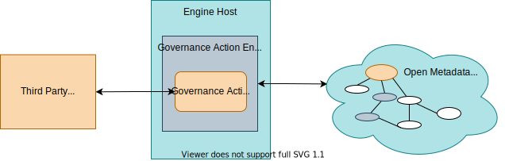

<!-- SPDX-License-Identifier: CC-BY-4.0 -->
<!-- Copyright Contributors to the Egeria project. -->

## Governance Action Services

[Governance action services](/egeria-docs/frameworks/gaf/#governance-action-service) are connectors that perform monitoring of metadata changes, validation of metadata, triage of issues, assessment and/or remediation activities on request.

They run in the [Governance Action OMES](/egeria-docs/services/omes/governance-action) hosted by the
[Engine Host OMAG Server](/egeria-docs/concepts/engine-host).

The definition of the connector interfaces for governance action services is defined in the [governance-action-framework :material-github:](https://github.com/odpi/egeria/tree/master/open-metadata-implementation/frameworks/governance-action-framework) module.

--8<-- "snippets/abbr.md"
