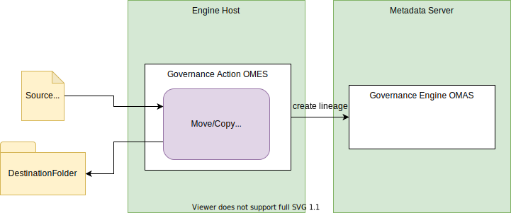
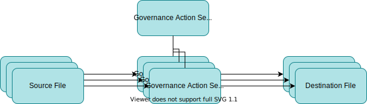
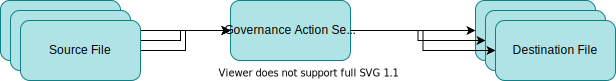
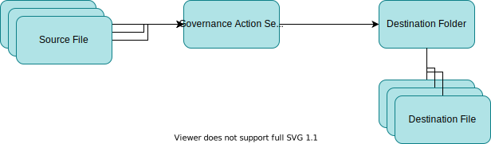

---
hide:
- toc
---

<!-- SPDX-License-Identifier: CC-BY-4.0 -->
<!-- Copyright Contributors to the ODPi Egeria project. -->


# Move/Copy File Provisioning Governance Action Service

!!! info "Connector summary"

    - Connector Category: [Governance Action Service](/concepts/governance-service)
    - Hosting Service: [Governance Action OMES](/services/omes/governance-action/overview)
    - Hosting Server: [Engine Host](/concepts/engine-host)
    - Source Module: [governance-action-connectors :material-github:](https://github.com/odpi/egeria/tree/main/open-metadata-implementation/adapters/open-connectors/governance-action-connectors){ target=gh }
    - Jar File Name: `governance-action-connectors.jar`
    - ConnectorProviderClassName: `org.odpi.openmetadata.adapters.connectors.governanceactions.provisioning.MoveCopyFileGovernanceActionProvider`
 

*Move/Copy File* Provisioning Governance Action Service moves or copies files from one location to another and
optionally creates lineage between them.

This governance action service is highly configurable.
It can be set up to perform a move file, a copy file or a delete file action.
The destination file name may be adapted from the source file name using a file pattern and
the lineage may be turned on or off.



> **Figure 1:** Operation of the move/copy file provisioning governance action service

If lineage is requested, it includes adding a new [DataFile](/types/2/0220-Files-and-Folders)
asset for the new file in the destination folder and creating [DataFlow](/types/7/0750-Data-Passing)
relationships between the process that represents this governance action service and both the
asset for the original source file and as well as the destination.
There are four choices for lineage:

Figure 2 shows the default lineage from this service.
It allows exact traceability between source file and destination file.


> **Figure 2:** Exact traceability between source and destination files

Figure 3 shows lineage where there is no need to track the
the lineage between individual files, because for example, the source files
always come from the same source and all go to the same destination. 


> **Figure 3:** Traceability between the collection of source files and the collection of destination files

Figure 4 links the source files to the instance of this governance action process
but not to the individual destination files.


> **Figure 4:** Traceability between the collection of source files and the provisioning instance and the destination folder

Figure 5 shows the traceability between the source files and the governance action process
and the destination folder.  It is not possible to tell which instance of the
governance action service processes each source file.
        

> **Figure 5:** Traceability between the collection of source files and the destination folder

Figure 6 shows the most abbreviated lineage that shows the linkage from the source folder
to the governance action process to the destination folder.  There is no traceability at the file level.
This pattern is appropriate when the files themselves are very numerous, they all follow the same
processing path and the folders represent the data sets.


> **Figure 6:** Traceability between the source files' folder and the destination folder

Irrespective of the pattern used, the resulting changes to the metadata can lead to the triggering of additional activity
in the open metadata ecosystem.  For example:

* An [integration connector](/services/omas/asset-manager/overview) may publish the lineage to the [Lineage Warehouse](/concepts/lineage-warehouse).

* Additional [Governance Action Services](/concepts/governance-action-service) may be triggered to provide additional enrichment of the lineage graph.

## Configuration

The following configuration properties can be set to control the behavior of the service on every instance.
 
- **targetFileNamePattern** - pattern to construct the name of the destination file. If this is not set, the source file name is used.
  
- **noLineage** - if this property is set to any value, do not produce lineage as part of the provisioning process.

- **topLeveProcessQualifiedName** - if this property is set, it overrides the default process name (ie the name of this
  governance action service) with the value that this property is set to.
  
- **topLevelProcessLineageOnly** - if this property is set, lineage mappings are connected to the top level process representing
  this governance action service.

- **lineageToDestinationFolderOnly** - if this property is set, the lineage relationship from the
  governance action service to the destination is linked to the destination folder rather than the new file in the destination folder.
  Without this value, the default behavior is to show lineage from governance action process to the destination file.
  
- **lineageFromSourceFolderOnly** - if this property is set, the lineage relationship from the source to the
  governance action service is linked from the source folder rather than the source file.
  Without this value, the default behavior is to show lineage from source file to governance action process.  

This is its connection definition to use when creating the definition of the governance action service using the [Open Governance Service](/services/gaf-metadata-management). Remove the configuration properties that are not required. Replace `{{processName}}` and `{{pattern}}` as required. 


```json
{
   "connection" : { 
                      "class" : "Connection",
                      "connectorType" : 
                      {
                           "class" : "ConnectorType",
                           "connectorProviderClassName" : "org.odpi.openmetadata.adapters.connectors.governanceactions.provisioning.MoveCopyFileGovernanceActionProvider"           
                      },
                      "configurationProperties": 
                      {
                              "targetFileNamePattern": "{{pattern}}",
                              "noLineage": "",
                              "processName": "{{processName}}",
                              "lineageWithTopLevelProcessOnly": "",
                              "lineageToDestinationFolderOnly": "",
                              "lineageFromSourceFolderOnly": ""
                      }
                  }
}

```

## Governance Action Settings

When this governance action service is called through an [engine action](/concepts/engine-action) it supports the following options.

### Request Types and Parameters

There are three request types:

- **copy-file** to request a file copy
- **move-file** to request a file move
- **delete-file** to request a file delete

The source and destination can be configured as request parameters:

- **source-file**
- **destination-folder**

Which can be overridden by the following named action targets

- **source-file**
- **destination-folder**

### Completion Status and Guards

On completion, this governance action service uses:

- `CompletionStatus.ACTIONED` with guard `provisioning-complete` or
- `CompletionStatus.FAILED` with guard `provisioning-failed`


## Examples of use

* [Open Metadata Labs](/education/open-metadata-labs/overview): this connector is configured in the `governDL01` engine host server as part of the **automated curation** asset management lab.

??? education "Further information"

- [Designing a Provisioning Governance Action Service](/guides/developer/governance-action-services/provisioning-governance-service)


--8<-- "snippets/abbr.md"